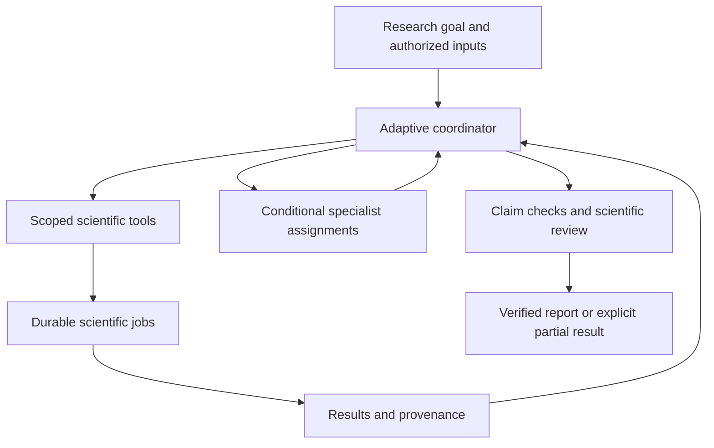

<div align="center">

# SciML Workbench

### An agentic workspace for reproducible scientific machine learning.

**Bring your data. Define the question. Keep the evidence.**

Coordinate dataset audits, leakage-aware partitions, benchmark runs, evidence, and failure memory in one research workspace—with traceable artifacts from input to report.

[](https://github.com/yukevindai/sciml-workbench/actions/workflows/ci.yml)
[](backend/pyproject.toml)
[](frontend/package.json)
[](docs/architecture.md)
[](compose.yaml)
[](LICENSE)

[Quick start](#quick-start) · [Agent workflow](#agent-workflow) · [Try the demo](#try-the-scientific-workflow) · [Documentation](#documentation) · [Release status](#release-status)

</div>

---

## Research with less orchestration

Scientific ML involves more than fitting a model: checking source data, choosing a defensible split, tracking evidence, understanding unsuccessful runs, and preserving enough context to reproduce a result.

**SciML Workbench connects those steps.** Its coordinator interprets a research goal, proposes and revises a plan, invokes supported scientific tools, and delegates scoped questions to specialists when useful. Researchers can inspect the underlying artifacts, answer material questions, and pause or cancel a run.

The scientific methods stay in four independently usable upstream projects. The workbench adds the interface, durable execution, agent coordination, and reproducibility layer.

> [!NOTE]
> **Current release: 0.1.0 candidate.** Manual scientific tools work without a model API key. Agent execution is implemented but disabled until provider configuration and trusted policies are installed. The release handoff still records pending live-provider and hosted acceptance gates; see [release status](#release-status).

## What you can do

| Capability | Research outcome |
|---|---|
| **Goal-driven coordination** | Start a research request with CSV/PDF attachments; follow the plan, real activity, linked results, and targeted questions. |
| **Dataset auditing** | Inspect quality findings and source declarations before treating a dataset as suitable for a benchmark. Unknown metadata stays unknown. |
| **Leakage-aware splitting** | Generate supported SciSplit partitions and inspect group-constrained counts, diagnostics, and every row assignment. |
| **Scientific baselines** | Execute installed mean or ridge regression baselines against a frozen task card and partition. Track validation results and deliberate test exposure. |
| **Evidence grounding** | Preserve original PDFs, inspect available text layers, and follow claim references to verified source spans. |
| **Failure memory** | Retain unsuccessful-run context, uncertainty, actor attribution, and confirmed or unresolved import receipts. |
| **Research controls** | Review a plan optionally, answer consolidated questions, pause/resume/cancel, and reconnect to the same persisted run. |
| **Reproducible reports** | Export original inputs, artifacts, scientific outputs, source evidence, dependency pins, and a SHA-256 manifest; verify and replay supported science. |

## Four tools, one workspace

| Independent project | Role in the workflow |
|---|---|
| [ChemData Auditor + SciSplit](https://github.com/yukevindai/chemdata-auditor) | Dataset quality checks and supported scientific partitioning. |
| [Scientific Evidence Engine](https://github.com/yukevindai/scientific-evidence-engine) | Public PDF ingestion and source material used for evidence inspection. |
| [ChemE ML Benchmarks](https://github.com/yukevindai/ChemE-ML-Benchmarks) | Task admission, frozen evaluation inputs, baseline execution, and scientific result bundles. |
| [Experiment Failure Memory](https://github.com/yukevindai/Experiment-Failure-Memory) | Persistent failure records, supported retrieval, and idempotent imports. |

All four are installed as pinned dependencies and accessed through their public interfaces. Their scientific logic is not copied into the workbench. See the [integration inventory](docs/integrations.md) and [verified public capabilities](docs/scientific-public-surface.md).

## Agent workflow

**Autopilot** starts execution after **Run research**, within the installed policy and available budget. **Review plan** is an optional mode. Missing essential scientific information becomes a focused question; routine permitted steps do not require another approval.



The coordinator chooses actions from actual results rather than following one fixed pipeline. An audit-only request should not train a model or summon every specialist.

| Agent role | Responsibility |
|---|---|
| **Coordinator** | Plan and revise the work, call allowed tools, request clarification, and organize completion. |
| **Data / evaluation specialist** | Review scoped data and evaluation questions. |
| **Evidence specialist** | Analyze authorized evidence context and return source-linked findings. |
| **Failure-memory specialist** | Interpret scoped prior failure context and return advisory findings. |
| **Scientific reviewer** | Review the exact final candidate through the finalization path. |

Specialists share the parent budget, receive scoped context, and return advisory results. They **cannot execute scientific tools or recursively delegate**; the coordinator owns subsequent actions. Scientific review is entered through finalization.

Execution uses PostgreSQL-backed state, LangGraph checkpoints, durable action records, and separately scheduled agent/scientific workers. Leases and publication fences guard stale work. Unknown provider usage remains accounted for and may require operator reconciliation; recovery does not imply that an external model call can always be replayed safely.

**Configure the real runtime:** [Agent operator guide](docs/agent-operator-guide.md) · [Coordinator and recovery](docs/agent-coordinator.md) · [Budgets](docs/budgets.md)

## Quick start

### 1. Start the local workspace

Use Docker Engine with Compose v2 and network access to GitHub, PyPI, and npm during the build. The supported scientific process boundary is Linux; on Windows, use the documented Docker/WSL path.

From a Linux/WSL shell:

```bash
git clone https://github.com/yukevindai/sciml-workbench.git
cd sciml-workbench
cp .env.example .env
```

Set independent values for `WB_API_TOKEN`, `WB_EFM_PASSWORD`, `WB_LOGIN_PASSWORD`, and `POSTGRES_PASSWORD` in `.env`. Generate a fresh value for each, for example:

```bash
python -c 'import secrets; print(secrets.token_urlsafe(48))'
```

Keep `WB_AGENTS_ENABLED=0` for the first startup, then run:

```bash
docker compose config --quiet
docker compose up --build -d --wait
```

Open **http://localhost:3000** and sign in with `WB_LOGIN_USERNAME` and `WB_LOGIN_PASSWORD` from `.env`.

Setup applies migrations and provisions the local Failure Memory service account. Only the web interface is published, bound to loopback; PostgreSQL, the API, and workers stay internal. The manual workflow needs **no model API key**.

### 2. Enable agents when configured

Follow the [agent operator guide](docs/agent-operator-guide.md) to:

1. Configure the server-side Anthropic adapter with account-available pinned coordinator/specialist model IDs.
2. Verify the models and structured generation; install reviewed usage bounds and pricing where required.
3. Install trusted server/project policies granting the exact inputs, tools, exposure, and budgets.
4. Set `WB_AGENTS_ENABLED=1` and start the agent profile:

```bash
docker compose --profile agents up --build -d --wait
```

Research then provides **Run research**, optional plan review, activity, and run controls. New uploads require explicit policy grants; uploading a file alone does not authorize model access. There is currently no public policy-editing UI.

Start with the guide's narrow audit demonstration before expanding the permitted workflow. Model keys remain in backend configuration, never browser code, goal text, or uploaded files.

**Setup references:** [Runtime and configuration ownership](docs/runtime-setup.md) · [Private Render deployment](docs/render-setup.md)

## Try the scientific workflow

The included [synthetic CSV](examples/demo.csv) demonstrates the integrations. It does not establish empirical predictive performance.

| Step | In the workspace |
|---|---|
| **1 · Create a project** | Open **Projects**, name the study, and describe the research question. |
| **2 · Audit the dataset** | Upload `examples/demo.csv`, explicitly choose **Use bundled synthetic demo declarations**, and run the prefilled audit. Ordinary uploads start with unknown source metadata. |
| **3 · Inspect a partition** | In **Split designer**, generate the supported partition. The demo requests 60/20/20 train/validation/test by generated family; inspect the actual group-constrained counts and full assignments. |
| **4 · Run a baseline** | In **Benchmarks**, execute the prefilled ridge baseline. All 60 rows enter the upstream protocol. Inspect validation results; **Reveal test results…** records exposure before showing held-out scores. |
| **5 · Record an unsuccessful outcome** | In **Failure memory**, select the run and give a reason and uncertainty. For example: “The synthetic demonstration cannot establish empirical predictive performance.” This is an attributed assessment, not an execution failure or physical experimental outcome. |
| **6 · Attach evidence** | Upload a PDF in **Evidence**. Optionally choose **Extract text**, then inspect exact page text where available. Original files remain available even when extraction fails. |
| **7 · Follow the lineage** | Open **Provenance** to inspect the links between inputs, configurations, jobs, and artifacts. |
| **8 · Export the study** | After relevant jobs settle, choose **Export project** in **Reports**. Download the checked archive and inspect its frozen scope. |

To exercise an admission rejection, submit a second benchmark with `units: {}` in the task card. The upstream rejects missing units; inspect the failed run and record its context.

The agent path uses these same scientific integrations through scoped tools. Its [acceptance fixtures](docs/agent-coordinator.md#acceptance-evidence) exercise real scientific packages with deterministic provider responses; those fixtures are not evidence of live model quality.

<details>
<summary><strong>Scientific boundaries worth knowing</strong></summary>

- The current baseline options are **mean and ridge regression**. Validation-driven adaptive tuning is unavailable in the pinned API.
- Nonempty train/validation/test partitions are required. User uploads become local task cards, not automatic admissions to the public benchmark catalog.
- For your own CSV, supply the columns, target, units, provenance, and scientific question that actually apply. Demo declarations belong only to the demo.
- Original data is not silently rewritten. Warning acceptance requires the supported mechanism and authorized justification; non-waivable scientific errors remain errors.
- PDF ingestion reads supported text layers. It is not OCR or figure digitization, and ingestion alone does not verify a scientific claim.
- Agent failure recording derives eligible observations and actor identity from trusted records. It does not invent researcher judgments or experimental causes.
- Test metrics are withheld from selection roles. Revealing them is recorded; a new run does not erase prior exposure.

</details>

## Reproduce the result

A report preserves the inputs and execution context needed to inspect the science independently of the conversation.

| Included | Purpose |
|---|---|
| Original CSV/PDF inputs and artifact lineage | Establish what was analyzed and where it came from. |
| Benchmark bundles, predictions, task cards, and splits | Preserve actual scientific inputs and outputs. |
| Evidence sources and failure snapshots | Retain context behind findings and unsuccessful outcomes. |
| Schemas, software pins, environment, and agent-version metadata where applicable | Record the contracts and implementations used. |
| Readable report and SHA-256 manifest | Support human inspection and archive-integrity checks. |

With the compatible pinned Python environment installed:

```bash
# Verify structure, hashes, and compatibility without rerunning science.
python -m workbench.replay examples/release/report.zip --verify-only

# Replay supported science into a NEW output directory.
python -m workbench.replay examples/release/report.zip outputs/reviewer-replay
```

Replace the example archive with your downloaded report to inspect your own run. Replay compares audits, exact split assignments, baseline metrics, and predictions using the documented tolerances (`rtol=1e-9`, `atol=1e-12`). It never reimports failure records or replays agent prose/provider calls.

The UI's archive verification is separate from scientific replay; an export is not labeled replayed merely because its hashes pass.

[Example report](examples/release/report.zip) · [Example replay receipt](examples/release/verification.json) · [Verification and replay guide](docs/report-replay.md)

## Architecture

A **modular monolith** with separate processes for HTTP requests, scientific jobs, and agent scheduling.

| Layer | Implementation |
|---|---|
| Research interface | Next.js + TypeScript; Research workspace and eight scientific inspection views |
| Application API | FastAPI + Pydantic; versioned contracts and scoped operations |
| Agent orchestration | Python coordinator, Anthropic provider adapter, conditional specialists, LangGraph persistence |
| Durable metadata | PostgreSQL 16 for projects, artifacts, jobs, run state, ledgers, and checkpoints |
| Scientific execution | Background workers invoking pinned public upstream APIs |
| Artifact storage | Immutable content-addressed local files behind a small storage interface; future S3 support remains separate |
| Failure persistence | Upstream-owned SQLite accessed through supported Failure Memory interfaces |

The Next.js server proxy adds the backend API token server-side. Provider, PostgreSQL, and Failure Memory credentials are not supplied to the browser. Project policies, budgets, data exposure, and evaluation rules are enforced by application code around model proposals.

The current access model is **one trusted operator**, with a password-protected web interface. It does not provide independent user accounts or per-user project isolation. For hosted use, follow the private-backend [Render runbook](docs/render-setup.md).

[Architecture](docs/architecture.md) · [Versioned schemas](contracts/v1/) · [Exposure controls](docs/agent-egress.md) · [Backup and restore](docs/backup-restore.md)

## Development

Use **Python 3.12**, **Node 22+**, and **PostgreSQL 16**. The commands below assume a supported Linux/WSL environment.

<details>
<summary><strong>Run the backend and frontend without Compose</strong></summary>

From the repository root:

```bash
python3.12 -m venv .venv
source .venv/bin/activate
pip install -c backend/constraints.txt -e 'backend[dev]'
cp .env.example .env
# Set private secrets and WB_DATABASE_URL for your PostgreSQL database.
python -m workbench.config
python -m workbench.setup
uvicorn workbench.api:create_app --factory --host 127.0.0.1 --port 8000
```

In a second terminal with the same environment and activated virtualenv:

```bash
python -m workbench.worker
```

For the frontend, copy `frontend/.env.example` to `frontend/.env.local`, set the matching backend API token and independent web login values, then:

```bash
cd frontend
npm ci
npm run dev
```

Use localhost consistently: browser writes are checked against `WB_PUBLIC_ORIGIN`. Never put credentials in `NEXT_PUBLIC_` variables. This sequence starts the manual runtime; agent enablement additionally requires the [operator setup](docs/agent-operator-guide.md).

</details>

<details>
<summary><strong>Windows: preserve upstream source bytes during installation</strong></summary>

Git for Windows can convert upstream source line endings during pip's Git clones. Since benchmark admission checks the installed source bytes, CRLF conversion can cause `Installed ChemData Auditor/SciSplit source differs from the pinned official implementation`.

For a Git Bash installation, disable conversion for those clones:

```bash
GIT_CONFIG_COUNT=2 GIT_CONFIG_KEY_0=core.autocrlf GIT_CONFIG_VALUE_0=false GIT_CONFIG_KEY_1=core.eol GIT_CONFIG_VALUE_1=lf pip install -c backend/constraints.txt -e 'backend[dev]'
```

These variables do not change your global Git configuration. If already installed with converted bytes, reinstall the four exact Git requirements from `backend/pyproject.toml` with `--force-reinstall --no-deps`.

Native Windows supports tests but is not a supported scientific worker host; use Linux/WSL or the supported container path for process supervision.

</details>

### Checks

From the repository root, with the relevant dependencies and services running:

```bash
pytest backend/tests -q
python scripts/export_schemas.py --check
python scripts/release_manifest.py --check
npm --prefix frontend run build
(cd frontend && npx playwright install chromium && npm run test:e2e)
```

For strict PostgreSQL data/API acceptance, set `TEST_DATABASE_URL` to a **dedicated test database** and run:

```bash
python scripts/check_data_integration.py
```

The default backend tests use temporary SQLite metadata; PostgreSQL locking and transaction checks require PostgreSQL. Scientific integration tests use real pinned packages. Deterministic agent tests replace provider decisions, not scientific implementations. Browser checks need the documented running stack.

[Integrated CI gates](docs/integrated-ci.md) · [Scientific integration](docs/tickets/C10.md) · [Browser acceptance](docs/tickets/A10.md) · [Agent evaluations](docs/autonomy-evaluation.md)

## Release status

The [release handoff](docs/release-handoff.md) separates implementation and local evidence from acceptance of a live model or hosted deployment.

| Area | Recorded status |
|---|---|
| Scientific integrations and reproducible example | Implemented; revision-specific local evidence and example replay receipt are linked in the handoff. |
| Agent coordinator, specialists, controls, and reports | Implemented; exercised with deterministic provider/transport fixtures and real scientific integrations. |
| Live account/model walkthrough and quality evaluation | Pending in the handoff; requires configured models, reviewed bounds/policies, and recorded live outcomes. |
| Hosted access, redeploy, and production restore | Remain open acceptance gates in the handoff. |
| Full release-revision CI | Must be verified at the accepted revision; consult the live workflow badge and [Actions](https://github.com/yukevindai/sciml-workbench/actions). |

Historical test counts remain in their original evidence records. A passed test at an earlier revision, a scripted coordinator demo, or a successful container build does not establish current live-agent or hosted acceptance.

[Release handoff](docs/release-handoff.md) · [Validation inventory](docs/release/validation.json) · [Compatibility inventory](docs/release/compatibility.json) · [Historical readiness inspection](docs/implementation-readiness.md)

## Documentation

| Start here | Guide |
|---|---|
| Install and configure | [Runtime setup](docs/runtime-setup.md) |
| Run the agent workspace | [Agent operator guide](docs/agent-operator-guide.md) |
| Understand decisions and recovery | [Coordinator runtime](docs/agent-coordinator.md) |
| Deploy privately | [Render setup](docs/render-setup.md) |
| Operate and troubleshoot | [Operations](docs/operations.md) · [Diagnostics](docs/diagnostics.md) |
| Preserve and restore a workspace | [Backup and restore](docs/backup-restore.md) |
| Verify and replay a report | [Report reproduction](docs/report-replay.md) |
| Review the design and delivery scope | [Blueprint: five workstreams, 64 tickets](sciml-workbench-mvp-design.md) |

<details>
<summary><strong>Engineering reference: contracts, integrations, and agent internals</strong></summary>

**Data and execution**

- [Input intake](docs/intake.md), [durable submission](docs/submission.md), and [artifact resolution](docs/artifact-resolution.md)
- [Scientific worker](docs/scientific-worker.md), [fenced publication](docs/publication.md), and [bounded read projections](docs/read-projections.md)
- [External-operation journal](docs/external-operations.md), [report capture](docs/report-capture.md), and [PostgreSQL data checks](docs/data-integration.md)

**Scientific integrations**

- [Public capabilities and exact pins](docs/scientific-public-surface.md)
- [Audit integration](docs/audit-integration.md) and [SciSplit integrity](docs/split-integrity.md)
- [Benchmark admission and bundles](docs/benchmark-integration.md)
- [Evidence ingestion](docs/evidence-ingestion.md) and [Failure Memory](docs/failure-memory-integration.md)

**Agent internals**

- [Typed tool registry](docs/tool-registry.md)
- [Memory, correction, and compatible reuse](docs/agent-memory-reuse.md)
- [Evaluation discipline and holdout exposure](docs/agent-evaluation.md)
- [Provider egress and untrusted content](docs/agent-egress.md)
- [Budgets and accounting](docs/budgets.md)
- [Autonomy evaluation and bounded live pilot](docs/autonomy-evaluation.md)

</details>

---

<div align="center">

**Scientific results you can inspect. Research workflows you can reproduce.**

Built by [Kevin Dai](https://github.com/yukevindai) · [MIT License](LICENSE)

</div>
