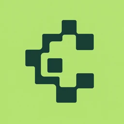
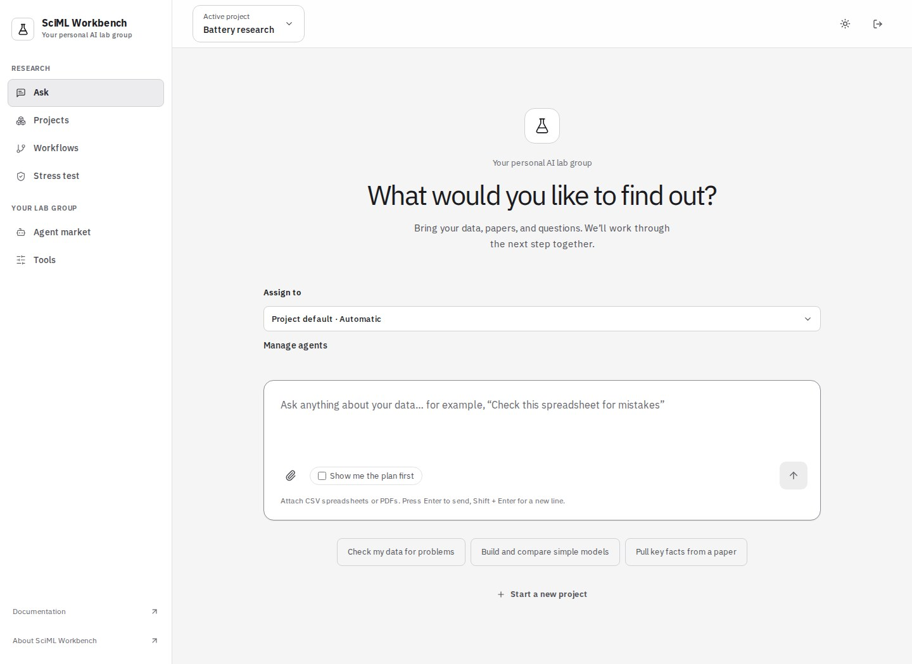
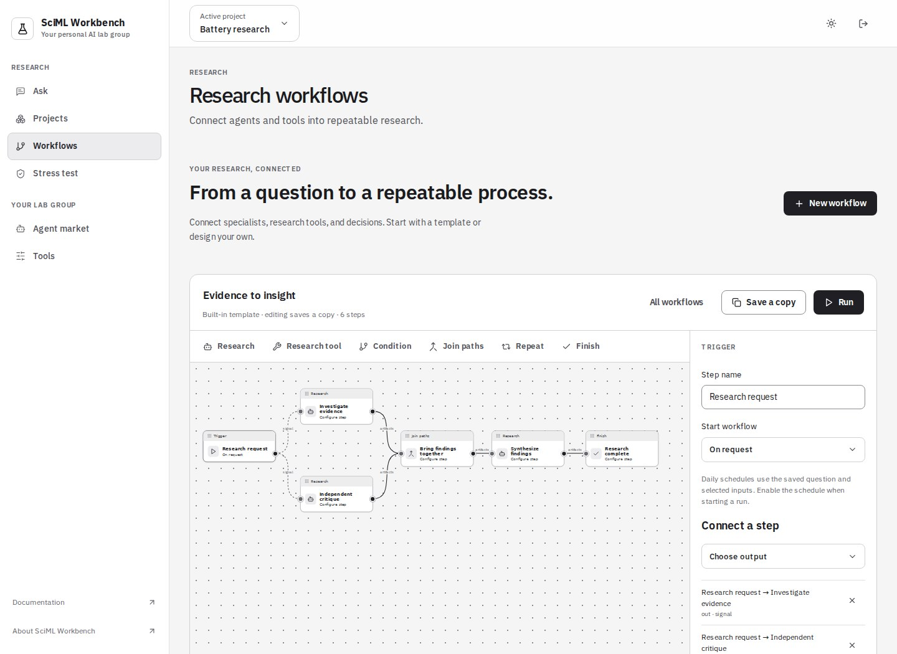
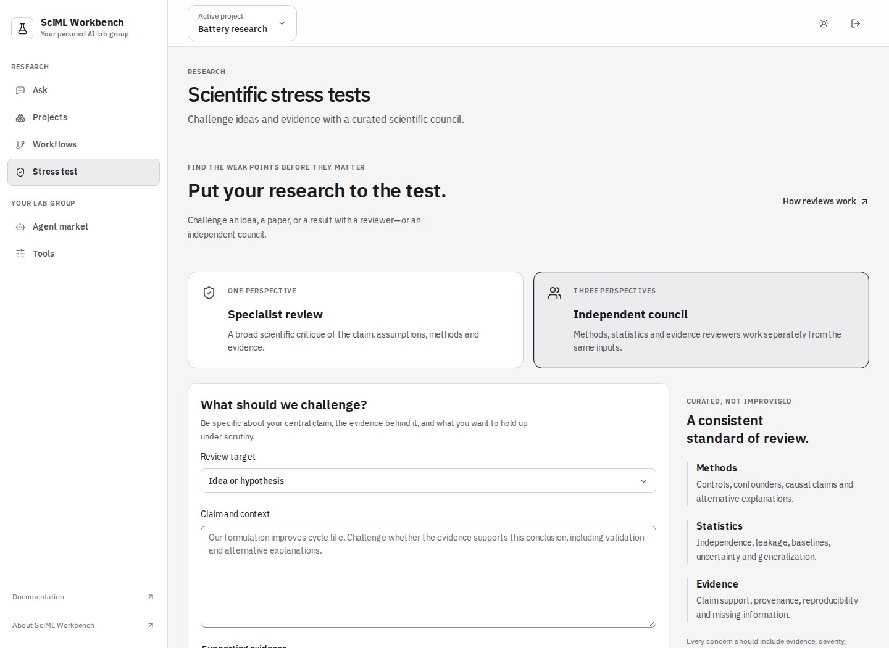

<div align="center">



# Colattice

### Your personal AI lab group.

An open-source workspace for research agents, scientific tools, and evidence you can trace.

**[Try the demo](https://www.colattice.ca/demo)** · **[Website](https://www.colattice.ca)** · **[Docs](https://www.colattice.ca/docs)** · **[Contribute](CONTRIBUTING.md)**

[](https://github.com/yukevindai/colattice/actions/workflows/ci.yml)
[](LICENSE)
[](#run-it-yourself)

</div>

<br />

<picture>
  <source media="(prefers-color-scheme: dark)" srcset="frontend/public/images/product-ask-dark-desktop.jpg" />
  
</picture>

<p align="center"><sub>The real Colattice interface, shown with synthetic example data. Screenshots follow your light or dark theme.</sub></p>

## Research starts with a question

Bring a dataset, a paper, or an idea. Colattice helps you assemble a team of agents, connect scientific tools, and follow an investigation from the first question to an inspectable report.

It brings the work around a model into the same workspace: checking data quality, choosing defensible splits, tracing claims to sources, questioning results, and keeping enough context to reproduce the science.

**[Explore the interactive demo →](https://www.colattice.ca/demo)** No account or API key needed. The demo uses sample data and scripted responses; edits reset on refresh. Real research runs happen in your own configured workspace.

## Inside your lab group

| | What you can do |
|---|---|
| **Ask** | Attach CSVs or PDFs, choose an agent or team, and follow the plan, activity, questions, and linked results. |
| **Agents & tools** | Customize specialists, build teams, and create reusable tools manually or from a prompt. |
| **Visual workflows** | Connect research steps, parallel paths, conditions, and bounded repeats on a canvas. Save and reuse the process. |
| **Scientific stress tests** | Challenge an idea, paper, or result with a specialist or an independent review council. |
| **Data & evidence** | Audit datasets, inspect leakage-aware splits, run supported baselines, and trace findings to source material. |
| **Reports & memory** | Retain unsuccessful-run context and export inputs, artifacts, software pins, and verification manifests. |

<details>
<summary><strong>See the workflow designer</strong></summary>

<br />

<picture>
  <source media="(prefers-color-scheme: dark)" srcset="frontend/public/images/product-workflows-dark-desktop.jpg" />
  
</picture>

Start from a template or connect your own steps. Assign agents and tools, pan and zoom, then save the workflow before running it.

</details>

<details>
<summary><strong>See the scientific review council</strong></summary>

<br />

<picture>
  <source media="(prefers-color-scheme: dark)" srcset="frontend/public/images/product-stress-test-dark-desktop.jpg" />
  
</picture>

Give reviewers the same claim and evidence, then inspect their concerns, assumptions, and suggested tests. Agreement between agents is not proof of a scientific claim.

</details>

## Try a first investigation

With agents enabled in your workspace, attach the [example CSV](examples/demo.csv) in **Ask** and start with:

> Audit this synthetic dataset for missing values, duplicates, and unusual values. Do not train a model. Ask me for any source declarations you need; do not infer provenance or units.

Review the findings, supply the scientific context, and then request a supported split or baseline. Use **Stress test** to challenge a claim and export a report when the work settles.

You can pause or cancel a run, answer clarification questions, and optionally review a plan before execution. Results retain links to their inputs and execution history.

[Research walkthrough](docs/local-setup.md#try-the-scientific-workflow) · [Example report](examples/release/report.zip) · [Verify and replay](docs/report-replay.md)

## Run it yourself

**Requirements:** Git, Docker with Compose v2, and network access for the initial build. Use Linux or Docker through WSL on Windows.

```bash
git clone https://github.com/yukevindai/colattice.git
cd colattice
cp .env.example .env
```

In `.env`, replace `WB_API_TOKEN`, `WB_EFM_PASSWORD`, `WB_LOGIN_PASSWORD`, and `POSTGRES_PASSWORD` with independent secrets. Generate a fresh value for each with:

```bash
python -c 'import secrets; print(secrets.token_urlsafe(48))'
```

Leave `WB_AGENTS_ENABLED=0` for the first startup, then run:

```bash
docker compose config --quiet
docker compose up --build -d --wait
```

Open **[localhost:3000](http://localhost:3000)** and sign in with the username and password in `.env`.

**Enable AI research:** follow the [agent setup guide](docs/agent-operator-guide.md) to configure a provider key, model IDs, usage bounds, and project access. DeepSeek and Anthropic adapters are supported. The scientific APIs can run without a model key; AI-led research requires one.

The current installation uses a **single-operator login**, rather than separate accounts for each user. For your own domain, set `WB_PUBLIC_ORIGIN` to its exact HTTPS origin and redeploy the frontend.

[Full local setup](docs/local-setup.md) · [Vercel deployment](docs/vercel-setup.md) · [Developer setup](docs/development.md)

## Built on open scientific tools

Colattice coordinates four independently usable projects through their public interfaces. Their scientific implementations remain in their own repositories.

| Project | What it brings |
|---|---|
| [ChemData Auditor + SciSplit](https://github.com/yukevindai/chemdata-auditor) | Dataset quality checks and scientific partitioning. |
| [Scientific Evidence Engine](https://github.com/yukevindai/scientific-evidence-engine) | PDF ingestion and source material for evidence inspection. |
| [ChemE ML Benchmarks](https://github.com/yukevindai/ChemE-ML-Benchmarks) | Frozen evaluation inputs, supported baselines, and scientific result bundles. |
| [Experiment Failure Memory](https://github.com/yukevindai/Experiment-Failure-Memory) | Failure records, retrieval, and repeatable imports. |

**Stack:** Next.js / TypeScript · FastAPI / Python · PostgreSQL · LangGraph · background workers.

[Architecture](docs/architecture.md) · [Integration inventory](docs/integrations.md) · [Scientific capabilities](docs/scientific-public-surface.md)

## Make it yours. Help it grow.

**[Fork Colattice](https://github.com/yukevindai/colattice/fork)** to adapt the workspace to your research, or **[open an issue](https://github.com/yukevindai/colattice/issues)** to share a bug, use case, or improvement.

Useful places to contribute:

- **Research workflows:** reproducible examples, task templates, and clearer scientific inspection views.
- **Product experience:** accessibility, mobile layouts, and interactions that make research easier to follow.
- **Engineering:** regression tests, documented integrations, and reliability improvements.
- **Documentation:** setup fixes, walkthroughs, and explanations that help the next person get started.

You can explore and modify the public demo with just the frontend—no database or model key required. The [contribution guide](CONTRIBUTING.md) covers that setup, the repository map, and how to prepare a pull request.

## Project notes

Colattice is under active development. Current scientific baselines are mean and ridge regression; PDF ingestion uses supported text layers, not OCR or figure digitization. AI-generated findings still need scientific review. See the [supported capabilities](docs/scientific-public-surface.md) and [release handoff](docs/release-handoff.md) for detailed boundaries and recorded validation.

[Changelog](https://www.colattice.ca/changelog) · [Operations](docs/operations.md) · [Troubleshooting](docs/diagnostics.md) · [Design blueprint](colattice-mvp-design.md)

## License

Colattice is released under the **[MIT License](LICENSE)**. You can use, modify, and distribute it, including in commercial projects, under the license terms. Dependencies retain their respective licenses.

---

<div align="center">

**Your data. Your direction. Your personal AI lab group.**

Built by [Kevin Dai](https://github.com/yukevindai) · Feidy AI

[Try Colattice](https://www.colattice.ca/demo) · [Contribute](CONTRIBUTING.md) · [Explore the source](https://github.com/yukevindai/colattice)

</div>
