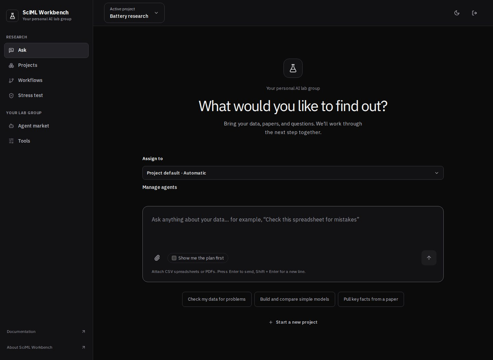
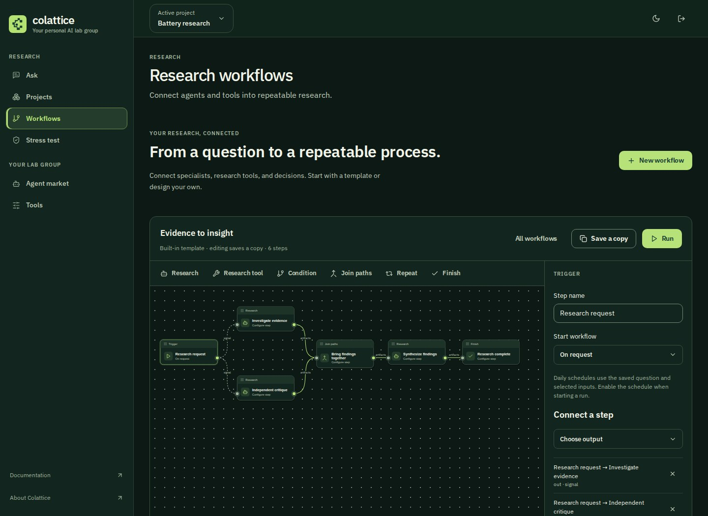
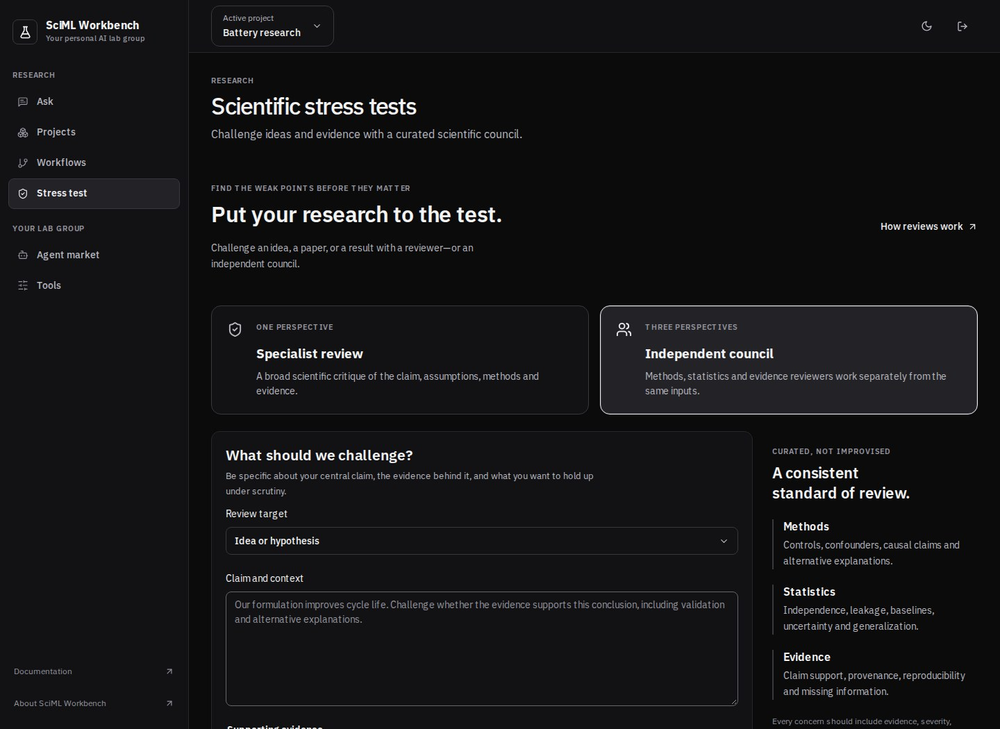
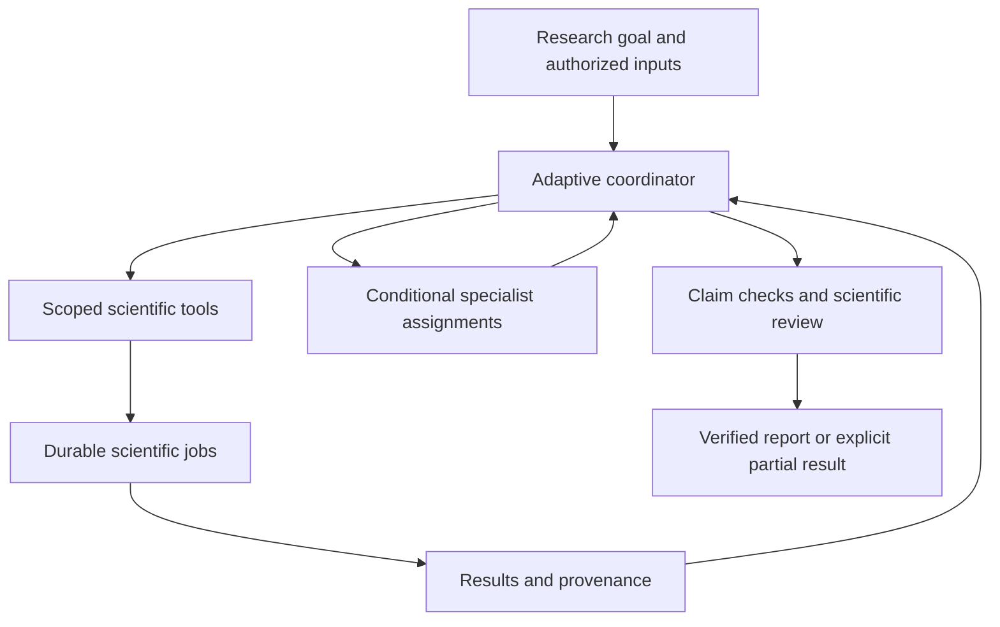

<div align="center">

# SciML Workbench

### Your personal AI lab group.

**Bring your data. Define the question. Keep the evidence.**

Ask a research question, assemble your agents, design a visual workflow, or challenge an idea with a scientific review council. Keep the data, evidence, results, and reasoning behind each investigation together.

[](https://github.com/yukevindai/sciml-workbench/actions/workflows/ci.yml)
[](backend/pyproject.toml)
[](frontend/package.json)
[](docs/architecture.md)
[](compose.yaml)
[](LICENSE)

[What’s new](#whats-new) · [Quick start](#quick-start) · [Agent workflow](#agent-workflow) · [Try the demo](#try-the-scientific-workflow) · [Documentation](#documentation) · [Release status](#release-status)

</div>

---

## What’s new

**Try without an account:** choose **Try the demo** on the landing page, or open `/demo` on your deployment. Explore the real workspace with synthetic inputs, scripted Ask/council responses, editable agents and workflows, and linked sample results. No DeepSeek or other model calls are made. Demo edits reset on refresh; uploads, real schedules and research downloads require the live workspace.

**Product version: 0.2.1** adds the public interactive demo, following the research studio and October 5 responsiveness and progress updates ([PR #19](https://github.com/yukevindai/sciml-workbench/pull/19)). The [product changelog](frontend/app/changelog/page.tsx) tracks UI milestones; the frontend/backend package version and release compatibility inventory remain **0.1.0**. These are separate from live deployment and release acceptance.

| Update | What changed |
|---|---|
| **Research studio** | Custom agents and teams, reusable research tools, visual workflows, templates, parallel paths, conditions, bounded repeats, and optional daily schedules. Built-in agents remain intact when customized. |
| **Workflow navigation** | Cancel accidental workflow creation; edited drafts ask before discarding. Hold the primary or middle mouse button on empty canvas space to pan. Move steps by their grips, or use keyboard controls and zoom/fit. |
| **Product Support** | A persistent Help launcher inside the signed-in workspace, with AI answers about controls and searchable product guidance. It is absent from the public landing and sign-in pages. |
| **Scientific stress tests** | Challenge an idea, paper, or result with one scientific reviewer or a preset council of independent methods, statistics, and evidence reviewers. |
| **Loading and response improvements** | Workspace views load on demand; independent catalogs render without waiting for scientific history. Initial job and artifact reads run concurrently. Support uses a smaller direct-answer request, instant guide suggestions, and quicker response polling; queue continuations avoid unnecessary scheduler waits. |
| **Visible progress** | Ask, lab-group activity, support, workflows, and stress tests show elapsed time and recorded activity or step counts where available. Queued, paused, input-required, and interrupted-update states are distinct. Timers use saved timestamps and add no server polling. |
| **Accurate product previews** | Landing-page tabs use captures of the actual Ask, workflow, and stress-test screens, with synthetic data, desktop/mobile layouts, and light/dark themes. |
| **CI correction** | The anonymous preview test now inherits the shared Playwright base URL, fixing its local-port mismatch in GitHub Actions. |

These changes reduce avoidable waits and make ongoing work visible; model response time still depends on the provider and the task. Elapsed time includes queueing and waits, and is not an estimated completion percentage.

### Inside the workspace

These are captures of the real interface using synthetic example data. The public preview is illustrative; research runs require signing in and configuring the runtime.



<details>
<summary><strong>Visual workflows and scientific stress tests</strong></summary>





</details>

## Agent market

Customize the built-in research agents or create your own with names, roles, skills, instructions and integrated tools. Build reusable teams, assign prompts to them, and save a default agent or team for each project. Exclusive assignments enforce the chosen roster and tool limits on the backend. See the [agent market guide](docs/agent-market.md) for behavior and the required database migration.

## Research with less orchestration

Scientific ML involves more than fitting a model: checking source data, choosing a defensible split, tracking evidence, understanding unsuccessful runs, and preserving enough context to reproduce a result.

**SciML Workbench connects those steps.** Its coordinator interprets a research goal, proposes and revises a plan, invokes supported scientific tools, and delegates scoped questions to specialists when useful. Researchers can inspect the underlying artifacts, answer material questions, and pause or cancel a run.

The scientific methods stay in four independently usable upstream projects. The workbench adds the interface, durable execution, agent coordination, and reproducibility layer.

> [!NOTE]
> **Agent-led product UI; scientific APIs remain available independently.** The AI assistant runs on **DeepSeek** (Anthropic is also supported) and stays off until a key and usage bounds are configured. Scientific execution through the API does not require a model key, but Ask, workflow agents, AI support, and stress reviews do. Searchable product guidance remains available without a provider. The release handoff still records pending live-provider and hosted acceptance gates; see [release status](#release-status).

## What you can do

| Capability | Research outcome |
|---|---|
| **Goal-driven coordination** | Start a research request with CSV/PDF attachments; follow the plan, real activity, linked results, and targeted questions. |
| **Visual workflows** | Connect agent and tool steps, parallel paths, conditions, and bounded repeats; save templates and opt into daily schedules. |
| **Scientific stress tests** | Receive structured critiques from one reviewer or three independent reviewers using the same selected evidence. |
| **Product help** | Ask what a control does from inside the workspace, or search local guidance immediately. |
| **Dataset auditing** | Inspect quality findings and source declarations before treating a dataset as suitable for a benchmark. Unknown metadata stays unknown. |
| **Leakage-aware splitting** | Generate supported SciSplit partitions and inspect group-constrained counts, diagnostics, and every row assignment. |
| **Scientific baselines** | Execute installed mean or ridge regression baselines against a frozen task card and partition. Track validation results and deliberate test exposure. |
| **Evidence grounding** | Preserve original PDFs, inspect available text layers, and follow claim references to verified source spans. |
| **Failure memory** | Retain unsuccessful-run context, uncertainty, actor attribution, and confirmed or unresolved import receipts. |
| **Research controls** | Review a plan optionally, answer consolidated questions, pause/resume/cancel, and reconnect to the same persisted run with elapsed time and recorded activity. |
| **Reproducible reports** | Export original inputs, artifacts, scientific outputs, source evidence, dependency pins, and a SHA-256 manifest; verify and replay supported science. |

## Four tools, one workspace

| Independent project | Role in the workflow |
|---|---|
| [ChemData Auditor + SciSplit](https://github.com/yukevindai/chemdata-auditor) | Dataset quality checks and supported scientific partitioning. |
| [Scientific Evidence Engine](https://github.com/yukevindai/scientific-evidence-engine) | Public PDF ingestion and source material used for evidence inspection. |
| [ChemE ML Benchmarks](https://github.com/yukevindai/ChemE-ML-Benchmarks) | Task admission, frozen evaluation inputs, baseline execution, and scientific result bundles. |
| [Experiment Failure Memory](https://github.com/yukevindai/Experiment-Failure-Memory) | Persistent failure records, supported retrieval, and idempotent imports. |

All four are installed as pinned dependencies and accessed through their public interfaces. Their scientific logic is not copied into the workbench. See the [integration inventory](docs/integrations.md) and [verified public capabilities](docs/scientific-public-surface.md).

## Agent workflow

**Autopilot** starts execution when you send a question in **Ask**, within the installed policy and available budget. **Review plan** is an optional mode. Missing essential scientific information becomes a focused question; routine permitted steps do not require another approval.


```mermaid
flowchart TD
    REQUEST["Research goal and authorized inputs"] --> COORD["Adaptive coordinator"]
    COORD --> TOOLS["Scoped scientific tools"]
    COORD --> SPECIALISTS["Conditional specialist assignments"]
    SPECIALISTS --> COORD
    TOOLS --> JOBS["Durable scientific jobs"]
    JOBS --> ARTIFACTS["Results and provenance"]
    ARTIFACTS --> COORD
    COORD --> FINAL["Claim checks and scientific review"]
    FINAL --> REPORT["Verified report or explicit partial result"]
```

The coordinator chooses actions from actual results rather than following one fixed pipeline. An audit-only request should not train a model or summon every specialist.

| Agent role | Responsibility |
|---|---|
| **Coordinator** | Plan and revise the work, call allowed tools, request clarification, and organize completion. |
| **Data / evaluation specialist** | Review scoped data and evaluation questions. |
| **Evidence specialist** | Analyze authorized evidence context and return source-linked findings. |
| **Failure-memory specialist** | Interpret scoped prior failure context and return advisory findings. |
| **Scientific reviewer** | Review the exact final candidate through the finalization path. |

Specialists share the parent budget, receive scoped context, and return advisory results. They **cannot execute scientific tools or recursively delegate**; the coordinator owns subsequent actions. Scientific review is entered through finalization.

Execution uses PostgreSQL-backed state, LangGraph checkpoints, durable action records, and separately scheduled agent/scientific workers. Leases and publication fences guard stale work. Unknown provider usage remains accounted for and may require operator reconciliation; recovery does not imply that an external model call can always be replayed safely.

**Configure the real runtime:** [Agent operator guide](docs/agent-operator-guide.md) · [Coordinator and recovery](docs/agent-coordinator.md) · [Budgets](docs/budgets.md)

## Workflows, stress tests, and support

In **Workflows**, start from a template or a new graph, assign agents or reusable tools, connect steps, and save before running. Drag empty canvas space to pan; use **Cancel creation** to leave a new draft. Execution continues on the backend when the browser closes. Stopping a workflow cancels active child runs while retaining completed results. Optional daily schedules run at most once per UTC day when the scheduler wakes, with no exact-time guarantee.

In **Stress test**, choose an idea, paper, or scientific result, describe the central claim, and select the evidence to include. **Specialist review** uses one challenger; **Independent council** uses three reviewers who receive the same authorized inputs without seeing one another’s prose. The council shares the request budget. Reviews ask for evidence or explicit gaps, severity, justified confidence, alternative explanations, and resolving tests. Open each review for its findings, source artifacts, questions, and any plan approval. **Stop test** cancels active reviews. Reviewers can share a provider’s blind spots; agreement is not proof or peer-review certification.

The **Help** launcher stays available throughout the signed-in workspace. Product Support explains controls using the product guide and has no research tools or research attachments. AI questions and answers stay in the selected project’s run history. Local guidance works without a provider or a selected project; closing Help does not cancel an active request.

[Research studio and execution guide](docs/research-workflows.md) · [Agent market guide](docs/agent-market.md)

## Quick start

### 1. Start the local workspace

Use Docker Engine with Compose v2 and network access to GitHub, PyPI, and npm during the build. The supported scientific process boundary is Linux; on Windows, use the documented Docker/WSL path.

From a Linux/WSL shell:

```bash
git clone https://github.com/yukevindai/sciml-workbench.git
cd sciml-workbench
cp .env.example .env
```

Set independent values for `WB_API_TOKEN`, `WB_EFM_PASSWORD`, `WB_LOGIN_PASSWORD`, and `POSTGRES_PASSWORD` in `.env`. Generate a fresh value for each, for example:

```bash
python -c 'import secrets; print(secrets.token_urlsafe(48))'
```

Keep `WB_AGENTS_ENABLED=0` for the first startup, then run:

```bash
docker compose config --quiet
docker compose up --build -d --wait
```

Open **http://localhost:3000** for the landing page, choose **Get started**, and sign in on the sign-in page with `WB_LOGIN_USERNAME` and `WB_LOGIN_PASSWORD` from `.env`. You land on **Ask**: one prompt box where you attach a CSV or PDF and type what you want to know. The main navigation includes **Ask**, **Projects**, **Workflows**, **Stress test**, **Agent market**, and **Tools**. The **Tools** catalog defines reusable agent instructions and allowed integrated capabilities; scientific results open through their inspection links.

Setup applies migrations and provisions the local Failure Memory service account. Only the web interface is published, bound to loopback; PostgreSQL, the API, and workers stay internal. The scientific APIs need **no model API key**; enable agents below to run research from the product UI.

### 2. Enable agents when configured

**Quick path (DeepSeek with automatic access):** in `.env`, set `DEEPSEEK_API_KEY`, keep `WB_MODEL_PROVIDER=deepseek` and the `deepseek-chat` model IDs, set a reviewed `WB_AGENT_MODEL_BOUNDS` record, and set `WB_AGENTS_ENABLED=1` and `WB_AGENT_AUTO_POLICY=1`. Then:

```bash
docker compose run --rm --no-deps api python -m workbench.model_provider   # checks the key and model IDs
docker compose --profile agents up --build -d --wait
```

With `WB_AGENT_AUTO_POLICY=1`, the first question in a project grants the assistant access to that project's own uploads: column names and summary numbers only, never raw rows, within per-request and per-project limits. Sending the question is the consent to spend. See the [DeepSeek section of the operator guide](docs/agent-operator-guide.md#deepseek-quick-path).

The coordinator assigns advisory specialists as needed within the shared request,
token and time budgets, with two specialists running at once. Larger batches
continue in checkpointed waves. Coordinator calls and specialist calls share the
same 40-request default allowance; a configured monetary ceiling also applies.

**Reviewed path:** leave `WB_AGENT_AUTO_POLICY=0` and follow the [agent operator guide](docs/agent-operator-guide.md) to install exact server/project policies with `workbench.operator_policy`. Then only the inputs you granted can be offered to the model. Research activity retains each request’s inputs, policy, limits, and results for inspection.

Start with the guide's narrow audit demonstration before expanding the permitted workflow. Model keys remain in backend configuration, never browser code, goal text, or uploaded files.

**Setup references:** [Runtime and configuration ownership](docs/runtime-setup.md) · [Vercel deployment and migration](docs/vercel-setup.md)

**Hosting on Vercel:** deploy the Next.js frontend (`frontend/`) and FastAPI backend (repository root) as two projects from the same commit. The backend uses managed PostgreSQL for metadata, file bytes and Failure Memory snapshots, plus durable Vercel Queues for scientific work, recovery and optional agents. This configuration supports **Vercel Hobby**, caps uploads at **4 MiB** and scientific jobs at **240 seconds**, and preserves the local Compose workflow. Start with the dedicated [backend](.env.vercel.example) and [frontend](frontend/.env.vercel.example) environment templates. Existing Render data requires the documented transfer before retiring those services.


## Try the scientific workflow

The included [synthetic CSV](examples/demo.csv) demonstrates the integrations. It does not establish empirical predictive performance. The current UI starts research through agents; the older standalone scientific entry forms are no longer the product workflow.

With agents configured, create or select a project in **Projects**, open **Ask**, attach the CSV, and send a scoped request such as:

> Audit this synthetic dataset for missing values, duplicates, and unusual values. Do not train a model. Ask me for any source declarations you need; do not infer provenance or units.

Choose a specific agent or team if needed, and optionally select **Review plan**. Follow the elapsed-time panel, answer scientific questions, and open the resulting audit. Then request a supported split and baseline once the required target, units, provenance, and evaluation choices are supplied. Results link to their inspection views; original inputs remain unchanged.

For a paper, attach a PDF and ask for source-linked findings. To challenge the resulting claim, open **Stress test** and select the relevant evidence. Ask for a report after the work settles, then inspect and download the retained report archive.

For a deterministic integration walkthrough without a live provider, use the [scientific integration guide](docs/tickets/C10.md) and [acceptance fixtures](docs/tickets/A10.md), rather than the removed manual UI forms.

The agent path uses these same scientific integrations through scoped tools. Its [acceptance fixtures](docs/agent-coordinator.md#acceptance-evidence) exercise real scientific packages with deterministic provider responses; those fixtures are not evidence of live model quality.

<details>
<summary><strong>Scientific boundaries worth knowing</strong></summary>

- The current baseline options are **mean and ridge regression**. Validation-driven adaptive tuning is unavailable in the pinned API.
- Nonempty train/validation/test partitions are required. User uploads become local task cards, not automatic admissions to the public benchmark catalog.
- For your own CSV, supply the columns, target, units, provenance, and scientific question that actually apply. Demo declarations belong only to the demo.
- Original data is not silently rewritten. Warning acceptance requires the supported mechanism and authorized justification; non-waivable scientific errors remain errors.
- PDF ingestion reads supported text layers. It is not OCR or figure digitization, and ingestion alone does not verify a scientific claim.
- Agent failure recording derives eligible observations and actor identity from trusted records. It does not invent researcher judgments or experimental causes.
- Test metrics are withheld from selection roles. Revealing them is recorded; a new run does not erase prior exposure.

</details>

## Reproduce the result

A report preserves the inputs and execution context needed to inspect the science independently of the conversation.

| Included | Purpose |
|---|---|
| Original CSV/PDF inputs and artifact lineage | Establish what was analyzed and where it came from. |
| Benchmark bundles, predictions, task cards, and splits | Preserve actual scientific inputs and outputs. |
| Evidence sources and failure snapshots | Retain context behind findings and unsuccessful outcomes. |
| Schemas, software pins, environment, and agent-version metadata where applicable | Record the contracts and implementations used. |
| Readable report and SHA-256 manifest | Support human inspection and archive-integrity checks. |

With the compatible pinned Python environment installed:

```bash
# Verify structure, hashes, and compatibility without rerunning science.
python -m workbench.replay examples/release/report.zip --verify-only

# Replay supported science into a NEW output directory.
python -m workbench.replay examples/release/report.zip outputs/reviewer-replay
```

Replace the example archive with your downloaded report to inspect your own run. Replay compares audits, exact split assignments, baseline metrics, and predictions using the documented tolerances (`rtol=1e-9`, `atol=1e-12`). It never reimports failure records or replays agent prose/provider calls.

The UI's archive verification is separate from scientific replay; an export is not labeled replayed merely because its hashes pass.

[Example report](examples/release/report.zip) · [Example replay receipt](examples/release/verification.json) · [Verification and replay guide](docs/report-replay.md)

## Architecture

A **modular monolith** with separate processes for HTTP requests, scientific jobs, and agent scheduling.

| Layer | Implementation |
|---|---|
| Research interface | Next.js + TypeScript; public site and sign-in, **Ask**, projects, visual workflows, stress tests, agent/team and tool catalogs, in-product support, and linked scientific inspection views |
| Application API | FastAPI + Pydantic; versioned contracts and scoped operations |
| Agent orchestration | Python coordinator, DeepSeek (default) and Anthropic provider adapters, conditional specialists, LangGraph persistence |
| Durable metadata | PostgreSQL 16 for projects, artifacts, jobs, run state, ledgers, and checkpoints |
| Scientific execution | Background workers invoking pinned public upstream APIs |
| Artifact storage | Immutable content-addressed files locally; PostgreSQL blobs on Vercel; future S3 adapter remains separate |
| Failure persistence | Upstream-owned SQLite accessed through supported Failure Memory interfaces |

The Next.js server proxy adds the backend API token server-side. Provider, PostgreSQL, and Failure Memory credentials are not supplied to the browser. Project policies, budgets, data exposure, and evaluation rules are enforced by application code around model proposals.

The current access model is **one trusted operator**, signing in through a form that sets a signed, HttpOnly session cookie (no browser pop-up; scripts may still send the same login as HTTP Basic). It does not provide independent user accounts or per-user project isolation. For hosted use, follow the [Vercel runbook](docs/vercel-setup.md): two projects, authenticated server-to-server access, managed PostgreSQL, and bounded queue execution with daily catch-up.

[Architecture](docs/architecture.md) · [Versioned schemas](contracts/v1/) · [Exposure controls](docs/agent-egress.md) · [Backup and restore](docs/backup-restore.md)

## Development

Use **Python 3.12**, **Node 22+**, and **PostgreSQL 16**. The commands below assume a supported Linux/WSL environment.

<details>
<summary><strong>Run the backend and frontend without Compose</strong></summary>

From the repository root:

```bash
python3.12 -m venv .venv
source .venv/bin/activate
pip install -c backend/constraints.txt -e 'backend[dev]'
cp .env.example .env
# Set private secrets and WB_DATABASE_URL for your PostgreSQL database.
python -m workbench.config
python -m workbench.setup
uvicorn workbench.api:create_app --factory --host 127.0.0.1 --port 8000
```

In a second terminal with the same environment and activated virtualenv:

```bash
python -m workbench.worker
```

For the frontend, copy `frontend/.env.example` to `frontend/.env.local`, set the matching backend API token and independent web login values, then:

```bash
cd frontend
npm ci
npm run dev
```

Use localhost consistently: browser writes are checked against `WB_PUBLIC_ORIGIN`. Never put credentials in `NEXT_PUBLIC_` variables. This sequence starts the manual runtime; agent enablement additionally requires the [operator setup](docs/agent-operator-guide.md).

</details>

<details>
<summary><strong>Windows: preserve upstream source bytes during installation</strong></summary>

Git for Windows can convert upstream source line endings during pip's Git clones. Since benchmark admission checks the installed source bytes, CRLF conversion can cause `Installed ChemData Auditor/SciSplit source differs from the pinned official implementation`.

For a Git Bash installation, disable conversion for those clones:

```bash
GIT_CONFIG_COUNT=2 GIT_CONFIG_KEY_0=core.autocrlf GIT_CONFIG_VALUE_0=false GIT_CONFIG_KEY_1=core.eol GIT_CONFIG_VALUE_1=lf pip install -c backend/constraints.txt -e 'backend[dev]'
```

These variables do not change your global Git configuration. If already installed with converted bytes, reinstall the four exact Git requirements from `backend/pyproject.toml` with `--force-reinstall --no-deps`.

Native Windows supports tests but is not a supported scientific worker host; use Linux/WSL or the supported container path for process supervision.

</details>

### Checks

From the repository root, with the relevant dependencies and services running:

```bash
pytest backend/tests -q
python scripts/export_schemas.py --check
python scripts/release_manifest.py --check
npm --prefix frontend run build
(cd frontend && npx playwright install chromium && npm run test:e2e)
```

Public product previews are screenshots of the real workspace routes with synthetic example data. After changing those screens, build and start the frontend locally, then run `npm --prefix frontend run preview:capture` with `E2E_BASE_URL` pointing at localhost and `WB_LOGIN_USERNAME` / `WB_LOGIN_PASSWORD` set to that local test login. The capture script intercepts all API reads, rejects mutations, and omits the in-product support launcher. Commit the generated desktop/mobile images for both themes, then rebuild before checking the public page. An optional `CHROMIUM_EXECUTABLE` selects an installed browser.

For strict PostgreSQL data/API acceptance, set `TEST_DATABASE_URL` to a **dedicated test database** and run:

```bash
python scripts/check_data_integration.py
```

The default backend tests use temporary SQLite metadata; PostgreSQL locking and transaction checks require PostgreSQL. Scientific integration tests use real pinned packages. Deterministic agent tests replace provider decisions, not scientific implementations. Browser checks need the documented running stack.

[Integrated CI gates](docs/integrated-ci.md) · [Scientific integration](docs/tickets/C10.md) · [Browser acceptance](docs/tickets/A10.md) · [Agent evaluations](docs/autonomy-evaluation.md)

## Release status

The latest product milestone is **0.2.1**, adding the public demo to the research studio, responsiveness, progress, and preview updates. Package metadata and the [release handoff](docs/release-handoff.md) still identify the **0.1.0 candidate**. The handoff separates implementation and local evidence from acceptance of a live model or hosted deployment; the product changelog does not certify those gates.

| Area | Recorded status |
|---|---|
| Scientific integrations and reproducible example | Implemented; revision-specific local evidence and example replay receipt are linked in the handoff. |
| Research studio, support, stress tests, and visible progress | Merged through PR #19; consult revision-specific CI for automated verification. Live provider quality and deployed behavior require separate acceptance. |
| Agent coordinator, specialists, controls, and reports | Implemented; exercised with deterministic provider/transport fixtures and real scientific integrations. |
| Live account/model walkthrough and quality evaluation | Pending in the handoff; requires configured models, reviewed bounds/policies, and recorded live outcomes. |
| Hosted access, redeploy, and production restore | Remain open acceptance gates in the handoff. |
| Full release-revision CI | Must be verified at the accepted revision; consult the live workflow badge and [Actions](https://github.com/yukevindai/sciml-workbench/actions). |

Historical test counts remain in their original evidence records. A passed test at an earlier revision, a scripted coordinator demo, or a successful container build does not establish current live-agent or hosted acceptance.

[Release handoff](docs/release-handoff.md) · [Validation inventory](docs/release/validation.json) · [Compatibility inventory](docs/release/compatibility.json) · [Historical readiness inspection](docs/implementation-readiness.md)

## Documentation

| Start here | Guide |
|---|---|
| Install and configure | [Runtime setup](docs/runtime-setup.md) |
| Run the agent workspace | [Agent operator guide](docs/agent-operator-guide.md) |
| Configure agents and teams | [Agent market](docs/agent-market.md) |
| Use workflows, stress tests, and support | [Research studio](docs/research-workflows.md) |
| Follow product changes | [Product changelog](frontend/app/changelog/page.tsx) |
| Understand decisions and recovery | [Coordinator runtime](docs/agent-coordinator.md) |
| Deploy privately | [Vercel setup and Render migration](docs/vercel-setup.md) |
| Operate and troubleshoot | [Operations](docs/operations.md) · [Diagnostics](docs/diagnostics.md) |
| Preserve and restore a workspace | [Backup and restore](docs/backup-restore.md) |
| Verify and replay a report | [Report reproduction](docs/report-replay.md) |
| Review the design and delivery scope | [Blueprint: five workstreams, 64 tickets](sciml-workbench-mvp-design.md) |

<details>
<summary><strong>Engineering reference: contracts, integrations, and agent internals</strong></summary>

**Data and execution**

- [Input intake](docs/intake.md), [durable submission](docs/submission.md), and [artifact resolution](docs/artifact-resolution.md)
- [Scientific worker](docs/scientific-worker.md), [fenced publication](docs/publication.md), and [bounded read projections](docs/read-projections.md)
- [External-operation journal](docs/external-operations.md), [report capture](docs/report-capture.md), and [PostgreSQL data checks](docs/data-integration.md)

**Scientific integrations**

- [Public capabilities and exact pins](docs/scientific-public-surface.md)
- [Audit integration](docs/audit-integration.md) and [SciSplit integrity](docs/split-integrity.md)
- [Benchmark admission and bundles](docs/benchmark-integration.md)
- [Evidence ingestion](docs/evidence-ingestion.md) and [Failure Memory](docs/failure-memory-integration.md)

**Agent internals**

- [Typed tool registry](docs/tool-registry.md)
- [Memory, correction, and compatible reuse](docs/agent-memory-reuse.md)
- [Evaluation discipline and holdout exposure](docs/agent-evaluation.md)
- [Provider egress and untrusted content](docs/agent-egress.md)
- [Budgets and accounting](docs/budgets.md)
- [Autonomy evaluation and bounded live pilot](docs/autonomy-evaluation.md)

</details>

---

<div align="center">

**Scientific results you can inspect. Research workflows you can reproduce.**

Built by [Kevin Dai](https://github.com/yukevindai) · [MIT License](LICENSE)

</div>
