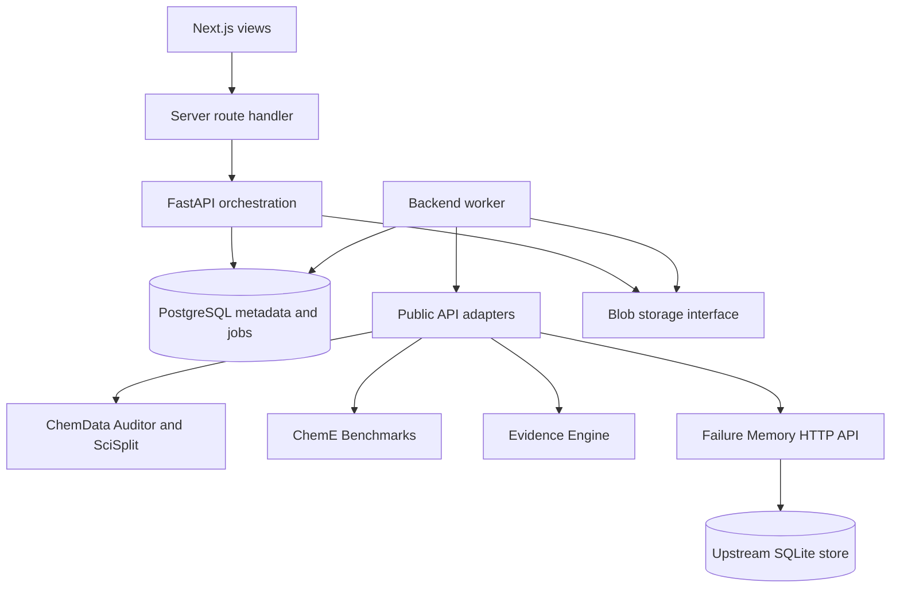

# Architecture

API and worker share the same backend package, versioned contracts and data layer. Modules separate orchestration, adapters, contracts, persistence, files and jobs. There is no duplicated scientific implementation or distributed scientific service topology.

## Persistence

PostgreSQL owns project metadata, immutable artifact envelopes, lineage activities and queued jobs. Alembic owns schema changes. Jobs are inserted in the same transaction that validates their parent references. PostgreSQL claims use `FOR UPDATE SKIP LOCKED`, enabling multiple workers without duplicate claims. A unique project/idempotency-key constraint handles repeated submissions, with a conflict response if the request changes.

Long operations run in worker child processes, never FastAPI request handlers. A job has queued/running/succeeded/failed states, timestamps, result ID and sanitized error. Each task has a hard deadline; stale claims are marked failed rather than automatically repeated. Failures may be retried as new explicit requests. A benchmark admission failure produces a failure-status benchmark artifact that can be saved to Failure Memory. Job state and generated artifacts commit together. Shutdown/crash may leave unreferenced content-addressed blobs; no automatic garbage collection is implemented.

The job queue is backed directly by PostgreSQL; Redis/Celery is unnecessary for this MVP. Single-operator local defaults also keep file-based upstream Failure Memory within its supported small-team scope.

## Files and S3 boundary

`BlobStore` requires `put(bytes) -> key` and `get(key) -> bytes`. Local storage uses SHA-256 keys, validates keys and hashes on read, and atomically replaces complete writes. User filenames never become storage paths. Scientific libraries receive temporary local directories; their outputs are captured as immutable bundles. An S3 adapter can implement the same methods without changing scientific adapters. S3 support itself is not implemented.

Failure Memory storage is not covered by BlobStore: its supported SQLite file contains records and attachments and requires its own backup. Do not move it to object storage or network filesystems by changing the blob adapter.

## Contracts

`contracts/v1/*.json` are generated from strict Pydantic models. Every artifact has an immutable ID, project ID, UTC creation time, parent IDs, exact software versions/revisions and schema version `1.0`. Contract categories: dataset, audit, split, benchmark, evidence, failure, provenance, report. Unknown envelope fields and unknown versions are rejected. Upstream payloads retain their upstream schema and details instead of coupling the workbench to private nested data structures.

Dataset SHA-256 describes the exact uploaded bytes, while upstream reports may additionally fingerprint parsed content. Split assignments retain original zero-based row order. Benchmark bundles contain the externally documented card, original CSV, frozen partitions, prepared bundle and predictions. Reports include a hash manifest, source metadata and replay instructions. Hashes demonstrate consistency with the recorded snapshot, not authorship or scientific truth.

## Security boundary and limits

- Single trusted local operator. There is no web login, SSO or per-user project authorization yet. Project-scoped API checks prevent accidental cross-project artifact use, not access by different users of this workspace.
- Compose publishes only `127.0.0.1:3000`. API, worker and PostgreSQL have no host port mapping.
- Next.js adds a bearer token server-side. Only the API token goes to the web server process; EFM and database credentials stay in the backend. No `NEXT_PUBLIC_` credentials, browser credential storage, or provider keys.
- Mutating browser calls require the configured exact origin. Proxy paths and headers are allowlisted. Uploads are capped at 10 MiB; CSV parsing rejects duplicate/blank headers, ragged rows, over 200 columns or over 20,000 rows. Maximum 400 rows are drawn in the split preview, but all assignments remain in the artifact.
- Workers bound runtime. Report export is permitted only after existing non-report jobs settle. Export is a snapshot; work started after it queues can appear only in a later report.
- No arbitrary scripts, shell commands, remote URL fetching, credentials or model API calls are accepted from the client.
- Files and reports are private scientific data, not encrypted-at-rest by this application. Use protected disks/backups. Reports can grow as source evidence accumulates; large-scale pagination and streaming exports remain future work.
- Replay verifies archive membership and digests, uses no filesystem extraction and caps expanded archive size. It reruns successful computation, not failed jobs or external writes.
