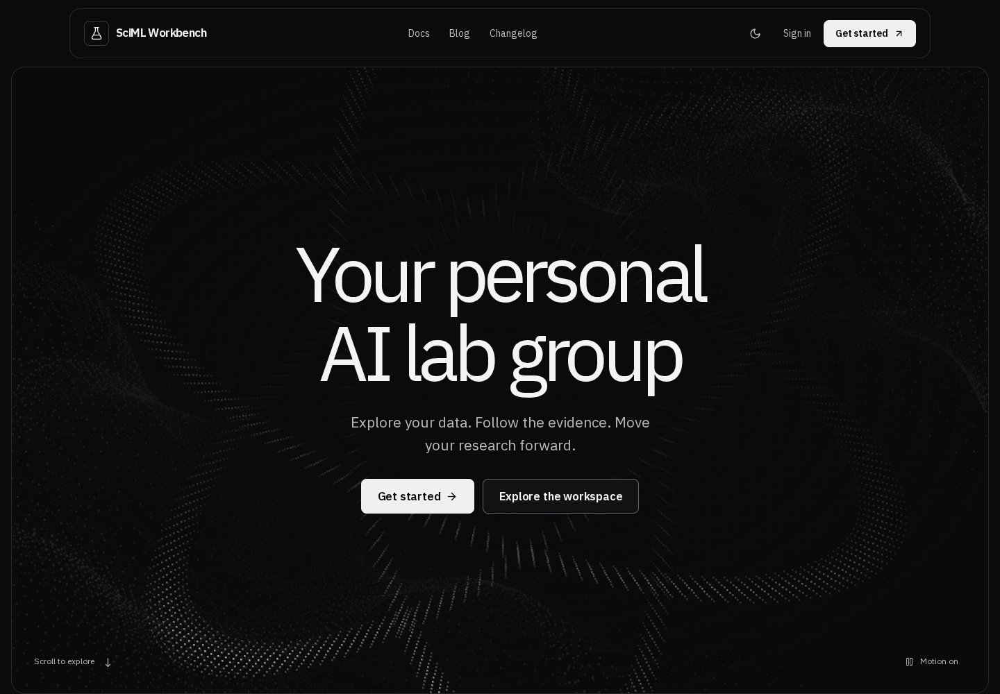
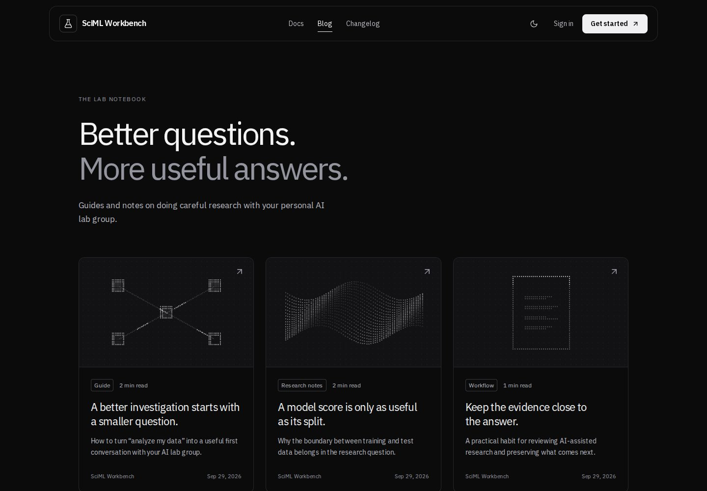
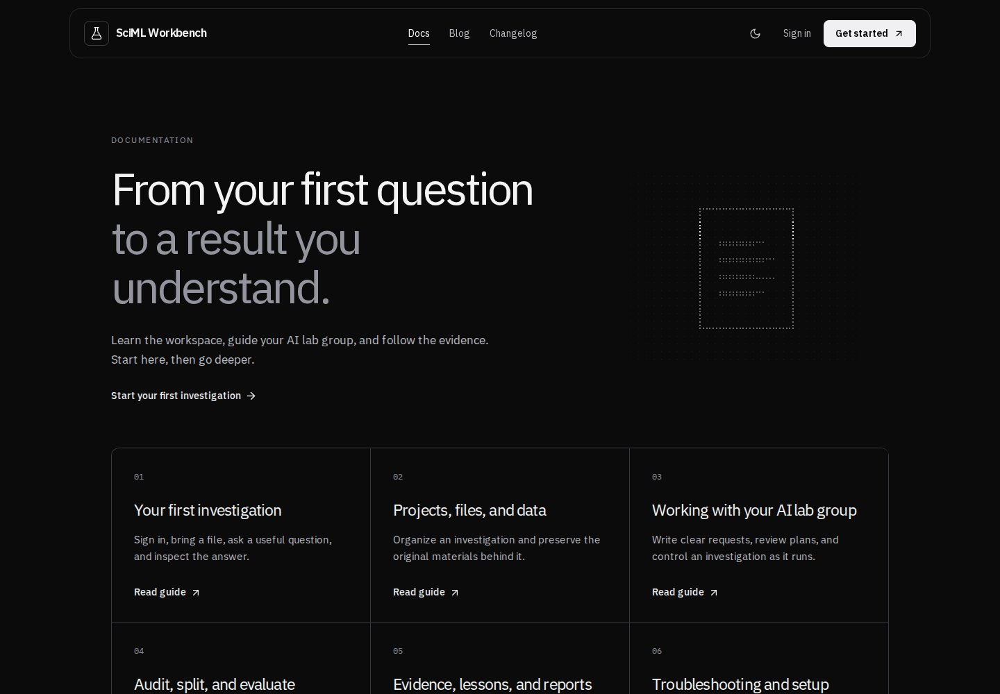

# Living pixel lab — September 2026

> Historical snapshot of the first motion update. See [public experience refinement](design-public-polish.md) for the current controls, artwork, header, and changelog numbering.

This update follows the personal AI lab group redesign. The hero now fills the
remaining first viewport below navigation, including tall desktop displays.
The research strip begins below that viewport. The headline remains
“Your personal AI lab group”.

## Reference and direction

Reviewed Amoeba's landing page, documentation index and guide, blog index and
article, changelog, and about/download information. The useful patterns are a
quiet monochrome surface, expansive typography, distinct destinations for
learning and updates, and continuously animated dot illustrations. The 21st.dev
Dotted Surface and scroll-animation collections informed the motion direction.
All code, illustrations, and product copy in this update are original.

The installed UI UX Pro Max and Taste skills guided the review. The explicit
request for pixel animation takes precedence over generic advice against
repeating decorative animation. Motion is more prominent on marketing pages;
working views retain their information density and legible state indicators.

## Motion and accessibility

- Four procedural canvas scenes: rotating orbitals, traveling waves, coordinating
  nodes, and a scanning document. All are decorative, not scientific output.
- Pointer movement gently offsets illustrations. Intersection-triggered reveals
  and progressive CSS scroll parallax add movement while navigating the page.
- Drawing is capped at 30 frames per second, stops outside the viewport and in
  hidden tabs, and cleans up observers/listeners/animation frames on unmount.
- Pause/play is shared across landing, content pages, sign-in, and the workspace.
  Preferences persist locally and apply before paint. System reduced motion
  takes priority. Content remains readable without JavaScript.
- No additional runtime dependency, remote animation service, or WebGL context.

## Public content and product flow

The header's three destinations are `/docs`, `/blog`, and `/changelog`, with a
keyboard-operable mobile menu. The same header/footer and theme cover the public
pages. Sign-in uses the shared pixel artwork; the workspace provides a Docs link
and shares the motion preference and restrained entrance transitions.

Docs contains six complete guides covering first use, projects/materials,
agents/review/control, audits/evaluation, evidence/reports, and troubleshooting.
UI labels and behavior were checked against the implementation and repository
manuals. Blog contains three original articles with full detail pages and links
to relevant guides. Content lives in `frontend/app/lib/public-content.ts`.

Changelog entries identify the current package version (0.1.0), verified dated
source updates, and unreleased work separately. New version releases must be
added when actually published; dates or version numbers are not fabricated.

Only the public content namespaces are added to the login gate. Private pages,
research uploads, streams, and downloads remain authenticated. Unknown article
and guide slugs return 404. Existing API contracts are unchanged.

## Verification

- Production build, TypeScript, generated contract check, 10 contract tests, and
  three private-boundary tests pass; release compatibility inventory matches.
- Targeted browser coverage verifies viewport ownership at 375, 768, 1440, and
  2048px; all guides/articles; anonymous access; mobile keyboard navigation;
  theme persistence; animated/frozen pixels; and real sign-in/sign-out flow.
- Automated axe checks found zero WCAG A/AA violations across landing, Docs,
  guide, Blog, article, Changelog, and sign-in in both themes (14 scans).
- Additional existing browser regressions cover research controls, uploads,
  audits, splits, benchmarks, evidence, lessons, reports, and recovery using the
  repository's deterministic fixtures. Live science/model integration remains
  the existing CI job's responsibility.

## Screenshots

These are captures of the implemented pages. Pixel scenes move in the product;
a still image captures only one frame.

