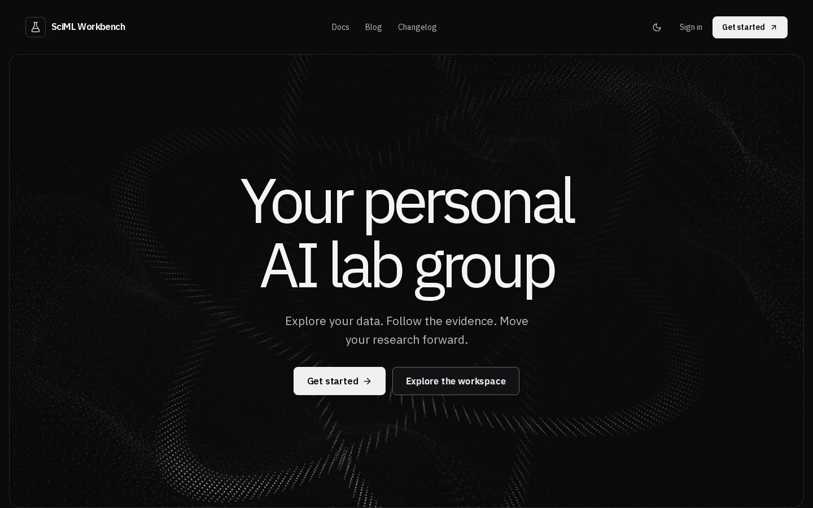
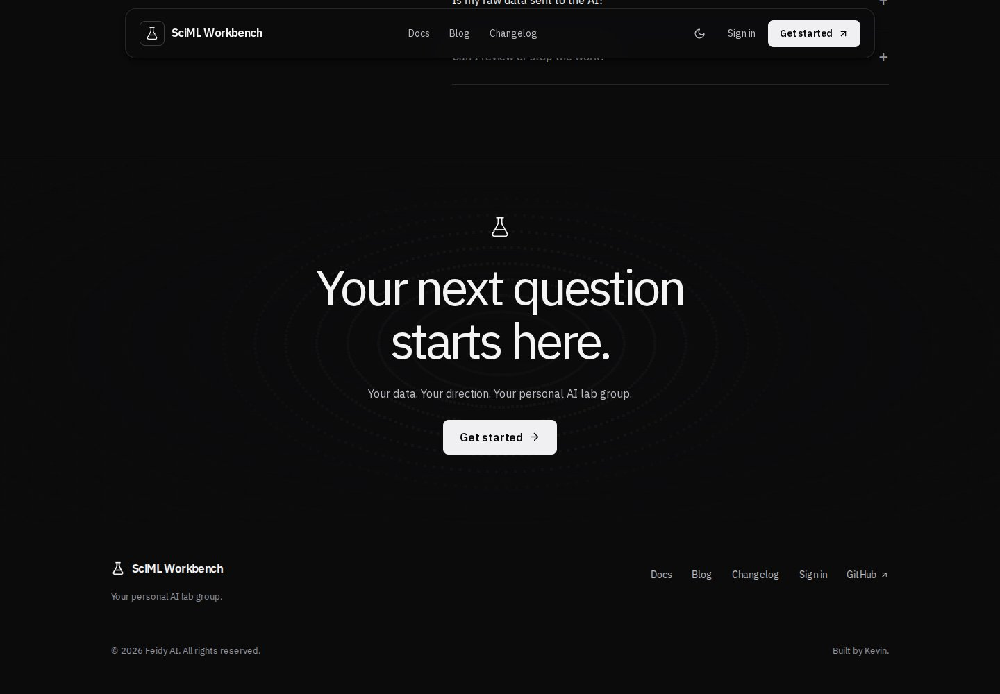
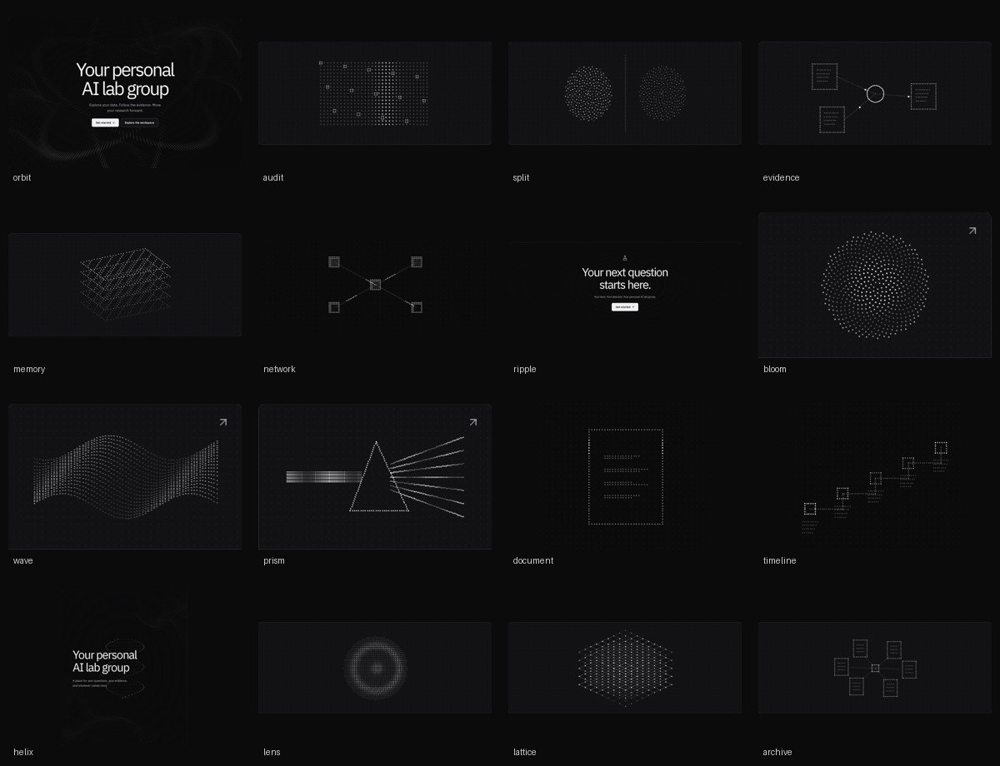

# Public experience refinement

September 29, 2026. Follow-up to `design-living-pixel-lab.md`.

## Direction

A targeted refinement of the existing monochrome scientific identity, using
Amoeba's open-to-floating navigation and quiet footer as references. Design
variance 6, motion intensity 6, visual density 3. Existing native CSS, typography,
theme tokens, Lucide icons, and canvas infrastructure are retained.

## Navigation and copy

- A transparent, borderless header at the top contracts into a floating panel
  after 64 pixels of scrolling. A fixed-height sticky wrapper prevents content
  shifts. An IntersectionObserver handles the threshold without per-frame React
  updates or a scroll event listener. Returning to the top restores the open view.
- The hero still owns the first viewport. The scroll cue and motion control are
  removed, as is the footer motion control. Sign-in and workspace controls still
  manage the shared preference, and system reduced motion remains authoritative.
- The shared footer reads “Your personal AI lab group.” and ends with
  “© [current year] Feidy AI. All rights reserved.” and “Built by Kevin.”
- Public changelog update identifiers now run from 0.1.0 through 0.1.3. The existing
  dated source checkpoints receive sequential identifiers; 0.1.3 is this change.
  These are public product-update identifiers introduced in this pass, not claims
  that historical Git tags or package releases were published. Runtime/package
  versions remain 0.1.0; the compatibility inventory remains unchanged.

## Illustration map

All illustrations are original procedural compositions in `app/lib/pixel-art.ts`.
They share square pixels and monochrome theme colors, not geometry or motion.

| Placement | Composition | Movement |
| --- | --- | --- |
| Landing hero | Three orbital bands | Rotation and traveling highlights |
| Data quality | Matrix with missing cells | Scanning plane |
| Evaluation | Two separated point clouds | Independent rotation |
| Evidence | Source pages connected to a claim | Traveling evidence signals |
| Experiment history | Isometric layers | Staggered vertical drift |
| Workflow | Coordinator and specialist nodes | Task signals |
| Closing invitation | Concentric elliptical rings | Outward propagation |
| First-question article card | Phyllotaxis bloom | Rotation and radial pulse |
| Evaluation article card | Wave surface | Traveling wave |
| Evidence article card | Prism and diverging rays | Traced beams |
| Docs | Document | Line-by-line scan |
| Changelog | Stepped timeline | Sequential highlights |
| Sign-in | Double helix | Strand rotation |
| First-question article cover | Lens | Radial interference |
| Evaluation article cover | Crystal lattice | Propagating lattice pulse |
| Evidence article cover | Orbital archive | Pages orbiting an index |

A post retains its card illustration between the landing-page excerpt and Blog
index, while its full article has a separate cover. All ten canvases visible along
the landing page are distinct. Illustrations are decorative, never research data.

Rendering remains capped at 30fps, device pixel ratio at 2, with offscreen and
background suspension. Reduced motion draws a static frame; the page never
requires motion to reveal information. No new dependency or external asset.

## Verification

The public browser suite covers header transitions and return-to-top on desktop
and mobile in both themes, removed controls, footer credit, numbered entries,
unique landing scenes, and actual frame changes for every composition. Existing
responsive and real sign-in/sign-out checks cover the landing-to-workspace flow.
The preference test retains the explicit Blog-navigation wait from the CI fix.

Validation completed: production build (including TypeScript), contract generation
check, 10 contract tests, 3 private-boundary tests, release-inventory consistency,
and all 25 targeted Playwright checks passed. Desktop/mobile and light/dark captures
were reviewed. Backend science and full-stack integration remain GitHub CI gates.

