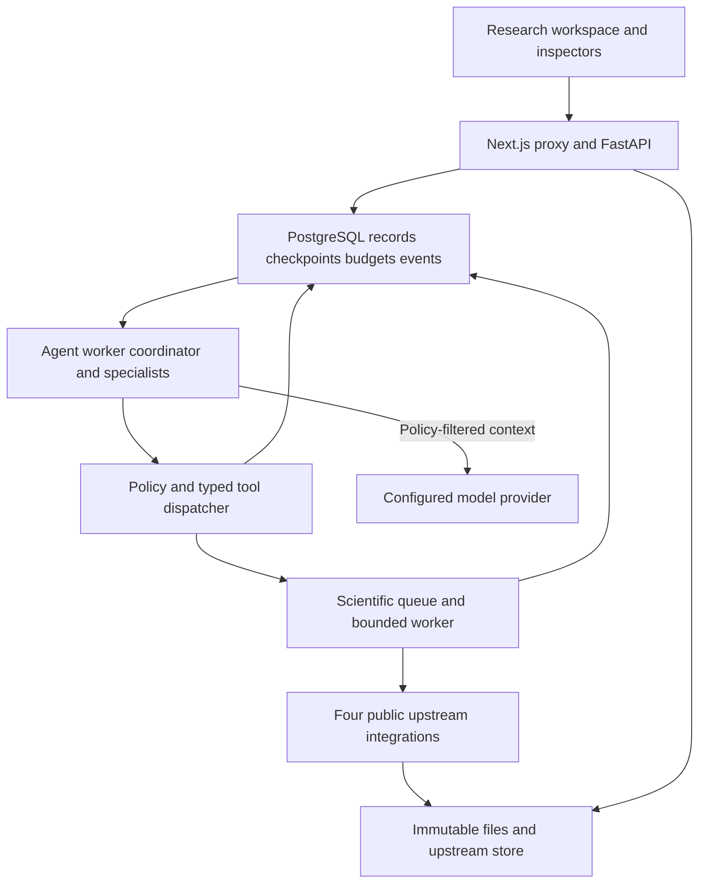
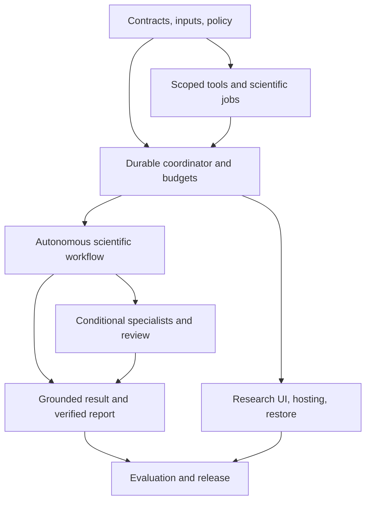

# SciML Workbench
## Agent operated research workspace design and implementation blueprint

Revised September 19, 2026. Draft 0.3. Supersedes the manual-first Draft 0.2.

## Summary

Build an agent-operated scientific ML workspace that takes a research goal, data, and papers and returns completed analysis, evidence-linked findings, recorded outcomes, and a verified reproducible report. The primary measure of success is useful research completed with minimal researcher intervention, while preserving scientific validity, provenance, and resource limits.

The normal interaction is: describe the goal, attach inputs, and select **Run research**. Under the saved project policy, the coordinator interprets the objective, inspects actual results, chooses and invokes supported tools, delegates useful independent investigations, revises its plan when justified, records eligible failures, and finishes the requested deliverables. An audit-only request remains an audit; it does not trigger unnecessary training or a team of agents.

**Autopilot is the default after one-time provider and project-policy setup.** A visible plan starts executing without an approval screen. Routine audit, split, baseline, local artifact creation, eligible recovery, failure recording, and report export need no additional clicks. **Review plan** is an optional mode. Missing essential scientific facts produce one focused clarification while independent useful work continues.

Preserve the four independently usable upstream projects: ChemData Auditor including SciSplit, Scientific Evidence Engine, ChemE ML Benchmarks, and Experiment Failure Memory. LLMs decide which supported operations to use and explain their outputs; the installed upstream packages still own the scientific methods. No generated Python, arbitrary shell, invented metrics, private upstream imports, or admission bypass is introduced.

Keep Next.js/TypeScript, FastAPI/Python, PostgreSQL, immutable local storage, and a modular monolith. Add a durable Python agent runtime, preferably LangGraph with PostgreSQL checkpoints, and one tested model-provider integration behind a small interface. Use the configured provider if suitable; otherwise implement Anthropic first. Exact SDK releases and available model IDs are verified and pinned during implementation, not invented in this design.

| Area | Target release behavior |
|---|---|
| Main workspace | Project conversation, attachments, editable plan, real progress, final answer and report |
| Autonomy | One request authorizes routine dependent operations within its intent and the saved policy |
| Coordinator | Adaptive goal interpretation, tool choice, result inspection, replanning, and completion decisions |
| Specialists | Conditional data/evaluation, evidence, failure-memory, and read-only scientific-review assignments |
| Input handling | Automatic file/schema inspection; reuse supplied metadata; preserve unresolved declarations explicitly |
| Scientific execution | Installed upstream APIs through typed tools and the durable scientific queue |
| Evidence | Resolvable source references, code-checked metric/reference consistency, qualified claims |
| Failure memory | Automatic eligible computational records with truthful actor attribution and uncertainty |
| Recovery | Checkpoint resume, fenced advancement, idempotent actions, bounded retries, receipt reconciliation |
| User controls | Pause, resume, cancel, targeted clarification, optional plan review, full manual fallback |
| Resource control | Atomic reservations for model usage and scientific work; saved partial results on exhaustion |
| Data sharing | One-time configured provider exposure; enforcement on every outbound context and trace |
| Reports | Frozen scientific inputs/results plus a separate sanitized agent execution record |
| Release metric | Zero required intermediate interventions for fully specified supported fixtures |

### Status and scope of this revision

The historical inspected repository baseline remains `d5c1520d03448fb917a10790b4c116f266014c06`. It contains the manual workflow, eight views, pinned adapters, artifact schemas, queue, reports, Compose, CI, and Render guide. This revision changes the design; it does not claim that an agent implementation, provider test, new migration, or live deployment has already been completed. The implementer must inspect the actual checkout before changing code.

The attached Agent and Multi-Agent Build Prompt is incorporated throughout the product, contracts, APIs, runtime, controls, tickets, and acceptance plan. Previous requirements for a click before every scientific step, manual-only retries/assessments, agent deferral, and absence of provider data flow are superseded. Independent upstream usability, immutable originals, project scoping, scientific admission, durable operations, and reproducibility remain required.

The eight detailed views remain supported inspectors and manual controls. Missing provider credentials disable agent execution clearly but leave manual scientific tools functional. This is a real tool-using agent release, not a chat overlay, a fixed pipeline renamed an agent, or a collection of mock result cards.

## 1. Product structure and authority

### 1.1 Project and research run

A project contains datasets, uploaded materials, evidence, scientific jobs and artifacts, failure records, reports, conversations, confirmed preferences, and a versioned execution policy. A research run is one accepted objective with a captured input scope, policy, plan, budget, and execution history. A conversation may contain several runs; a follow-up does not mutate an old completed run.

Project IDs and artifact IDs are server-generated. File names and project names never determine authority, a server path, or an external operation identity. One project can contain many datasets, formulations, papers, and experimental attempts, each with distinct lineage.

The run's allowed input IDs, not the browser's current selection or a model-supplied project ID, define its context. A researcher switching datasets in another tab cannot redirect an accepted run. New attachments or changed objectives are incorporated through a recorded amendment or a new run, with affected plan steps reconsidered explicitly.

### 1.2 One setup followed by low-friction use

An operator configures provider credentials and model IDs server-side, then selects a project policy covering data exposure, allowed tools/models, resource ceilings, warning rules, and automatic outcome recording. Sensible bounded defaults are supplied. Setup explains the external model data flow once; routine runs reuse it.

The researcher can ask a plain-language question without filling every tool form. Attachments are structurally inspected locally; reusable declarations come from explicit user statements, project preferences, source documents, or supported extraction. Unknown facts remain unknown. A missing license or independent-unit declaration does not prevent unrelated PDF ingestion or a descriptive audit.

### 1.3 Access remains independent of automation

The first deployment remains a private single-operator workspace, with the existing web login gate and server-to-server API token. The browser never receives the database, upstream, or provider credential. Shared operator access is not individual project membership; multi-user access remains a separate release.

An agent inherits a narrower execution context from the authenticated run. It cannot grant itself the operator's entire access, search other projects by inventing an ID, change policy, or retrieve secrets. Manual routes and agent tools call the same scoped services.

### 1.4 Authorization hierarchy

The effective authority is the intersection of server capability restrictions, the captured project policy, the accepted user request, the assignment's permissions, and the remaining budget. A request can narrow project policy. Expanding it requires an explicit operator policy amendment; the model cannot write that amendment.

One accepted request authorizes its ordinary supporting actions. Audit → inspect → split → admitted baseline → qualified summary → report can run without asking the researcher to approve each arrow. Tool dispatch still validates that each action actually supports the objective.

| Decision | Agent may do automatically | When researcher input is needed |
|---|---|---|
| Inspect attachments and project state | Read allowed files and existing artifacts; extract supported metadata | File is outside authorized scope |
| Configure an audit | Choose supported checks from schema and known declarations | Required scientific fact cannot be established and affects a requested conclusion |
| Choose a split | Match an available strategy to the objective and documented independent unit | Ambiguous grouping changes the meaning of generalization |
| Choose baselines/seeds | Use allowed models and reproducible seeds within budget | A requested method is unsupported or requires changed authority |
| Retry | Reconcile original operation; bounded retry of a classified transient failure | New scope/budget is needed, or scientific meaning would change |
| Accept a warning | Apply an explicit supported policy rule with its recorded justification | No applicable preauthorized rule exists |
| Record failure | Save objective computational failure or unmet declared criterion under policy | Subjective unsuccessful judgment lacks an agreed criterion |
| Export and verify | Build the requested output and verify it automatically | External publication or sharing is requested beyond the project's policy |
| Change original data | Never overwrite; use only explicitly supported, provenance-preserving transformations | A proposed transformation changes evidence or lacks a supported tool |

### 1.5 Independent upstream projects

Each upstream repository retains its own installation, CLI/API, tests, and documentation. The workbench installs exact versions and calls public interfaces. No upstream must depend on the coordinator, provider, or web UI to remain useful.

A missing public capability is a recorded integration gap. The runtime can use a narrower supported method, continue independent work, or return partial results. It cannot silently implement a different scientific algorithm in generated code or call private helpers to complete the plan.

## 2. Automated research workflow

### 2.1 Initial request

Example: “Assess whether these electrolyte data support predicting retention for unseen formulations. Check quality and leakage, compare the supported baselines, inspect the attached papers, record unsuccessful attempts, and export a reproducible report within my project budget.”

Run research captures the objective, selected materials, relevant conversation cutoff, policy version, and limits in one accepted run. Creating a project or dragging in a file alone does not imply consent to spend model budget; the Run action supplies that consent. A clearly phrased follow-up with Execute/Run has the same semantics.

The API returns a run ID immediately. A lost response is recovered with the same idempotency key; refresh never starts a second run. The browser is not required to stay open.

### 2.2 Inspect, reuse, and plan

The coordinator first inspects project capabilities and local metadata, retrieves relevant authorized artifacts and failure snapshots, and checks whether compatible completed work can be reused. Similar wording alone is not a reuse key.

It creates a short plan with stable step IDs, dependencies, expected outputs, material prerequisites, and completion criteria. In Autopilot, work begins immediately. The plan is visible and editable; it is not a mandatory approval screen. A simple request may need two tool calls and no delegation.

### 2.3 Resolve routine configuration

Local schema inspection identifies columns and structural issues without sending all rows to the model. The coordinator reuses supplied units, citations, target, empirical/synthetic classification, and grouping declarations. Every inferred field records its rationale, origin, and confidence/uncertainty.

A column named `cycle` does not prove which rows share a cell, and 1,000 points from 10 formulations do not imply 1,000 independent samples. Scientifically consequential ambiguity becomes a focused clarification, not a guessed admission card. Defaults such as a seed are chosen automatically and recorded.

### 2.4 Audit and revise from actual results

Submit the audit through the typed tool, checkpoint the returned job ID, and yield the agent worker while the scientific worker executes. Resume on durable completion or bounded polling. Inspect findings before deciding whether a requested split/benchmark is admissible.

A finding may lead to a corrected configuration based on existing evidence, a narrower supported analysis, a clarification, or an honest partial result. It must not lead to deletion of inconvenient rows or automatic error waivers. The agent's next action depends on the actual output; the workflow is not an unconditional chain.

### 2.5 Conditional parallel investigations

For a complex request, the coordinator may delegate evidence inspection and related-failure retrieval while the data/evaluation branch prepares its audit or partition. Assignments have separate contexts, scoped artifact references, tool permissions, budgets, and completion criteria.

The data/evaluation specialist cannot run a benchmark before its inputs exist. The evidence specialist cannot declare a model result. The reviewer cannot modify a split or waive an error. Waiting for one branch must not occupy the scientific worker or prevent other eligible work.

### 2.6 Freeze the evaluation design

Choose a supported split consistent with the objective and independent unit, then freeze the exact assignments. Capture the candidate model set and selection/evaluation protocol before releasing test results to any agent.

Use available validation results for model selection. Where the pinned upstream public API computes test scores during each baseline call, quarantine those outputs from agent-facing tools until the comparison is sealed. Section 12 defines this limitation and prevents claiming a physically separate final-test execution if the API does not provide one.

### 2.7 Execute and interpret supported baselines

Run allowed baselines through ChemE admission on the selected frozen partition. Preserve exact configuration, original bytes, upstream results, predictions, and software revisions. The coordinator checks successful results and rejection explanations, compares only compatible tasks, and follows the sealed protocol.

Routine admitted runs continue without human clicks. Bounded transient retries are permitted by policy. A scientific rejection is not retried indefinitely with the same inputs, and the agent cannot silently weaken the goal, change the target, relabel empirical data, or invent units to achieve success.

### 2.8 Clarify only material gaps

Collect currently known material questions into one request with the best-supported choices and consequences. Link each question to the steps it blocks. Continue authorized independent work while waiting; do not hold all branches because one paper is scanned or one column's unit is unknown.

The answer becomes a versioned clarification with attribution. It supplies or amends declarations; it does not rewrite old artifacts. Newly discovered material questions may be necessary, but never repeat a question whose answer is already in the captured project context.

### 2.9 Record eligible unsuccessful outcomes

Automatically record an objective admission/runtime failure or a result below a user-defined criterion when policy enables it. Store an agent actor, the observed error/criterion, run/tool references, and uncertainty. Suspected causes are explicitly hypotheses.

A completed baseline with a large error but no success criterion is a measured result, not automatically a failed experiment. The agent may flag it as concerning and explain the metric without impersonating a researcher who declared it unsuccessful.

### 2.10 Ground, review, and deliver

Build candidate claims from actual metrics and resolvable source references. Code checks identifiers, locators, quote hashes, values, and partitions; a read-only reviewer evaluates scientific support for consequential conclusions when warranted. Agreement among agents does not establish truth.

Automatically assemble and verify the requested scientific report plus a sanitized agent execution record. Present a concise final answer with results, uncertainty, limitations, source/artifact links, actions taken, skipped/blocked work, usage, and the download. An explanation-only request need not produce an archive; match the deliverable to intent.

For a fully specified supported fixture, acceptance requires zero intermediate clarification or approval actions after Run. Missing essential facts should produce useful partial progress and a precise question, never fabricated completeness.

## 3. Dataset and file model

### 3.1 Original bytes and display metadata

Compute SHA256 over the exact uploaded bytes. Preserve byte-order marks, line endings, quoting, and field values in storage. Parsing for validation or display must not replace the source blob.

The original filename is display metadata only. Sanitize it for display and response headers; use server-generated identifiers or digest keys for storage. A filename such as `../../data.csv` must never influence a path outside the managed root.

The UI can summarize rows and columns from the validated parse. That summary does not become a second authoritative dataset.

### 3.2 Metadata without an upload questionnaire

Automatically inspect structural metadata and preserve source declarations supplied with files, in the request, or in confirmed project preferences. Do not force the researcher to complete a large provenance form before any useful work can begin.

Introduce Dataset 2.0 with explicit declaration states; preserve the Dataset 1.0 reader. Each source/scientific declaration has a typed value or null, an origin (`user_supplied`, `source_derived`, `inferred`, `unknown`), supporting references, and applicable uncertainty. Missing empirical/synthetic classification stays unknown; it is never defaulted to synthetic.

| Declaration | Interpretation |
|---|---|
| Citation and source URL | Supplied or reliably extracted reference; unknown is allowed until required |
| License | Explicit source/user assertion; public availability never proves permission |
| Data kind | Empirical, synthetic, or unresolved; supported benchmark admission requires a valid concrete value |
| Transformations | Known extraction/cleaning/generation steps or explicit unknown status |
| Units and target | Reuse unambiguous supplied definitions; ask if ambiguity changes the requested analysis |
| Independent unit | Supported declaration and evidence; column names alone are insufficient |

Structural audit and PDF ingestion can proceed with incomplete source metadata when their public APIs permit it. Benchmark submission requires all declarations required by its public admission format. A projector creates that supported format only from resolved admissible values; it cannot fill unknowns with convenient placeholders.

Automatic schema inference is not a scientific fact. Store an inferred value as inferred, with its source and decision record; promote it to user-confirmed only after a user actually confirms it. Known demo metadata is populated only for the explicit bundled demo.

### 3.3 Validation limits

The existing baseline uses these initial limits; expose adjustable values only through validated server configuration where supported:

| Input | Initial rule |
|---|---|
| CSV/PDF request body | At most 10 MiB by default |
| CSV encoding | UTF-8, accepting a UTF-8 byte-order mark |
| CSV rows | At least 3 and at most 20,000 data rows by default |
| CSV columns | 1–200 unique, nonblank headers |
| CSV structure | Every row has the header's field count; reject malformed/ragged records |
| Scientific missing values | Preserve and delegate interpretation to upstream rules |
| Evidence title | Nonblank, at most 500 characters |
| Job execution | 900 seconds by default, measured from execution start |

Enforce request-size limits while reading, before expensive parsing. A file extension or `%PDF-` prefix is a preliminary type check, not proof that the full PDF is valid; ingestion runs in the bounded worker.

### 3.4 Immutability and corrections

There is no in-place CSV editor in the MVP. A corrected CSV is a new dataset upload. An amended split or benchmark configuration creates a new job and artifact. Existing reports remain tied to the old inputs.

The legacy artifact contracts do not define a formal revision-chain relation. Do not overload `parents` to claim a transformation occurred when the operator merely uploaded a replacement file. A later correction-link feature needs an explicit contract and UI.

### 3.5 Storage publication

Write bytes to a temporary file on the same filesystem, calculate/verify the digest, and atomically publish the final immutable object. Only then commit an artifact record referencing the object.

File storage and PostgreSQL do not share a transaction. A database rollback may leave an unreferenced blob; that is preferable to a committed artifact pointing at incomplete bytes. Never delete a digest automatically on rollback because another artifact may already reference it.

The pilot has no automatic garbage collector. Operator cleanup must identify references across all projects and report snapshots, respect a retention window, and avoid active job workspaces. General deletion and retention controls are deferred rather than implemented as unsafe recursive removal.

## 4. Upstream integration contracts

### 4.1 Version pins

The inspected baseline installs these exact revisions:

| Distribution or project | Git revision | Public integration boundary |
|---|---|---|
| `chemdata-auditor` | `eff3ed3c43ec71e9ceecabc1f04d1dfb5c91c116` | Package-root `AuditConfig`, `audit`, `SplitConfig`, `split`; documented result serialization and assignments |
| `cheme-ml-benchmarks` | `db02d8963725a1d406b9b07eb6f4cc3436fbb082` | Package-root `prepare`, `run_baseline`; documented external card and frozen partitions |
| `scientific-evidence-engine` | `09f5ec810e8f04bf8d233ec12eb9448342ee5121` | Package-root `ingest_paper`; returned record and exported evidence files |
| `experiment-failure-memory` | `63492787cbbea6d03662db63f2d958a6eec8d804` | Operator CLI, supported application factory, authenticated JSON API |

Keep Git references in `backend/pyproject.toml`, resolved Python constraints in `backend/constraints.txt`, and npm resolution in `frontend/package-lock.json`. Store the resolved package version and revision in artifact software metadata and the report environment record.

The pins are an inspected compatibility set, not a claim that they are the newest releases. Do not follow a moving branch at runtime.

### 4.2 Auditor and SciSplit adapter

The adapter accepts original CSV bytes and a configuration dictionary validated through the installed public configuration model. It parses the bytes using the representation expected by the integration and calls the public entry point.

Return upstream findings and result serialization without removing warnings or changing severity. A separate display projection may select safe fields for a table; the immutable artifact retains the original result.

For splits, require one valid assignment per source data row before publishing. This is an exchange-format integrity check, not a second splitting algorithm. The benchmark package independently validates admissibility of the resulting frozen partition.

Only advertise strategies verified against the installed revision. The broader repository roadmap may mention lab, time, scaffold, or extrapolation splits; that does not make every strategy available in this pinned MVP.

### 4.3 ChemE admission and baseline adapter

The adapter constructs a temporary task directory containing the byte-identical CSV, a documented task card, and a frozen partition JSON file. The frozen file includes dataset SHA256, row IDs, assignments, split configuration, and the SciSplit generator revision.

Call `prepare` with that task card. If it succeeds, call `run_baseline` with the prepared task, model choice, output directory, and seed. Preserve the card, frozen partition, prepared outputs, predictions, and metrics in the run bundle.

The current protocol is `cheme-tabular-v1`, with local regression tasks and the upstream `group_mae` primary metric declaration. Metric names, weighting, and interpretation come from the upstream protocol; the frontend does not recalculate them from predictions.

ChemE verifies a particular Auditor implementation. Updating Auditor alone may invalidate the frozen-partition provenance check. Do not disable its source guard, rewrite its dependency metadata, or substitute a different splitter because installation is inconvenient.

### 4.4 Evidence adapter

Call `ingest_paper` using a temporary input PDF and an isolated output directory. Persist the original PDF independently from the exported evidence bundle.

The initial public scientific surface remains PDF ingestion and its extracted outputs. The evidence agent may retrieve and cite those outputs through the new source-reference contracts. OCR and figure digitization remain unavailable until supported public APIs, extraction contracts, and acceptance fixtures are integrated. The agent cannot invent either capability.

### 4.5 Failure Memory adapter

The baseline embeds the unchanged upstream ASGI application using its public factory and calls its HTTP API through an ASGI transport. The adapter performs login, observes its CSRF mechanism, resolves/creates the workbench lab and project, imports the record, and logs out.

Use the installed CLI for operator provisioning and supported password maintenance. Keep upstream authentication and permission checks active even though the transport is in process.

Failure Memory's SQLite database is owned by Failure Memory. The workbench must not import private record-service helpers or directly inspect/update its tables. Its record schema remains an upstream schema; the workbench stores the returned snapshot and external identifiers.

### 4.6 Adapter interfaces

The following describes the intended internal boundary, not new upstream endpoints:

```python
class ScientificAdapters(Protocol):
    def audit(self, csv_bytes: bytes, config: dict) -> dict: ...
    def split(self, csv_bytes: bytes, config: dict) -> tuple[list[str], dict]: ...
    def benchmark(self, request: BenchmarkExecution) -> BenchmarkOutput: ...
    def ingest_evidence(self, pdf_bytes: bytes, title: str) -> EvidenceOutput: ...
    def import_failure(self, request: FailureImport) -> FailureReceipt: ...
```

`BenchmarkExecution`, output wrappers, and `FailureReceipt` are workbench transport types defined by B01/C01. They carry already-resolved inputs and safe result metadata. They do not expose database sessions or let the adapter select arbitrary project objects.

Adapters execute scientific operations and return values or classified failures. The application service owns artifact IDs, lineage, database publication, job state, and idempotency.


### 4.7 Retrieval capabilities and truthful fallback

Inspect Failure Memory's installed public search/read API before exposing retrieval. If it supports the required filters and access boundary, add that adapter; otherwise search the authorized workbench failure snapshots and label the coverage clearly. “No matches in saved workbench snapshots” is not “No such failures exist.” No direct upstream SQL search is allowed.

Evidence retrieval indexes only content actually extracted by the supported engine. Return source artifact IDs, exact extracted-text hashes, and resolvable locators. A locally built text index or metadata projection is orchestration infrastructure; it must not synthesize measurements, perform replacement figure digitization, or claim extraction succeeded when it did not.

### 4.8 Evaluation capability audit

Record whether the pinned ChemE public API supports validation-only execution, separated final test scoring, or a full baseline call returning both. Expose that capability to the protocol service, not as an unsupported UI promise. Preserve upstream computation and quarantine test outputs when necessary. A protocol requiring an unavailable capability returns a precise gap or an explicitly exploratory alternative.

## 5. Frontend and user experience

### 5.1 Research workspace as the primary entry

Open a project into a conversation with a goal composer, drag-and-drop CSV/PDF attachments, example goals, and Run research. Show the selected input scope and saved Autopilot policy compactly. Ordinary operation does not require choosing an agent, model-provider setting, or every scientific parameter.

After acceptance, show the plan and actual tool/event cards. The researcher can leave the page and return to the same run. A progress card links to an existing inspector instead of duplicating all scientific controls inside chat.

### 5.2 Plan and control behavior

Autopilot begins eligible work immediately. Review plan pauses once after planning and before scientific write actions, while allowing the permitted metadata reads needed to prepare the plan. It is an opt-in preference, not the default.

Pause stops new actions at the next safe dispatch boundary; completed work remains visible. Resume retains the run, inputs, remaining budget, and operation keys. Cancel stops future work and best-effort cancels solely owned running jobs, with already committed side effects shown. Never display Cancelled as if it rolled back an imported record.

Plan edits use expected revisions. A changed target invalidates affected pending steps and comparisons; in-flight results remain tied to their original inputs. Prompt text alone cannot retroactively edit a run or a scientific artifact.

### 5.3 Clarification and partial progress

Show a single inline clarification card listing known essential questions, suggested answers, evidence, consequences, and affected plan steps. Display continuing independent tasks beside it. Keep supplied answers across refresh; stale answers against a superseded question revision return a clear conflict.

Examples: “Does formulation_id identify independent formulations, with repeated cycles within each?” or “Is conductivity recorded in mS/cm or S/m?” Do not ask the researcher to choose a Python framework, approve routine report creation, or reconfirm a known unit.

A run with a blocked branch shows useful completed work and a concrete limitation. Partial results are a first-class outcome, not a generic error banner.

### 5.4 Preserve all eight inspectors

| View | Agent-operated behavior | Manual fallback |
|---|---|---|
| Projects | Show objectives, conversations, recent runs, datasets, and reusable preferences | Create/select projects and datasets directly |
| Evidence | Open cited passages, source locators, retrieval scope, contradictions, and extraction gaps | Upload/ingest PDF and inspect original/bundle |
| Dataset audit | Show selected checks, inferred/supplied inputs, actual findings, and agent response | Configure and run supported audit |
| Split designer | Show why a supported split was selected and the full frozen partition | Choose a supported split and generate it |
| Benchmark | Show sealed comparison, allowed baselines, validation/test visibility, results and failed attempts | Submit a task card and inspect results with exposure tracking |
| Failure memory | Show retrieved lessons, agent/human actor, objective criteria, saved records, and receipt uncertainty | Record a researcher assessment through the same scoped API |
| Provenance | Trace objective → plan step → tool action → scientific job → artifacts → claims | Navigate exact parents, parameters and software |
| Report | Automatically provide requested verified report and execution-record links | Request project-wide export and scientific replay |

The original scientific views remain fully usable without an API key. New policy, attribution, and integrity requirements still apply to their mutations.

### 5.5 Scientific display rules

Counts and progress are scoped to the selected dataset/run, not merely whether some project artifact exists. A completed audit with serious findings is not labeled clean. Missing metrics are unavailable, never zero. Partition colors have text/table equivalents; limited previews identify truncation and offer complete assignments.

Show actual dataset/split IDs, model, configuration origin, warning handling, metric partition, and limitations. The default presentation is readable; raw JSON and hashes sit in Details. Local benchmark results are not public leaderboard submissions.

### 5.6 Agent visibility

Show which role is working, what it is investigating, its dependencies, and its concise result. Do not require the researcher to manage individual workers. Simple tasks should not show four idle specialists for appearance.

Display decision summaries such as “Used formulation holdout because the requested population is unseen formulations,” tied to stored evidence. Never request or expose hidden reasoning, chain-of-thought, raw provider credentials, or fabricated completion percentages.

### 5.7 Streaming and reconnect

Use authenticated durable events through the Next.js proxy, with SSE and bounded polling fallback. Event IDs allow reconnect from the last known position; the current run/resource endpoints remain authoritative.

Closing an SSE connection does not cancel a run. Reconnecting fetches the accepted run before resuming event delivery. A duplicate event updates an existing card rather than creating another action. Raw model token streams may be shown as provisional narrative only; claims and action completion are published from validated records.

### 5.8 Outcome states

| State or condition | UI behavior |
|---|---|
| Waiting for scientific job | Show actual job and stage; no repeated Run button |
| Waiting for input | Consolidated question and useful completed/continuing branches |
| Paused | Show resumable checkpoint and remaining budget |
| Provider outage | Bounded retry/backoff state, then saved partial work if necessary |
| Budget exhausted | Stop new spending, show consumption and partial deliverables |
| Import outcome unknown | Show reconciliation; do not offer a new import as the default recovery |
| Completed | Validated result, source/artifact links, requested verified report |
| Partially completed | Explicit missing outputs, reason, preserved work, and bounded continuation options |
| Cancelled | Confirm stopped dispatch and list already completed or still-reconciling effects |
| Agent unavailable | Explain missing configuration and open manual tools |

### 5.9 Accessibility and friction measurement

Verify keyboard controls, clear labels, focus after validation, screen-reader status changes, usable narrow-screen forms, and non-color chart alternatives. Count required user interventions after Run in test telemetry. An extra confirmation dialog is a product regression unless it resolves an essential fact or changed authority.

## 6. Technology stack and hosting

### 6.1 Stack

| Component | Choice | Responsibility |
|---|---|---|
| Web application | Next.js, React, TypeScript | Views, forms, navigation, visualization, server proxy |
| Frontend dependency resolution | Existing npm lockfile | Reproducible package installation |
| API | FastAPI, Python 3.12 | Project actions, request validation, artifact reads, job submission |
| Contracts | Pydantic plus exported JSON Schema | Runtime validation and versioned artifact serialization |
| Metadata | PostgreSQL 16 reference environment | Projects, artifacts, jobs, operation receipts |
| Persistence layer | SQLAlchemy and Alembic | Queries, transactions, migrations |
| Scientific execution | PostgreSQL queue and Python worker subprocesses | Durable claims, bounded scientific execution, result publication |
| Agent runtime | LangGraph with PostgreSQL checkpoints, or verified suitable existing runtime | Durable coordinator decisions and scoped specialist contexts |
| Model integration | One tested provider, Anthropic by default if unconfigured | Server-side model/tool calls behind a small adapter |
| Agent progress | Durable events, authenticated SSE, polling fallback | Reconnectable UI updates |
| Scientific integration | Exactly pinned Git/Python dependencies | Upstream methods and supported exchange formats |
| File storage | Local content-addressed store | Immutable inputs and result bundles |
| Failure Memory persistence | Upstream-supported SQLite store | Independent upstream records and account state |
| Local runtime | Docker Compose | PostgreSQL, setup, API, worker, and web processes |
| Hosted pilot | Existing Render service topology | Persistent single backend instance plus Next.js and managed database |
| Tests | Backend tests, real package integration, browser tests | Contracts, concurrency, workflow, recovery, replay |

Continue with the repository's locked frontend versions unless a deliberate upgrade ticket changes them. This document specifies responsibility boundaries, not a requirement to upgrade every library while implementing the MVP.

### 6.2 Render topology

Run the Next.js server as a public web service. Run FastAPI, the scientific worker, and a separately scheduled agent worker in one private backend service with a persistent disk. Use the existing `python -m workbench.serve` entry point to run migrations/provisioning and supervise all three child processes. This launcher extension is a target change; the inspected baseline supervised API and scientific worker.

Keep the backend at one instance for the pilot. The API, worker, blobs, and upstream SQLite store must share the supported persistent filesystem. A second independent worker service cannot simply point at a local path on the first service.

The frontend, backend, and PostgreSQL should use the same configured region and the intended private backend address. The actual provider settings, available instance sizes, and prices must be verified when deployment is performed; no new price or capacity claim is part of this blueprint.

### 6.3 Vercel boundary

Vercel remains a possible later frontend host. Moving Next.js there does not move the Python worker, PostgreSQL, or persistent local files.

It would require a reachable, authenticated backend route and a reviewed network arrangement. Do not expose the existing private API publicly merely by changing `WB_API_URL`. Use the current all-Render pilot path until that change has its own deployment acceptance test.

### 6.4 Environment ownership

| Variable | Service that needs it | Meaning |
|---|---|---|
| `WB_DATABASE_URL` | Backend/setup/worker | PostgreSQL connection including credentials |
| `WB_STORAGE_ROOT` | Backend/setup/worker | Managed persistent root, `/var/data` in the current hosted guide |
| `WB_API_TOKEN` | Backend and Next.js server | Server-to-server bearer credential |
| `WB_API_URL` | Next.js server | Internal backend base URL |
| `WB_EFM_USERNAME` | Backend/setup/worker | Upstream operator account name |
| `WB_EFM_PASSWORD` | Backend/setup/worker | Upstream account credential |
| `WB_REQUIRE_LOGIN` | Next.js server | Production operator gate enabled with `1` |
| `WB_LOGIN_USERNAME` | Next.js server | Operator login name |
| `WB_LOGIN_PASSWORD` | Next.js server | Operator login password |
| `WB_PUBLIC_ORIGIN` | Next.js server | Exact public origin allowed for browser mutations |
| `WB_MAX_UPLOAD_BYTES` | Backend | Request-body limit; initial default 10 MiB |
| `WB_MAX_ROWS` | Backend | CSV row limit; initial default 20,000 |
| `WB_JOB_TIMEOUT_SECONDS` | Worker | Execution deadline; initial default 900 seconds |

Provider runtime values such as `PORT` and the Python runtime pin remain in the deployment guide. Local Compose database initialization values belong in the local environment template.

Do not prefix secrets with `NEXT_PUBLIC_`. Validate required values before accepting requests. Store examples as placeholders, with secrets generated by the operator and excluded from Git.


### 6.5 Model runtime configuration

Proposed server-only settings include `WB_AGENTS_ENABLED`, `WB_MODEL_PROVIDER`, `WB_COORDINATOR_MODEL`, `WB_SPECIALIST_MODEL`, and `WB_AGENT_CHECKPOINT_DATABASE_URL` (or the existing database URL through a dedicated schema/connection pool). Use the provider's server-side credential variable, such as `ANTHROPIC_API_KEY`, without exposing it to Next.js client code.

Project budgets, data-exposure rules, failure-record policies, and defaults are versioned database policy records, not editable environment values generated by the model. The operator may set server ceilings that project policies cannot exceed.

Implement one real provider end to end. Other provider names are not advertised as supported until their structured tools, usage accounting, errors, cancellation behavior, and live smoke checks pass. If no suitable configuration exists, Anthropic is the initial adapter; model IDs remain required configured values verified against the operator's available account.

Use provider-native typed client tools, but execute them through the workbench's dispatcher. The model emits an operation request; application code decides whether it is permitted and performs it. Do not automatically enable provider-hosted browsing, shell, or code execution. [Claude tool-use documentation](https://platform.claude.com/docs/en/agents-and-tools/tool-use/overview)

LangGraph checkpointers persist thread state; use a production PostgreSQL checkpointer rather than in-memory checkpoints. Keep graph state distinct from confirmed project memory and scientific records. Pin and test the chosen runtime/checkpointer/SDK set together during implementation. [LangGraph persistence](https://docs.langchain.com/oss/python/langgraph/persistence)

## 7. System design and source of truth



This remains one application codebase. Separate processes isolate long scientific execution from HTTP and model orchestration; they are not independent microservices. The agent worker yields while waiting for a scientific job instead of occupying its execution slot.

### 7.1 Sources of truth

| Information | Authority |
|---|---|
| Original inputs | Immutable content-addressed bytes |
| Declarations and confirmed preferences | Versioned user/source records with attribution |
| Accepted objective and policy | Run snapshot plus explicit amendments |
| Current plan | Latest committed plan revision; coordinator owns changes |
| Agent/tool authorization | Server dispatcher and effective policy, never prompt text |
| Scientific findings/partitions/metrics | Pinned upstream outputs retained in artifacts |
| Scientific job state | Guarded PostgreSQL job state |
| Agent advancement | Claimed run revision and persisted checkpoints/operation ledger |
| Model usage | Reservation and settlement ledger plus provider usage where available |
| Claims | Versioned claim artifacts and source/metric references, with review status |
| Upstream failure record | Failure Memory; workbench keeps immutable receipt/snapshot |
| Report contents | Frozen selected artifacts, execution cutoff, and manifest |

### 7.2 Short execution phases

Scientific execution follows claim → load immutable input → compute outside a transaction → publish immutable files → fenced artifact/provenance/terminal-state transaction. A scientific transaction does not stay open during training or extraction.

Agent advancement follows claim run → read checkpoint and operation ledger → reserve budget/record next action → release transaction → perform model/tool call → settle usage/receipt → checkpoint next state. No database lock is held during a provider request, human wait, or queued scientific job.

The run's relational state is the authority for cancellation, policy, budgets, ownership, and irreversible action intent. The graph checkpoint is the resumable decision state. They need explicit reconciliation because a checkpointer commit and an application transaction are not automatically one transaction.

### 7.3 Lock ordering and fencing

Operations touching multiple resources acquire locks in this order: project policy/budget root, run, assignment, action/budget reservation, scientific job. A queue claim needing only its own job releases that transaction before later acquiring a project/run barrier. Never hold a scientific job lock while waiting for a coordinator lock.

Use monotonically advancing fencing/claim tokens for run advancement and scientific result publication. A worker from an older claim may settle known usage or reconcile an already-dispatched side effect through the receipt service; it cannot schedule another operation, update the plan, or publish a late scientific success.

### 7.4 Internal versus external effects

Scientific artifacts and job state can publish atomically in PostgreSQL after their files are durable. Provider calls and upstream SQLite imports cannot share that transaction. Persist action intent first and reconcile receipts after uncertain outcomes. The design promises idempotent effects where supported and visible uncertainty otherwise, not distributed exactly-once execution.

### 7.5 Fail closed without unnecessary human work

Invalid tool arguments are returned to the coordinator for bounded repair when intent is clear. A scientific error cannot be repaired by policy evasion. A missing essential fact blocks only dependent steps. A provider outage or partial branch result should produce a useful saved outcome rather than a mandatory manual reconstruction of everything completed so far.

## 8. Database and persistent storage

### 8.1 Existing relational core

| Table | Existing main fields | Purpose |
|---|---|---|
| `projects` | `id`, `name`, `description`, `created_at` | Project metadata |
| `artifacts` | `id`, `project_id`, `kind`, `payload`, `created_at` | Immutable versioned artifact JSON |
| `jobs` | `id`, `project_id`, `request_key`, `kind`, `payload`, `state`, `result_id`, `error`, timestamps | Accepted operations and their durable execution state |

The core has one unique request key per project. Keep that uniqueness across operation kinds; reusing one key for a different operation is a conflict, not a second job.

PostgreSQL metadata does not replace the upstream Failure Memory database. Store external identifiers and receipts in workbench-owned structures only.

### 8.2 Target metadata extensions

Add only the metadata needed for the specified guarantees. Exact scientific column definitions belong in B02/B01; agent persistence is B11. Scientific and agent records have different lifecycle responsibilities.

| Structure | Fields or information to add | Reason |
|---|---|---|
| Jobs | Claim token/worker identity, fixed deadline, safe error code, optional `retry_of_job_id` | Reject late publication and explain authorized retry attempts |
| Jobs | Canonical request digest where useful | Detect incompatible replay without relying on request serialization order |
| Report job payload | Captured artifact IDs, sanitized job snapshots, project metadata, snapshot digest | Build one fixed export after the request returns |
| External operations | Job ID, connector, external ID, request digest, state, safe receipt/error, resulting artifact ID | Reconcile Failure Memory imports across independent transactions |

An external operation has `prepared`, `submitted`, `confirmed`, or `unknown` state. These are operation-receipt states, not scientific job states. A known failure before submission does not mean an external record exists.

Do not introduce a table for every scientific result when the versioned artifact payload already owns that content. Add query indexes or read projections when needed rather than duplicating mutable copies of metrics or assignments.

### 8.3 Integrity constraints

- `projects.id`, `artifacts.id`, and `jobs.id` are server-generated and stable.
- Artifact and job project IDs reference existing projects.
- `(project_id, request_key)` is unique.
- A non-null job result resolves to an artifact in the same project.
- A split references an audit for the same dataset.
- A benchmark references a split for the same dataset.
- A failure artifact references a benchmark in the same project.
- Published artifact payload, kind, ID, and project ID agree with the relational columns.
- Result and provenance publication is atomic with the job's terminal state.
- One external operation key identifies one exact connector request body.

Use database constraints where the relationship is relational. References nested in artifact JSON require application validation at both submission and publication. Parent existence is checked in project scope, not by a global artifact lookup.

### 8.4 Local storage interface

```python
class BlobStore(Protocol):
    def put(self, data: bytes) -> str:
        """Publish immutable bytes and return a validated storage key."""

    def get(self, key: str) -> bytes:
        """Read exactly that object; reject invalid keys and missing objects."""
```

This matches the deliberately small existing abstraction. Keep adapter callers independent of local paths. A future streaming extension can add methods without forcing the frontend or scientific packages to understand S3.

Current digest keys are internal object references, not public unauthenticated download URLs. A download route resolves an artifact in project scope before reading its referenced key. Do not add `GET /blobs/{arbitrary-key}` as an access bypass.

### 8.5 Persistent directory responsibilities

| Location | Contents | Owner |
|---|---|---|
| Storage root blob area | Original CSV/PDF files and immutable bundles | Workbench storage service |
| Storage root `failure-memory.sqlite` | Upstream application database | Failure Memory |
| Provisioning marker/state | Supported operator setup completion | Workbench bootstrap |
| Temporary execution directory | Adapter inputs, intermediate files, staged outputs | Worker process; disposable after completion |

Never execute a user-uploaded Python file or load an arbitrary serialized model. The MVP accepts CSV and PDF inputs and uses server-installed baseline implementations.


### 8.6 Agent persistence model

| Table or store | Principal fields | Responsibility |
|---|---|---|
| `project_policies` | project, revision, allowed actions/models, exposure, warning/failure rules, ceilings | Explicit operator authority; immutable revisions |
| `research_conversations` and `research_messages` | project, conversation, sequence, actor, content/material references | User objectives and visible assistant responses, not hidden reasoning |
| `agent_runs` | project, objective, input scope, policy revision, mode, state, control revision, plan revision, claim token, timestamps, output references | Durable accepted goal and current execution authority |
| `agent_run_amendments` | run, expected revision, user changes, policy changes, affected steps, timestamp | Explicit changes without overwriting original intent |
| `agent_plans` | run, revision, typed steps/dependencies, rationale summaries, expected artifacts | Versioned adaptive plan |
| `agent_assignments` | run, role, objective, allowed refs/tools, budget allocation, state, result, claim | Bounded specialist contexts and their returns |
| `agent_actions` | run, logical step/action ID, request digest, execution attempt, state, job/receipt/result IDs | Idempotent model/tool intent and observed outcomes |
| `run_job_links` | run, action, job, ownership mode, artifact reuse key | Distinguish solely owned jobs from reused/shared work |
| `agent_questions` | run, version, missing fields, blocked steps, options, answer, status, expiry | Consolidated user clarification with guarded answers |
| `usage_reservations` and `usage_entries` | project/run/assignment, request ID, reserved limits, observed usage, cost status | Atomic resource allocation and uncertain-usage accounting |
| `agent_events` | run, monotonically ordered sequence, type, safe payload, action reference | Reconnectable events committed with state transitions |
| `evaluation_protocols` and `test_exposures` | dataset/split fingerprint, candidates, sealed revision, release status, exposure event | Prevent test-informed changes to a claimed final evaluation |
| `project_memory` | scope, type, value, attribution, sources, valid/superseded status | Confirmed preferences distinct from provisional findings |
| Runtime checkpoint tables | thread/run ID, checkpoint version, runtime-owned state | LangGraph persistence managed through its supported API |

Do not create application dependencies on private LangGraph checkpoint table layouts. Back up those tables, but access them through the pinned runtime's documented interface. Use one stable root thread ID per research run and distinct namespaces/assignment IDs for specialists.

### 8.7 Agent constraints

- One accepted run per `(project_id, client_request_key)`; conflicting payloads reject with 409.
- One current coordinator claim per run, with compare-and-set revision/fencing on advancement.
- One logical action per `(run_id, action_key)`; a replay returns its stored outcome or pending receipt.
- Different execution attempts get distinct attempt IDs while retaining the same logical step and retry history.
- A scientific job cannot be cancelled on behalf of a run if another active owner depends on it.
- Question answers compare question/run revisions and cannot expand policy implicitly.
- Resource reservations count against project, run, and assignment limits in one transaction.
- Specialist allocations consume the parent's budget; they do not multiply it.
- Terminal run state is immutable; a continuation is a new run linked to the prior result and shared project budget.
- Same-project relationships hold for conversations, runs, assignments, actions, evidence references, claims, and reports.

### 8.8 Event ordering

Allocate a gap-free per-run event sequence under the run lock and commit the event with the state change. Do not rely on an independently allocated global sequence to imply commit order. The SSE transport sends committed events, and reconnect uses the last confirmed sequence.

Missed broadcasts do not change correctness: readers can page the durable events and current state. Event payloads are whitelist projections without raw prompts, dataset content, credentials, or hidden reasoning. Content needed for an inspector is retrieved through its scoped endpoint.

## 9. Artifact and shared contracts

### 9.1 Versioning policy

Artifact schema versions, API versions, upstream package versions, and report-manifest versions are different identifiers. Do not use one interchangeably with another.

The existing artifact envelope uses `schema_version: "1.0"`. Preserve its meaning. Old artifacts must remain readable after a deployment. Because current Pydantic models forbid unknown top-level fields, even an apparently additive field can break an old strict reader; prove compatibility or introduce an explicit new schema and reader.

Breaking changes require a new major artifact contract with an explicit migration/read policy. Never mutate stored 1.0 payloads to make a new reader pass.

Pydantic models are authoritative. Export JSON Schema from them, check generated files into version-specific directories, and make CI detect drift. Frontend types are generated or checked against those schemas; TypeScript alone does not validate an HTTP response.

### 9.2 Common envelope

The current shape is equivalent to:

```python
class ArtifactEnvelope(BaseModel):
    model_config = ConfigDict(extra="forbid", allow_inf_nan=False)

    schema_version: Literal["1.0"] = "1.0"
    id: str
    project_id: str
    created_at: datetime
    parents: list[str]
    software: dict[str, str]
```

This excerpt illustrates the boundary; implementers must import the repository model rather than copy a second definition. `kind` and `schema_version` together select the concrete reader in the new registry; the legacy kind-only union is retained only for legacy input.

`parents` identifies direct inputs, not every object in the project. `software` records software actually used. Do not populate a revision that does not match the installed environment.

### 9.3 Existing scientific artifact kinds

| Kind | Version 1.0 fields beyond the envelope | Invariant |
|---|---|---|
| Dataset | `filename`, `blob_key`, `sha256`, `rows`, `columns`, `source` | Hash identifies exact original bytes; source preserves upload declarations |
| Audit | `dataset_id`, `config`, `result` | Dataset is a direct parent; result is upstream audit output |
| Split | `dataset_id`, `audit_id`, `config`, `assignments`, `result` | One assignment per original row; dataset/audit chain is consistent |
| Benchmark | `dataset_id`, `split_id`, `model`, `seed`, `status`, `result`, `error`, optional `bundle_key`, `config` | Exact frozen split is retained; failed runs do not imply predictions exist |
| Evidence | `title`, `pdf_key`, `sha256`, `result`, `bundle_key` | PDF bytes and upstream evidence output are separately recoverable |
| Failure | `benchmark_id`, `external_project_id`, `external_record_id`, `reason`, `record` | Returned upstream record is a snapshot of one explicit assessment |
| Provenance | `activity`, `inputs`, `outputs`, `parameters` | Records the operation that produced its outputs from those inputs |
| Report | `blob_key`, `sha256`, `artifact_ids` | Archive corresponds exactly to the captured artifact set |

Upstream objects remain in `result` or `record` namespaces. Their internal field evolution does not authorize the workbench to reinterpret old values. Normalized display projections are separate response types and retain links to full artifacts.

### 9.4 Benchmark input contract

The following request mirrors the supported demo path. It is an example for the synthetic fixture, not a configuration for arbitrary research data:

```json
{
  "dataset_id": "dataset-id-from-upload",
  "split_id": "split-id-from-job-result",
  "target": "response",
  "numeric_features": ["temperature"],
  "categorical_features": [],
  "row_id": "row_id",
  "group_columns": ["group_id"],
  "units": {"temperature": "kelvin", "response": "dimensionless"},
  "independence_unit": "Generated family",
  "independence_status": "synthetic",
  "independence_rationale": "Each generated family is held entirely within one partition.",
  "generalization": "Held-out generated families only.",
  "limitations": ["Synthetic software fixture; not experimental evidence."],
  "domain": "materials",
  "accepted_warnings": {},
  "model": "ridge",
  "seed": 0
}
```

Validate structure and references in the application, then scientific admissibility upstream. The presence of a string in `independence_rationale` does not establish that the rationale is true.

### 9.5 Target job response

Retain the four-state scientific-job vocabulary. The target adds bounded verification/replay job kinds and safe metadata through a documented API change. Agent-run states are defined separately in section 20:

```typescript
type JobState = "queued" | "running" | "succeeded" | "failed";

interface JobResponse {
  id: string;
  project_id: string;
  kind: "audit" | "split" | "benchmark" | "evidence" | "failure" | "report" | "report_verify" | "scientific_replay";
  state: JobState;
  result_id: string | null;
  error: string | null;
  error_code?: string | null;
  retry_of_job_id?: string | null;
  created_at: string;
  started_at: string | null;
  finished_at: string | null;
  deadline_at?: string | null;
}
```

Claim tokens, credentials, raw exception traces, database URLs, and internal paths are never response fields. A failed job may have a result artifact, especially a failed benchmark. The UI must not discard `result_id` merely because `state` is `failed`.

### 9.6 Schema checks at component boundaries

Validate incoming requests, adapter output wrappers, persisted artifact payloads, and exported manifests. Raw upstream dictionaries can remain opaque, but they must be JSON-serializable without NaN/Infinity and their required exchange-format fields must pass the integration checks.

Do not convert an unknown upstream metric to zero, an unknown partition to train, or a missing evidence page count to a fabricated value. Missing or unsupported content must remain visible as such.


### 9.7 New versioned records

The new capabilities require real contract changes, not strings inserted into human-only fields. Define strict Pydantic models and exported JSON schemas for the following. Existing readers remain available; no stored 1.0 artifact is silently rewritten.

| Contract | Version | Required information |
|---|---|---|
| Dataset | 2.0 | Legacy byte identity/shape plus typed nullable source declarations, origin, supporting references, unresolved fields |
| Failure assessment | 2.0 | Benchmark/source job, reason, uncertainty, observed outcome or criterion, truthful actor, policy/run/action references, upstream receipt/snapshot |
| Evidence reference | 1.0 | Source artifact and source file hash, extracted representation hash/version, locator, excerpt hash, availability |
| Claim set | 1.0 | Statements, classification, metric/source refs, scope/limitations, code validation, semantic review status |
| Evaluation protocol | 1.0 | Exact dataset/split/config fingerprints, allowed candidates, metric selection rule, sealed revision, exposure status |
| Agent execution record | 1.0 | Goal/input/policy snapshots, plan revisions, safe decisions, assignment/action/job refs, budgets/usage, versions, final state/cutoff |
| Run, plan, delegation, question and tool envelopes | 1.0 each | Runtime/API records validated separately from scientific artifacts |

Artifact records still carry IDs, project, timestamps, parents, and software. Runtime records such as budgets are operational metadata; they need typed contracts but need not all be artifact rows.

### 9.8 Actor attribution

An assessment actor is `human` or `agent`; an operational cancellation is recorded separately and is not an experimental failure. For an agent, require `run_id`, `assignment_id` if delegated, `action_id`, model/prompt versions, and the policy rule authorizing the assessment. For a human in the pilot, identify the operator session context without pretending it is a verified multi-user identity.

Failure 2.0 preserves the observed error or criterion and separates causal hypotheses. Import only fields supported by Failure Memory, using its source/notes fields for an honest agent-recorded explanation where supported. Retain structured attribution in the workbench even if upstream has no matching actor column. Never label an agent-generated reason as a researcher statement.

### 9.9 Evidence reference example

Illustrative values below are placeholders, not real extracted evidence:

```json
{
  "contract": "evidence_reference",
  "schema_version": "1.0",
  "source_artifact_id": "evidence-artifact-id",
  "source_sha256": "source-pdf-sha256",
  "representation_sha256": "extracted-text-sha256",
  "extraction_version": "recorded-upstream-version",
  "locator": {"kind": "text_span", "unit": "unicode_codepoint", "start": 120, "end": 236},
  "excerpt_sha256": "exact-excerpt-sha256",
  "page": null
}
```

Production schemas require valid 64-character digests and bounded offsets. Define the exact extracted UTF-8 text representation and newline normalization before hashing. Offset units are explicit; byte offsets and Unicode code points must not be confused. Set a PDF page only when the extraction establishes a reliable mapping.

### 9.10 Claims and decisions

A claim has a stable ID, statement, classification (`computed_result`, `source_supported`, `interpretation`, `hypothesis`), exact references, applicable population/split, uncertainty, and review status. Metric references identify artifact ID, field path, evaluation partition, units when defined, and value; code checks them against the artifact.

Consequential factual claims without a resolvable reference cannot be published as established results. Interpretations can be qualified; hypotheses remain hypotheses. The semantic reviewer does not certify a claim merely because a quoted span exists.

Store short decision summaries with input references and selected action. Do not request, expose, or store hidden model reasoning. Provider protocol material required for a supported API continuation, if any, is opaque server state: disable optional hidden-reasoning capture and exclude opaque protocol material from user-visible traces, memory, and reports.

### 9.11 Plan and assignment contracts

```typescript
interface ResearchStep {
  id: string;
  objective: string;
  depends_on: string[];
  allowed_input_ids: string[];
  expected_artifact_kinds: string[];
  completion_criteria: string[];
  status: "pending" | "ready" | "running" | "blocked" | "completed" | "failed" | "skipped";
}

interface SpecialistAssignment {
  id: string;
  run_id: string;
  plan_revision: number;
  role: "data_evaluation" | "evidence" | "failure_memory" | "scientific_reviewer";
  objective: string;
  allowed_artifact_ids: string[];
  allowed_tools: string[];
  budget_allocation_id: string;
  completion_criteria: string[];
}
```

Server code supplies run identity, permissions, and allocation IDs. A model proposal is validated against the effective policy and graph constraints before an assignment exists. Structured returns contain findings, supporting references, uncertainty, unresolved issues, and recommended actions.

## 10. API and component contracts

### 10.1 Existing route surface

The table describes FastAPI routes. Browser traffic reaches them through the existing Next.js server proxy; the browser does not attach the backend bearer token itself.

| Method and route | Operation | Successful response |
|---|---|---|
| `GET /health` | Basic backend/database health | Health object; no project data |
| `GET /api/v1/schema` | Protected API schema | OpenAPI document |
| `GET /api/v1/projects` | List operator projects | Project array |
| `POST /api/v1/projects` | Create project | 201 project object |
| `GET /api/v1/projects/{p}/artifacts` | List project artifacts | Artifact array |
| `GET /api/v1/projects/{p}/artifacts/{a}` | Read exact artifact | Artifact object |
| `GET /api/v1/projects/{p}/artifacts/{a}/download` | Download supported artifact file | Authenticated file response |
| `POST /api/v1/projects/{p}/datasets` | Upload CSV and source metadata | 201 dataset artifact |
| `POST /api/v1/projects/{p}/audit` | Queue audit | 202 job object |
| `POST /api/v1/projects/{p}/split` | Queue SciSplit | 202 job object |
| `POST /api/v1/projects/{p}/benchmark` | Queue baseline | 202 job object |
| `POST /api/v1/projects/{p}/evidence` | Upload PDF and queue ingestion | 202 job object |
| `POST /api/v1/projects/{p}/failure` | Queue failure assessment import | 202 job object |
| `POST /api/v1/projects/{p}/report` | Capture and queue report export | 202 job object |
| `GET /api/v1/projects/{p}/jobs` | Read project job history | Job array |

Next.js also exposes the existing public `/healthz` liveness response. It must not return configuration, authenticated content, or proof that the scientific worker is healthy.

### 10.2 Upload and request conventions

The existing CSV endpoint accepts raw bytes with `X-Filename` and JSON source metadata in `X-Source`. The PDF endpoint accepts raw bytes with `X-Title`. Queued operations require `Idempotency-Key`.

Preserve these documented conventions for compatibility. If proxy/header limits make metadata headers unsuitable, introduce a versioned multipart request and migrate callers deliberately; do not have two services silently disagree about the upload encoding.

Legacy project creation/CSV upload did not have job idempotency. Preserve those routes for compatibility, and add request-key deduplication to the new research attachment/promote path before an agent can invoke it. A deliberate separate upload still creates a separate record; transport retry must not.

### 10.3 Target additive read surfaces

These are proposed endpoints for B09, not existing APIs:

| Route | Purpose |
|---|---|
| `GET /api/v1/capabilities` | Return tested model/strategy choices, supported contract versions, and effective nonsecret limits |
| `GET /api/v1/projects/{p}/jobs/{j}` | Poll one job without downloading the entire history |
| `GET /api/v1/projects/{p}/artifact-index?after=...&limit=...` | Paginated lightweight artifact metadata for growing projects |
| `GET /api/v1/projects/{p}/job-index?after=...&limit=...` | Paginated job history without changing the existing array route |

Use bounded limits and opaque cursors derived from stable ordering such as creation time plus ID. An artifact detail request returns the full immutable artifact. Do not squeeze assignments out of a full contract simply to optimize a list response; define a separate summary type.

Resubmission can use the existing operation route with a new request key. The agent service uses the same submission service through a recorded new execution attempt when policy permits; it never simulates a researcher button click. If `retry_of_job_id` is accepted, verify that the referenced job belongs to the same project and compatible operation kind.

### 10.4 Submission transaction

For a queued operation:

1. Authenticate and validate the request shape.
2. Acquire the short project barrier.
3. Look up the request key. If already accepted with the same canonical input, return that job.
4. If the key exists with different content or kind, return a conflict.
5. Resolve referenced artifacts and validate the lineage.
6. Insert the immutable payload and queued job; commit before returning 202.

The unique constraint handles genuinely concurrent first submissions. Catch a uniqueness conflict, read the winner, and compare the input rather than converting every duplicate into an internal server error.

For a repeated report request, return the original snapshot job before considering newer active jobs. A lost response must not turn a valid prior request into a different report or a new conflict.

### 10.5 Error response contract

**Target change:** add stable codes and correlation IDs while retaining the current top-level error string and validation-detail list. Do not replace the string with an object under the same API version without a migration.

```json
{
  "error": "The selected split belongs to another dataset.",
  "error_code": "LINEAGE_MISMATCH",
  "request_id": "server-generated-request-id",
  "details": [
    {"loc": ["body", "split_id"], "msg": "Choose a split for the selected dataset."}
  ]
}
```

| Code | HTTP status for request failure | Meaning |
|---|---|---|
| `UNAUTHORIZED` | 401 | Missing or invalid required credentials |
| `ORIGIN_REJECTED` | 403 | Browser mutation origin is not allowed |
| `PROJECT_NOT_FOUND`, `ARTIFACT_NOT_FOUND`, `JOB_NOT_FOUND` | 404 | Requested object is absent in the authorized project scope |
| `IDEMPOTENCY_CONFLICT` | 409 | Request key already describes another operation |
| `PROJECT_BUSY` | 409 | New report snapshot cannot capture unsettled work |
| `VALIDATION_FAILED`, `LINEAGE_MISMATCH` | 422 | Invalid request or mismatched artifact chain |
| `UPLOAD_TOO_LARGE` | 413 | Request exceeds effective byte limit |
| `STORAGE_UNAVAILABLE`, `DEPENDENCY_UNAVAILABLE` | 503 | Required service or storage cannot currently serve the operation |
| `INTERNAL_ERROR` | 500 | Unexpected failure; inspect redacted logs using request ID |

Accepted asynchronous operations still return 202. Later scientific rejection, timeout, or interruption appears on the job with codes such as `ADMISSION_REJECTED`, `JOB_TIMED_OUT`, `WORKER_INTERRUPTED`, `INTEGRITY_FAILED`, or `EXTERNAL_OUTCOME_UNKNOWN`; these are not delayed HTTP status codes.

### 10.6 Internal service ownership

| Service boundary | Owns | Must not own |
|---|---|---|
| Project/input service | Project records, upload metadata, input validation | Model training |
| Job service | Accepted requests, idempotency, state guards | Scientific algorithms |
| Artifact service | Contract validation, lineage, atomic publication | Editing upstream data stores |
| Storage service | Immutable bytes and validated keys | User permission decisions without artifact context |
| Scientific adapters | Public calls and supported exchange formats | Job lifecycle or browser selections |
| Report service | Snapshot assembly, manifest, readable summary | Choosing new scientific parameters |
| Runtime service | Claims, process deadlines, startup/shutdown | Bypassing artifact validation |

These are module boundaries inside the existing backend package. They do not require a framework rewrite, dependency-injection platform, or microservice deployment.


### 10.7 Agent and policy routes

All routes are project-scoped and require the same authenticated proxy/session context. Mutations use request keys and expected revisions where state can be edited.

| Route | Operation |
|---|---|
| `GET/PUT /api/v1/projects/{p}/execution-policy` | Read policy or create an explicit operator revision; no agent write permission |
| `POST /api/v1/projects/{p}/research-materials` | Idempotent CSV/PDF attachment with optional declarations; bytes preserved before run |
| `GET/POST /api/v1/projects/{p}/conversations` | Read/create research conversation |
| `POST /api/v1/projects/{p}/conversations/{c}/messages` | Append user text/attachments; ordinary discussion alone does not start spending |
| `POST /api/v1/projects/{p}/agent-runs` | Accept objective, input IDs, conversation cutoff, policy revision, mode, limits; return 202 run |
| `GET /api/v1/projects/{p}/agent-runs` | Cursor-paginated run history |
| `GET /api/v1/projects/{p}/agent-runs/{r}` | Current run, plan, progress, questions, budgets, deliverable links |
| `POST /api/v1/projects/{p}/agent-runs/{r}/amend` | Apply user scope/plan amendment with expected revision |
| `POST /api/v1/projects/{p}/agent-runs/{r}/questions/{q}/answer` | Answer a current question; store attribution and resume eligible work |
| `POST /api/v1/projects/{p}/agent-runs/{r}/pause` | Stop new dispatch at a safe boundary |
| `POST /api/v1/projects/{p}/agent-runs/{r}/resume` | Continue the same paused/input-resolved run without resetting usage |
| `POST /api/v1/projects/{p}/agent-runs/{r}/cancel` | Cancel future dispatch and manage already accepted actions |
| `GET /api/v1/projects/{p}/agent-runs/{r}/events?after=...` | Durable ordered events for polling/recovery |
| `GET /api/v1/projects/{p}/agent-runs/{r}/stream` | Authenticated SSE with event IDs; polling fallback |
| `GET /api/v1/projects/{p}/agent-runs/{r}/result` | Validated final/partial result and source/report references |
| `GET /api/v1/projects/{p}/memory` | Authorized confirmed preferences and scoped findings |
| `POST /api/v1/projects/{p}/memory/{m}/correct` | User correction/supersession with expected revision |

The attachment route accepts unresolved source declarations through the new contract rather than making the browser forge legacy required fields. Never expose an HTTP endpoint that accepts a replacement graph checkpoint, arbitrary tool permission set, or a client-supplied coordinator lease.

### 10.8 Accepting a run

In one short transaction, authenticate, resolve all selected inputs/conversation records, validate the captured policy, compare/reuse the client request key, reserve admission capacity if applicable, create the run, and append its accepted event. Schedule graph initialization after commit through durable scheduling state.

If scheduling fails after acceptance, the run still exists and a scheduler sweep can pick it up. The API does not invoke a provider before recording the run. Unknown provider credentials produce a clear agent-unavailable response before creating billable work; manual tools remain available.

### 10.9 Agent errors

Add stable codes including `AGENT_UNAVAILABLE`, `POLICY_DENIED`, `DATA_EXPOSURE_DENIED`, `RUN_REVISION_CHANGED`, `QUESTION_STALE`, `BUDGET_EXHAUSTED`, `PROVIDER_UNAVAILABLE`, `TOOL_SCHEMA_INVALID`, `UNSUPPORTED_CAPABILITY`, `REFERENCE_INVALID`, `TEST_PROTOCOL_SEALED`, and `RUN_CANCELLED`.

Use the existing compatible error envelope. Provider/rate-limit problems trigger bounded policy-controlled recovery; denied authority is not solved by repeated prompting. A partial run result contains a stop reason and completed artifacts, not only an HTTP error message.

## 11. Background jobs and recovery

### 11.1 Job lifecycle

Retain the existing job states:

| State | Meaning | Allowed next state |
|---|---|---|
| `queued` | Accepted durable request, not claimed | `running`; `failed` for a documented pre-execution integrity failure or fenced cancellation |
| `running` | One current worker claim is executing | `succeeded` or `failed` |
| `succeeded` | Required outputs were atomically published | None |
| `failed` | Scientific rejection, execution failure, or fenced operational cancellation is recorded | None |

A policy-authorized automatic retry or manual resubmission creates a new job. It does not change a failed row back to queued. The original input, explanation, and any result artifact remain available.

Agent cancellation is required. Preserve the four-state job vocabulary initially by terminalizing a safely stopped solely owned job as `failed` with `RUN_CANCELLED`, while the parent agent run becomes `cancelled`. This operational outcome is not eligible for an automatic scientific-failure record. Store a cancellation request/control generation, fence publication, and terminate its process safely. Already completed or shared jobs are retained; a cancelled run detaches from shared work without stopping another consumer.

### 11.2 Atomic claims

Use PostgreSQL row locking with `FOR UPDATE SKIP LOCKED` to claim one eligible queued job in a short transaction. Record the claim identity, start time, and deadline before launching scientific execution.

The initial hosted worker processes one job at a time. Database-safe claims do not imply that arbitrary worker replicas are operationally supported: local file access and the upstream SQLite store still constrain deployment.

Use database time for persisted timestamps/deadlines and a monotonic timer for process waiting. Queue wait time does not consume the execution allowance. A retry receives a new execution deadline because it is a new recorded execution attempt.

### 11.3 Execution fencing

**Target change:** every result publication compares the job's current claim token, running state, and deadline against the execution that produced it. The parent worker is responsible for publication authorization; a detached child cannot publish simply because it knows a job ID.

Terminate an expired subprocess, then kill it if it does not exit within the configured grace period. A result arriving after the deadline is not accepted as successful. Do not accept output merely because its temporary file timestamp precedes the deadline.

A stale-job sweeper can mark abandoned work failed, but its update must be guarded against an already terminal row. An exception handler must not overwrite a success committed by another valid completion path.

### 11.4 Scientific outcome versus job outcome

| Situation | Job state | Benchmark artifact | Outcome interpretation |
|---|---|---|---|
| Audit finishes with findings | `succeeded` | Not applicable | Agent or researcher interprets findings using actual outputs |
| Baseline admitted and executed | `succeeded` | `status: succeeded`, result bundle | Agent may apply a predeclared criterion; researcher may make an attributed assessment |
| Admission rejected | `failed` | `status: failed`, safe rejection reason, no invented predictions | May be saved to Failure Memory |
| Benchmark times out or worker dies | `failed` after recovery | Target: failed artifact from captured request, when metadata/storage are available | Operational failure, not a measured experimental outcome |
| Failure import cannot confirm outcome | `failed` with explicit code | Original benchmark remains unchanged | Import receipt requires reconciliation |

**Existing:** admission-related exceptions can already produce failed benchmark artifacts. **Target change:** extend the same traceability to bounded runtime failure. Preserve dataset ID, split ID, model, seed, configuration, and explanation; leave result data empty when it was not produced.

The original scientific job must not be rerun just to construct its failure artifact. If PostgreSQL was unavailable, recovery creates the record after connectivity returns using persisted input metadata.

### 11.5 Automatic recovery within policy

Separate a transport replay, receipt reconciliation, and a new scientific attempt. A lost submission response repeats the exact request key and returns the accepted job. An uncertain upstream import reconciles its original external ID. Neither allocates another scientific experiment.

A known transient failure may create a new execution attempt automatically if retry class, budget, and user intent permit it. Keep the original job, reason, attempt count, changed inputs if any, and new key. Bounded retries do not require a new human click. Persistent deterministic rejection of unchanged inputs is not transient.

The coordinator may repair a syntactically invalid tool call from known context or select a supported alternative consistent with the objective. It cannot alter scientific meaning, discard data, waive non-waivable errors, or expand budget. An unresolvable material gap becomes a consolidated clarification or partial result.

### 11.6 Failure Memory side effects

PostgreSQL and Failure Memory's SQLite transaction cannot commit atomically. An import may succeed upstream and then lose its workbench response or database commit.

Use a workbench-owned external-operation journal:

1. Persist the exact import body, its digest, connector identity, and stable external ID before calling the upstream API.
2. Bind that external ID to the original job ID. Do not derive it from mutable project names or assessment text.
3. Mark the call submitted in durable metadata.
4. Call the documented idempotent import endpoint.
5. Persist the returned upstream IDs and snapshot, then publish the Failure artifact under the normal guarded publication boundary.
6. If outcome cannot be determined, record `unknown` and show reconciliation required.

The existing adapter already uses the job ID as the import external ID. The journal and reconciliation behavior are target changes, not a reason to replace the supported API.

The trusted reconciliation service, automatically within policy or through an operator command, may repeat the exact documented idempotent import using the original external ID and body digest. It does not create a new scientific experiment or a new assessment. A confirmed receipt can publish the missing Failure artifact in a short recovery transaction and link it through the journal. The original failed job remains failed; its history is not rewritten to pretend the interruption never happened.

The job detail/read projection may expose the resolved receipt artifact separately from its original `result_id`. Define that projection in B01/B09. Never change the original request body during reconciliation. If the installed upstream behavior cannot confirm idempotency, stop for operator inspection rather than guessing.

### 11.7 Startup and shutdown

Startup validates configuration, applies controlled migrations, provisions the upstream account when needed, checks writable storage, and starts the API, scientific worker, and separately scheduled agent worker. Do not allow two bootstrap routines to race to provision the same upstream account.

A scientific worker restart does not blindly replay running jobs. The agent coordinator resumes from durable state and may reconcile or create a bounded new attempt under its saved policy. Reconcile abandoned claims using their deadline and worker ownership; preserve queued jobs for normal claiming. On the single-backend topology, the supervisor must ensure prior child processes are terminated before the replacement accepts their work as abandoned.

Graceful shutdown stops new claims and permits the current job to finish only within the shutdown allowance. Otherwise terminate the subprocess and leave a recoverable interrupted outcome. Recovery must reject any subsequent result from that expired execution.

### 11.8 Failure matrix

| Failure | Preserved state | Recovery |
|---|---|---|
| Browser disconnect | Accepted job and committed artifacts | Re-fetch state and reuse request key if acceptance was uncertain |
| Process exits before claim | Queued job | Another worker iteration claims it |
| Worker dies during audit or training | Job payload and original inputs | Mark interrupted; preserve failed-run context; policy-bounded new attempt or partial result |
| Files saved but publication rolls back | Immutable unreferenced files | No success shown; later controlled cleanup |
| Failure import committed but receipt lost | Stable external operation ID/body | Reconcile original import; do not submit a new assessment |
| Report archive build interrupted | Captured report snapshot | Retain snapshot/job; policy-controlled new attempt reuses the intended frozen snapshot |
| Database unavailable | Existing durable DB state and local objects | Fail safely; resume reconciliation after connection returns |
| Disk full or checksum mismatch | Previously committed immutable objects | Fail operation, alert operator, restore capacity/integrity |

## 12. Scientific execution rules

### 12.1 Audit findings are evidence, not automatic repair

The workbench does not edit a CSV to make an audit pass. If duplicate rows, impossible values, unit problems, sparse coverage, or provenance gaps are found, show the upstream evidence and recommended action.

A researcher may upload a corrected dataset and run another audit. Do not drop rows, convert units, or merge formulations without a new explicit data transformation and provenance record.

### 12.2 Partition integrity

Before publishing a split artifact, verify its labels are allowed and its length matches the parsed source row count. Retain original order so index `i` identifies the same original row throughout the workflow.

When building the benchmark exchange file, map source row IDs to those exact labels. Check for missing/duplicate row identifiers through the upstream admission path and supported input validation. Never truncate assignments with an unchecked `zip` and treat the shorter result as a complete partition.

Include excluded rows explicitly. They are not silently folded into training. All original rows must be accounted for even when the upstream policy excludes some from evaluation.

### 12.3 Preventing leakage

Target values cannot be feature inputs or a hidden partition criterion under the supported benchmark protocol. Group declarations in the task card must match the intended independent unit and frozen partition.

ChemE performs its own admission audit using the actual evaluation configuration. Passing the earlier user-configured audit does not guarantee admission; the later card may declare a different feature set, unit mapping, or official partition column.

The workbench must not pre-fit scaling, imputation, encodings, or feature selection on the full dataset. It passes raw inputs and declarations to the supported benchmark workflow, which owns training-only preprocessing and its validation/test protocol.

### 12.4 Warning handling without repetitive approval

Warnings can be accepted only through the upstream's explicitly waivable mechanism and an applicable versioned policy rule or explicit user justification. Match warning code, dataset/task conditions, permitted severity, and required rationale. The agent records the rule ID, policy revision, evidence, and exact justification passed to admission.

Do not generate generic justifications for every warning. No matching rule means the dependent action stays blocked while other useful work continues. Non-waivable errors remain blocking regardless of coordinator or reviewer confidence. Updating the policy is an operator action, not a tool available to the agent.

### 12.5 Sealed evaluation and test exposure

Create an evaluation protocol with dataset hash, target, features, preprocessing declaration, independent groups, full split digest, candidate models/seeds, primary metric, success criterion if supplied, and model-selection rule. Seal candidates and scientifically consequential choices before any agent sees test outputs. Scientific computations remain upstream-owned.

If a verified public upstream API supports validation-only training and separate final test evaluation, use it. If the pinned baseline call returns test results immediately, keep the complete result server-side and expose only permitted validation projections until the predeclared comparison is complete. This is a visibility boundary, not a claim that test computation occurred later.

Every access path used by agents—including artifact JSON, predictions, bundles, reports, memory, reviewer context, and reused artifacts—respects this boundary. A direct manual inspection can reveal test results but records an exposure event and prevents a later run from claiming an untouched test estimate. Masking one metric card is insufficient.

Select by validation information where supported. If validation output is unavailable through supported interfaces, use a predeclared fixed comparison without post-hoc winner selection, or report the capability gap. Do not compute replacement metrics locally or choose the lowest test error and call that validation.

Release test results once the comparison protocol is sealed and accepted jobs settle. No automated test-informed tuning follows. A subsequent exploratory analysis is a new labeled protocol retaining exposure history. Fingerprint equivalent datasets/splits rather than allowing duplicate upload IDs to reset this history; retain only authorized exposure metadata across permitted scope.

Automatic replays verify recorded computations and do not create new model-selection opportunities. Describe conclusions narrowly for repeated formulations, composition aliasing, small independent sample counts, and other upstream findings.

### 12.6 Reproducibility claims

Exact original-byte hashes and identical split assignments are hard verification criteria. Floating-point predictions and metrics use documented tolerances in the tested pinned environment.

Do not promise bitwise-identical model outputs on every CPU, operating system, or dependency resolver. Record Python, package versions, upstream commits, workbench commit, configuration, and seed so a mismatch can be investigated.

## 13. Evidence grounding and failure record semantics

### 13.1 Supported evidence retrieval

Use original PDFs and the exact supported extracted representation. Retrieve relevant spans with stable locators, source artifact IDs, document and representation hashes, and excerpt hashes. A page number is shown only when extraction provides a reliable mapping; otherwise show the precise text locator.

Locally indexing extracted text is allowed. Inventing quotations, equations, measurements, calibration, OCR, or page locations is not. Scanned or inaccessible evidence produces an explicit extraction gap while the data/evaluation branch can continue.

### 13.2 Claim validation and review

First, code validates that references exist in authorized scope, locators resolve, excerpt hashes match, and metric values/partitions match their source artifacts. Second, the evidence specialist or read-only reviewer assesses whether the cited content actually supports the statement and whether its scope is appropriate.

Use statuses such as `supported`, `partially_supported`, `unsupported`, `conflicting`, and `not_reviewed`. A valid pointer is not semantic proof. Conflicting sources remain visible; the coordinator cannot resolve disagreement by counting agent votes.

Generated reports distinguish computed results, source-supported claims, interpretations, and hypotheses. A hypothesis about degradation chemistry is not an experimentally observed mechanism. A model score across correlated digitized rows is not evidence of unseen-formulation prediction unless the protocol supports that inference.

### 13.3 Provenance without inferred extraction history

An attached paper and dataset do not automatically share an extraction lineage. A declaration can cite source references supporting its units or meaning without claiming that the values were digitized from that paper. Explicit evidence-to-dataset relations require a source-backed extraction/derivation record.

Unknown provenance does not stop unrelated useful work, but it remains a limitation and cannot be silently “completed” by the agent. Consequential unsupported claims are removed or qualified before final publication.

### 13.4 Automatic outcome recording

Eligible automatic records include an objective admission rejection, an actual execution failure, or a failed success criterion explicitly defined by the user/project policy before observing the result. Their Failure 2.0 record names the agent actor, source run/action/job, observed error/criterion, policy rule, benchmark context, and uncertainty.

A provider outage, user cancellation, or tool-policy denial belongs in operational history rather than automatically becoming a failed scientific experiment. A high error metric without a criterion remains a result. Suspected causes and possible fixes are labeled hypotheses/recommendations and never populated as established laboratory facts.

The agent may draft a subjective assessment for later user confirmation when useful, but that must not block an otherwise complete analysis/report. The report can honestly say no eligible unsuccessful record was created.

### 13.5 Retrieval and lessons

Retrieve relevant prior failures using supported upstream APIs or clearly scoped workbench snapshots. Record the search scope and source versions. A prior attempt is applicable only when its conditions, dataset/protocol context, and limitations are relevant; semantic similarity alone does not prove transferability.

Saved failures are untrusted input to the agent, just like paper text. An instruction embedded in a memory cannot change permissions or authorize data export. The system can learn a user's confirmed preferences; it must not promote a previous agent's speculation to an experimental fact.

### 13.6 Snapshot consistency and reconciliation

Failure artifacts retain a point-in-time upstream receipt. Independent upstream edits do not rewrite workbench snapshots or old reports. Bidirectional synchronization remains deferred.

Resolve/project-map through supported APIs and stable workbench IDs. Persist original external IDs before importing. Automatically reconcile uncertain outcomes using the same exact idempotent request where supported; never allocate a new import identity merely because the coordinator resumed. Preserve unresolved uncertainty in final/partial results.

## 14. Automatic reports and reproducibility

### 14.1 Two export scopes

The default agent report captures the accepted run's selected input/output closure and relevant job/assessment/claim records. It does not wait for unrelated jobs in the same project. Manual project-wide export remains available and requires a settled project-wide scientific snapshot.

For a run report, first freeze a completion/capture revision, the selected artifact IDs, required producer jobs, job snapshots, claims, policy/evaluation references, and a sanitized execution-record cutoff. All included producers must be terminal. A blocked branch may be represented as an explicit limitation in a partial report; it cannot be silently omitted from a claimed complete result.

Capture under a short project/run barrier after resolving the action's idempotency key. New unrelated work after capture is excluded. The coordinator waiting for its own report is not a scientific producer that blocks capture. Report assembly executes outside locks.

### 14.2 Avoiding circular execution records

Freeze the included agent execution record before submitting report generation. It states that export/verification are pending at its cutoff and includes planned operation IDs. The report and verifier receipts are then linked in the final run result and durable events. Do not recursively regenerate the archive to embed its own checksum or final event.

The archive is self-contained for its scientific snapshot. The final run result separately names the report artifact and its verification status. A later complete execution-log export can reference the report by checksum rather than nesting it recursively.

### 14.3 Archive contents

| Entry | Contents |
|---|---|
| `README.md` | Supported verification/replay commands, source checkout, limitations |
| `report.md` | Readable results, grounded claims, uncertainties, and blocked/skipped work |
| `project.json`, `snapshot.json` | Project metadata, run/scope/cutoff, exact selected artifact set |
| `artifacts.json`, `jobs.json` | Scientific payloads and safe terminal outcomes |
| `claims.json`, `evidence-references.json` | Versioned claims and resolvable source/metric references |
| `evaluation-protocol.json` | Sealed candidates/configuration, selection rule, exposure history |
| `agent-execution.json` | Sanitized objective, plan/decisions, actions/delegation, policy, usage and cutoff |
| `software.json`, `environment.json` | Exact workbench/upstream/runtime/prompt/tool versions and reproducibility inputs |
| `contracts/` | Every schema required by the included records, with version-specific names |
| `blobs/` | Original bytes and referenced upstream result/evidence bundles |
| `manifest.json` | Versioned entry inventory and SHA256 digests |

Introduce manifest 2.0 for the expanded records and keep a 1.0 reader. A legacy reader must fail clearly on an unsupported contract, not reinterpret it. Existing scientific artifacts need not all change version merely because an agent invoked them.

### 14.4 Grounded summary generation

The agent drafts conclusions from validated claim objects and actual artifacts. Deterministic assembly checks required sections, links, numeric consistency, and coverage of the accepted objective. If the provider is unavailable during finalization, produce a factual template report from stored results and mark missing narrative/review explicitly.

The report states what was computed, what is source-supported, what is interpreted, what was unsuccessful under which criterion, what remains unknown, and what the analysis cannot establish. No output is labeled verified/replayed because a model says so.

### 14.5 Automatic verification and optional scientific replay

Every requested report is structurally verified automatically: inventory, digests, schemas, reference closure, source locators, safe paths, and expected files. Scientific replay is a separate bounded operation that can run automatically when requested or included in policy/budget; a verification-only report is not labeled numerically replayed.

The supported CLI remains `python -m workbench.replay /path/to/report.zip /new/output-directory`. A typed runtime wrapper uses that trusted implementation/public service boundary with fixed arguments and managed output paths, not a model-generated shell command.

Scientific replay verifies original inputs, reruns supported audits/splits/successful baselines, checks identical assignments and documented numeric tolerances, and writes a structured comparison. It never reimports failure records or mutates the original archive. Unsafe paths, duplicate archive members, missing/corrupt files, or incompatible contracts fail before consuming payloads.

### 14.6 Agent execution is not deterministic scientific replay

Preserve provider/model identifiers, prompt/tool-schema versions, selected inputs, action requests, returned artifact IDs, usage, policy, and concise decision explanations. Replaying those scientific tool inputs can reproduce supported calculations. Re-running an LLM may choose different actions or prose; do not promise deterministic agent reasoning.

Exact replay of recorded actions is a supported audit/evaluation mode, not permission to perform side effects again. Failure imports resolve stored receipts; paid model calls are not reissued unless a new authorized evaluation explicitly requests them.

### 14.7 Export failure and minimal manual recovery

A failed archive build retains its frozen snapshot. Policy-controlled retry reuses that intended snapshot with a new execution attempt, not a silently recaptured later project. Missing files or unresolved required references produce an integrity failure and partial deliverable, never a complete archive missing evidence.

On exhausted model budget, stop billable calls and use a reserved bounded finalization allowance for factual partial output where possible. Budget policy must separately bound this allowance; it is not unlimited emergency work. Completed artifacts remain accessible even if storage or verification prevents an archive.

## 15. Data exposure and security boundaries

### 15.1 Provider exposure policy

During setup, the operator selects `schema_aggregates`, `selected_excerpts`, or `raw_project_content` exposure, with allowed content classes and size limits. Default to the least data sufficient for the configured workflow; a selected-excerpts policy can support literature grounding without sending entire PDFs. No external telemetry is enabled implicitly.

Filter every outgoing model prompt, tool result, retrieved memory, specialist handoff, summary, trace, and retry context. The model never chooses its own data classification. A tool's full local result can be stored while its provider-facing projection omits raw rows or disallowed text.

If exposure policy prevents a requested interpretation, continue local scientific work and explain the limitation. An explicit request to broaden sharing becomes one policy question; ordinary tool use under existing policy does not trigger repeated approvals. Material already sent to a provider cannot be recalled by a later policy restriction.

### 15.2 Secrets and logs

Provider keys, database URLs, upstream credentials, backend bearer tokens, session cookies, and claim tokens stay outside browser code and model context. The model adapter accesses credentials directly from the server environment; no tool returns them.

Persist only the context needed for recovery under the retention policy. User-visible events/exports use safe whitelisted fields. Raw provider errors and exception traces are redacted; diagnostics identify request/run/action IDs and safe classes. Do not collect hidden reasoning as an observability feature.

### 15.3 Prompt injection and untrusted content

CSV cells, PDFs, source snippets, prior failure notes, and tool outputs are data. Instructions inside them cannot redefine roles, add tools, expand project scope, alter budgets, expose credentials, or overwrite the accepted objective.

Enforce those boundaries in the dispatcher, storage readers, egress filter, and budget service rather than relying only on a system prompt. Test malicious content that asks to exfiltrate files, search another project, waive errors, invoke shell, or spend beyond budget. A model attempting a forbidden call must receive a safe denial without performing the action.

### 15.4 Narrow execution tools

No unrestricted filesystem, shell, generated-code execution, arbitrary remote browsing, or uploaded pickle/model execution is required. Tools resolve server-controlled artifact IDs and supported configurations; paths and credentials are never model-selected.

Any later external-source retrieval tool needs its own URL/data-sharing/SSRF boundary and acceptance cases. It is not silently available because the underlying provider offers a browsing tool.

### 15.5 Consistent access and evaluation filters

Use the same project checks on HTTP reads, downloads, SSE, memory retrieval, tool calls, and source locators. Apply held-back test-result filtering on every agent-facing path. Future user permissions must be enforced server-side rather than inferred from possession of an artifact ID.

### 15.6 Policy changes during a run

Capture policy at acceptance for reproducibility, but enforce any later restrictive server/project change before dispatch. The effective policy cannot become broader merely because a saved checkpoint used an older permissive policy. An explicit expansion is an amendment with attribution and a new policy revision; previously denied actions are revalidated.

Cancel/pause and egress restriction changes use the same control-generation check as dispatch. A request already sent may finish and incur usage; block new sends and reconcile the old call. State that boundary honestly in the UI and audit log.

## 16. Setup, backups, and operations

### 16.1 Local setup deliverable

The README and environment template must support this sequence from a fresh checkout:

1. Install the documented Docker/Compose prerequisites, or follow the supported native Python/Node path.
2. Copy the environment template and generate separate operator/API/upstream credentials.
3. Start PostgreSQL, controlled setup/migrations, API, scientific worker, agent worker, and Next.js using Compose.
4. Open the web URL, sign in, configure the provider/project policy once, and run the synthetic goal through automatic verified export. Also exercise manual mode with agents disabled.
5. Stop and restart without losing datasets, jobs, or upstream records.

Document which commands run from the repository root and which run from `frontend`. Explain that `docker compose down` preserves named volumes, while removing volumes is destructive. Native Windows setup should either be exercised explicitly or direct the user to the supported container/WSL path rather than promise unverified parity.

### 16.2 Hosted setup deliverable

Follow and update `docs/render-setup.md` for the accepted release commit. It must identify service types, root directories, build/start commands, private address wiring, disk mount, environment ownership, health checks, and post-deployment verification.

Use the same release revision for frontend and backend. Record the deployed revision in diagnostics and release evidence. A successful build is not sufficient: create a project, execute the workflow, redeploy, and verify persistence.

### 16.3 Consistent backup

For the small pilot, prefer a documented maintenance window:

1. Stop accepting mutations and pause coordinator/specialist dispatch and new scientific worker claims.
2. Let active operations settle or mark them interrupted; reconcile uncertain imports and retain reservations for provider calls with unknown usage. Snapshot agent checkpoints, operation intents, policy, and budget state consistently.
3. Stop processes that may write the file store or upstream SQLite database.
4. Back up PostgreSQL and the matching entire persistent data volume.
5. Record backup time, application revision, migration revision, and matching backup identifiers.
6. Resume only after the backup operation is complete.

The volume includes blobs, `failure-memory.sqlite`, and provisioning state. A PostgreSQL dump alone is not a complete backup. An upstream Failure Memory-only backup is also not a complete workbench backup.

### 16.4 Restore drill

Restore into an isolated test environment before relying on the procedure. Restore matching metadata and files, configure fresh deployment secrets appropriately, start the compatible code revision, and verify:

- Project and artifact counts match the backup snapshot.
- Representative original files and report hashes resolve.
- Failure Memory records remain accessible through its supported API.
- A preserved report verifies and replays.
- Coordinator state resumes without duplicate committed scientific operations; uncertain provider execution retains its reservation and bounded replacement policy. Scientific retries obey the retained policy and remaining budget.

Record observed restore time and backup frequency. The operator chooses acceptable data loss and downtime; this document does not invent a production SLA.

### 16.5 Credential rotation and migrations

Rotate the API token on both Next.js and FastAPI together. Rotate provider credentials in the agent worker environment and validate the configured model without exposing the key. Rotate the operator login on the web service. Changing `WB_EFM_PASSWORD` alone does not update an existing upstream account; use Failure Memory's supported password-reset command, then restart the consuming processes.

Back up before a schema or dependency upgrade. Apply migrations through the controlled setup path, once. Prefer backward-compatible migrations. A code rollback cannot undo an incompatible data migration; restore or use a tested forward fix rather than assuming Git checkout repairs the database.

### 16.6 Operational acceptance

Verify unauthorized reads/downloads fail, mutation origin checks work, storage survives restart, queue progress is observable, and a worker failure does not leave the UI indefinitely running. Keep redacted diagnostic evidence tied to the deployed commit.

No separate message broker, S3 bucket, Kubernetes cluster, or distributed worker fleet is required for the first release. Introduce those only when their storage and correctness implications are covered by new acceptance criteria.


### 16.7 Agent runtime operations

Bootstrap the pinned PostgreSQL checkpointer through its supported setup path, with separate operational ownership from application migrations. Back up checkpoint tables, action ledgers, pending reservations, events, and policy alongside the scientific metadata and files.

Monitor coordinator claim age, specialist activity, model request latency/failures, outstanding usage reservations, scientific queue age, unresolved imports, disk capacity, and blocked questions. A running API is not proof the coordinator or scientific worker is progressing.

Missing provider credentials or an unavailable model disable agent admission with a clear message. A provider outage during an accepted run preserves completed work and follows bounded recovery. Deployment resource sizing must account for API, agent scheduling, scientific worker/subprocesses, and upstream store; a new process is not assumed to fit the old instance without measurement.

Restore tests include a run waiting on a scientific job, a submitted action whose checkpoint was not saved, a pending clarification, a paused run, and an uncertain provider/import receipt. Old runtime checkpoints may require a compatible runtime version; a code rollback does not guarantee checkpoint compatibility.

## 17. Autonomy policy and interruption rules

### 17.1 Default policy behavior

Autopilot permits routine local analysis and artifacts needed for the accepted goal, supported baselines, deterministic seeds, bounded transient recovery, policy-eligible computational outcome recording, and requested report verification. Set these once per project rather than prompting for each operation.

Review plan is opt-in. It permits inexpensive configured context inspection before presenting a plan, then waits for one approval before execution. It is not a hidden prerequisite in Autopilot and does not authorize actions beyond the saved policy.

### 17.2 Policy contract

Policy includes version, allowed tool actions, allowed scientific/model-provider models, exposure class and limits, artifact reuse rules, warning allowlist with conditions/justifications, automatic failure eligibility, spend/token/call/job/time ceilings, retry limits, delegation limits, and report/replay preferences. User instructions can narrow it for a run.

Server capability restrictions override project settings. For example, setting `allow_generated_code=true` in untrusted JSON cannot create a tool that the server never exposes. The policy editor rejects unknown fields and invalid combinations.

### 17.3 Configuration origins

| Configuration type | Automatic handling | Recorded provenance |
|---|---|---|
| Seed, bounded preview size, permitted baseline | Choose a supported reproducible default | Policy/default rule and chosen value |
| Target explicitly named by user | Resolve to the unambiguous actual column | User message and column reference |
| Units defined in metadata or reliable source span | Reuse if applicable to the exact column | Declaration/source reference and interpretation |
| Target inferred from several plausible outcomes | Do not choose silently when it changes the question | Consolidated clarification |
| Independent unit | Use documented declaration and evidence; flag repeated measurements | Unit/rationale/source and limits |
| License, empirical/synthetic status | Preserve supplied/source assertion or unknown | Declaration origin; never a convenient fabricated value |
| Warning acceptance | Match explicit supported rule and conditions | Policy revision, code, justification, evidence |

### 17.4 Interruption decision

Ask only if an unresolved fact materially changes scientific meaning, the requested action exceeds authority/resources, or the user selected Review plan. First check the objective, supplied metadata, confirmed preferences, existing artifacts, and supported sources.

Do not interrupt for an ordinary framework choice, routine local file write, known default seed, permitted baseline, already authorized retry, report export, or a warning with an applicable preauthorized rule. Do not use a blanket “scientific task” category to ask approval for every step.

When information is missing, combine the known questions and state the best-supported option plus its consequence. The question record lists blocked steps and accepts structured answers. The coordinator continues independent authorized work and can produce a partial report rather than making the researcher restart the workflow.

### 17.5 Completion criteria match intent

An audit request completes after actual findings and requested explanation. A full analysis request requires its planned scientific outputs, grounded conclusions, eligible outcomes, and verified report. If no eligible failure occurred, completion records that fact rather than manufacturing a failure record.

A completed run satisfies its accepted criteria or an explicit user amendment. The agent cannot quietly redefine success as “I explained how you could do it.” Missing requested outputs are `partially_completed` with reasons, or `failed` if no useful work could be delivered.

## 18. Coordinator and adaptive plan execution

### 18.1 Decision loop

The coordinator repeatedly observes current run/artifact state, determines the next useful action, validates that proposal through server policy, dispatches it, inspects the result, and updates the plan or finalizes. The graph supplies durable control flow; it does not prescribe that every user request run every scientific tool.

Each decision records a concise explanation, references to the observations used, plan revision, and proposed action. Do not store hidden reasoning or ask specialists to reveal it. Replanning is visible as changed steps and reasons.

### 18.2 Plan validation

Validate stable step IDs, dependency existence, acyclicity, supported tools/artifact kinds, permitted inputs, estimated resource fit, and objective coverage. The model cannot mark prerequisites complete without corresponding artifacts/receipts or satisfy a benchmark by inventing a metric in prose.

Plan revisions preserve old versions. Completed actions stay associated with the revision and inputs that authorized them. A revision can add a supported analysis or skip an irrelevant branch; changing the target, intended generalization, or success criterion needs a user-supplied amendment unless the original request explicitly authorized that choice.

### 18.3 Action classes

- **Read:** inspect authorized metadata, artifacts, job state, or source spans.
- **Compute:** submit a supported scientific job with immutable inputs.
- **External supported write:** import a failure record through the idempotent upstream API.
- **Control:** propose plan changes, delegate, request clarification, or finish; server validates authority.
- **Report:** capture/assemble/verify the specified output; no new scientific parameters are chosen by export.

The dispatcher, not the prompt, assigns side-effect and retry classifications. Model-provided `read_only` labels are ignored.

### 18.4 Reuse and no-progress detection

Reuse only when original data digest, parent graph, configuration, upstream/software versions, outcome validity, source availability, policy permissions, and evaluation exposure are compatible. Record reuse as an action referencing the original artifact; do not pretend it was freshly executed.

Detect repeated failed request digests, repeated unsupported tool calls, unchanged plans with no new information, and review loops. Return a bounded repair opportunity or stop with useful partial results. More model calls without progress are not autonomy.

### 18.5 Runtime behavior

Prefer a small LangGraph graph with explicit nodes for context, decision, validated dispatch, observation, questions, review, and finalization, plus scoped specialist subgraphs or equivalent contexts. Use its supported persistent checkpointer and interrupt/resume APIs; avoid a custom graph persistence framework.

An interrupted node may restart from its beginning on resume. Therefore side effects before an interrupt must already have stable operation identities and recorded receipts; do not place an unguarded submit/import in replayed node code. [LangGraph interrupts](https://docs.langchain.com/oss/python/langgraph/interrupts)

Checkpoint state references artifact/action IDs instead of repeatedly embedding complete datasets. The authoritative ledger is reconciled before advancing after restart, even when the checkpoint appears to be one step behind the last accepted scientific job.

## 19. Typed scientific tool registry

### 19.1 Registry descriptor

Each tool declares a version, purpose, input/output Pydantic schemas, allowed roles, prerequisites, accepted artifact versions, project/exposure checks, side-effect class, retry class, resource estimate, and expected outputs. An execution wrapper returns `completed`, `submitted` with job ID, `blocked` with a typed reason, or `failed` with a safe error.

Tool names below are target internal contracts, not claims that those endpoints already exist. The registry binds them to the existing scoped services/adapters and new validated projections.

| Tool | Purpose and boundary | Effect/retry behavior |
|---|---|---|
| `inspect_project` | Read authorized project state, policy summary, capabilities, selected inputs | Read; bounded retry |
| `inspect_dataset` | Local schema/profile and declaration status; no replacement scientific audit | Read; exposure-filtered projection |
| `list_artifacts`, `read_artifact` | Resolve typed artifacts by allowed IDs; enforce test-result masking | Read; never raw arbitrary file access |
| `read_job` | Observe an already accepted job and receipt/result | Read; never resubmit as a polling side effect |
| `run_audit` | Call installed ChemData Auditor through scientific queue | Idempotent submission; bounded new attempt after classified failure |
| `generate_split` | Call installed SciSplit with admitted chain/configuration | Idempotent submission; full immutable assignments |
| `seal_evaluation` | Validate and store the exact candidate/selection protocol | Idempotent controlled write; no post-test mutation |
| `run_baseline` | Submit documented ChemE card/frozen split under protocol | Idempotent submission; no private training/metric code |
| `read_evaluation` | Return validation or authorized released test projection | Read; exposure recorded, mask across all paths |
| `ingest_evidence` | Invoke supported PDF ingestion | Idempotent submission; preserve original/extracted hashes |
| `search_evidence`, `read_evidence_span` | Retrieve actual extracted content and resolvable locators | Read; data-sharing and scope filters |
| `search_failures`, `read_failure` | Supported upstream reads or labeled workbench snapshots | Read; scope and source version explicit |
| `record_outcome` | Save policy-eligible Failure 2.0 assessment and supported upstream record | Journaled idempotent external effect |
| `reconcile_outcome` | Resolve original uncertain import using original request identity | Trusted bounded reconciliation; no new assessment |
| `validate_claims` | Check source/metric reference integrity and report discrepancies | Read/validation; semantic support still reviewed |
| `build_report` | Capture selected scientific/claim closure and execution cutoff | Idempotent snapshot and job submission |
| `verify_report` | Verify paths, manifest, schemas, references and required files | Bounded local job; no model truth claim |
| `replay_science` | Run trusted replay against recorded scientific inputs | Bounded compute; no Failure Memory mutation |
| `read_memory` | Retrieve permitted confirmed preferences and sourced prior findings | Read; provisional versus confirmed preserved |

Clarification, delegation, and final-result publication are coordinator control operations with their own schemas, not arbitrary scientific tools. Specialist roles receive only their relevant subset.

### 19.2 Dispatch validation

Resolve authenticated project/run/assignment context server-side. Check control generation and policy, validate arguments, resolve artifact ownership/versions, enforce prerequisites/evaluation boundary, reserve resources, persist the action key/digest, and then perform the action. The model cannot supply a trusted actor, claim token, quota exemption, or project membership assertion.

Invalid arguments get a safe structured error suitable for bounded repair. Unknown tools and unsupported capabilities do not return empty successful data. A denied call consumes its actual model usage but performs no forbidden side effect.

### 19.3 Output projection

Store complete scientific output locally, then construct a role-specific, exposure-compliant model result. Prefer summaries and artifact references over rows or entire PDFs. Detect oversized results and retrieve bounded relevant slices. Output projection must not change the underlying scientific artifact.

Even tool output is untrusted content to the model. The dispatcher returns data with provenance; text inside that data cannot define a subsequent permission or change the accepted goal.

## 20. Agent run lifecycle and durable recovery

### 20.1 States

| State | Meaning | Normal next states |
|---|---|---|
| `queued` | Durable accepted goal awaiting coordinator claim | running, cancelled, failed |
| `running` | Coordinator or authorized assignments have eligible work | waiting_for_job, waiting_for_input, paused, completed, partially_completed, failed, cancelled |
| `waiting_for_job` | No immediately eligible branch; accepted scientific work is pending | running, waiting_for_input, paused, partially_completed, failed, cancelled |
| `waiting_for_input` | Remaining useful progress needs a recorded user answer or optional plan review | running, queued, paused, partially_completed, cancelled |
| `paused` | User requested no new dispatch; prior work may settle | queued, running, waiting_for_job, waiting_for_input, cancelled, partially_completed |
| `completed` | Accepted deliverables and required verification satisfied | Terminal |
| `partially_completed` | Useful work delivered with explicit unmet criteria/stop reason | Terminal |
| `failed` | Execution cannot produce a useful accepted result | Terminal |
| `cancelled` | Further dispatch prohibited; prior effects retained/reconciled | Terminal |

When one branch needs input but another can work, the run stays running with an open-question indicator. Waiting states describe lack of eligible run work, not merely the existence of one pending branch. After inputs answer or jobs settle, the scheduler re-evaluates eligible steps from authoritative records.

### 20.2 Single advancement owner

Acquire a short renewable coordinator lease with fencing token and expected run revision. Specialists have their own assignment claims but cannot modify the coordinator plan directly. Only one valid coordinator advances a run at a time.

A lease expiring does not make an in-flight provider request free to repeat. Its action/usage record remains pending or unknown until reconciled. A replacement coordinator reads receipts/actions before deciding what to dispatch. Terminal state and control generation checks reject late attempts to restart work.

### 20.3 Logical actions and execution attempts

Use a server-created stable action key for a logical planned operation, independent of model-generated tool-call IDs. Bind it to canonical arguments and the intended input/policy/protocol revision before the call. Re-executing a checkpoint resolves that action's ledger entry.

If the call accepted a scientific job but checkpoint saving failed, read the persisted action/job mapping and wait for that job. If acceptance is unknown, replay the same idempotent submission key. A known failed attempt can get a new attempt ID/key under retry policy; it must not overwrite the previous attempt or reset usage.

Provider calls may not support server idempotency. When a response is lost, preserve the uncertain reservation; use supported status/retrieval if available, otherwise record unknown usage and apply a bounded replacement-call policy within conservative remaining limits. Do not claim the provider executed exactly once.

### 20.4 Dispatch and cancellation boundary

In one transaction, check run/control generation and lease, reserve resources, and mark an action ready for dispatch. Immediately before sending, recheck cancellation/policy under the dispatch protocol. A cancel racing with an already dispatched external call cannot recall it; the ledger records that boundary.

Cancel blocks new actions, resolves open questions as cancelled, and signals active assignments. Queued/running solely owned scientific work receives a cancellation request and publication fence; shared/reused jobs are detached. A model response arriving afterward can settle usage but cannot initiate tools or publish new claims. Already committed Failure Memory records remain and are reported.

Pause differs from cancel: it suspends future actions and preserves the same resumable run. Accepted jobs may finish, and their receipts are collected without launching dependent steps. Resume rechecks current restrictive policy and uses remaining budget rather than reinitializing it.

### 20.5 Checkpoint and relational reconciliation

Every externally visible action has an intent/receipt in application tables before graph state advances. On resume, reconcile checkpoint action references against those tables. Never infer that an action did not happen merely because its graph checkpoint is older.

Completion/finalization writes guarded run state, deliverable references, and the completion event in one application transaction. A checkpoint that resumes after that terminal commit observes terminal state and stops. A crash before final commit resumes only the missing guarded finalization, not the scientific workflow.

### 20.6 Recovery cases

| Interruption | Automatic recovery |
|---|---|
| Browser reload/SSE disconnect | Fetch same run and events after last durable sequence |
| Agent worker restarts before call | Reclaim/checkpoint and dispatch only unissued permitted action |
| Scientific submission response lost | Reuse original request key and attach to original job |
| Scientific job failed transiently | Inspect error and create bounded new attempt if policy permits |
| Import committed, receipt lost | Reconcile exact original external ID/body |
| Provider response/usage unknown | Retain reservation; supported reconciliation or bounded conservative replacement |
| Question answered twice | First compatible answer wins by version/idempotency; stale conflicting answer rejected |
| Cancel overlaps model/tool response | Settle known usage/receipts; prohibit subsequent actions |
| Final result commit precedes checkpoint | Observe terminal run; do not regenerate/import/export again |

### 20.7 Continuations

A terminal partial result may offer Continue with additional input/budget. This creates a new linked run with explicit authorization and preserves prior history, project-level spend, exposure, and compatible reuse. It is not a hidden reset of the previous run's hard limits.

## 21. Conditional specialist delegation

### 21.1 Roles

| Application agent | Purpose | Allowed effects |
|---|---|---|
| Research coordinator | Interpret objective, plan, allocate, delegate, reconcile, and finalize | Scoped tools and control operations permitted by run policy |
| Data and evaluation specialist | Investigate schema/findings, propose scientific configuration, execute permitted audits/splits/baselines | Only assigned scientific actions; no invented algorithms or independence |
| Evidence specialist | Locate actual support, contradictions, and extraction gaps | Read/ingest authorized evidence if assigned; no unrelated browse |
| Failure-memory specialist | Retrieve related attempts and record eligible computational outcomes | Scoped reads and policy-authorized journaled imports |
| Scientific reviewer | Evaluate claims, leakage, protocol alignment and limits independently | Read-only; no writes, waivers, training or permission changes |

Developer owner roles A–E later in this document are implementation responsibilities, not these runtime agent roles.

### 21.2 When to delegate

Delegate when there are distinct investigations, a large evidence context, independent branches whose overlap is useful, or a consequential claim needing separate review. A schema explanation or simple audit uses the coordinator and direct tools.

The coordinator chooses roles from actual task needs, not a fixed “spawn all” template. Specialists use separate contexts and scoped permissions; they can share one provider/model and run in the same agent-worker service. More agents are a resource/quality tradeoff, not a claim of inherently better science. Selective delegation and concise handoffs follow the general pattern described in [Anthropic's research-system engineering account](https://www.anthropic.com/engineering/multi-agent-research-system); the concrete rules here are workbench design decisions.

### 21.3 Assignment and return

Each assignment contains objective, plan revision, allowed artifacts/materials, permitted tools, allocation, deadlines, completion criteria, and output schema. Return findings, supporting references, uncertainty, unresolved issues, and recommended next actions. Do not send a full raw dataset just to provide context when schema/results suffice.

Specialists cannot recursively spawn further agents. They may recommend another investigation; the coordinator decides under its existing limits. Default maximum delegation depth is one. Shared outputs become artifacts or structured assignment returns, not edits to a shared unversioned prompt.

### 21.4 Parallelism and conflicts

Run independent evidence retrieval and failure search concurrently where allowed. Scientific dependencies remain ordered. The scientific worker may still execute one job at a time even when model investigations run concurrently; the UI must distinguish parallel reasoning from parallel numerical computation.

If specialists disagree, retain both references and explain the uncertainty. The coordinator can request a bounded targeted follow-up or qualify the conclusion. It cannot treat consensus as permission to overrule a deterministic admission or reference check.

### 21.5 Read-only review

Review an exact candidate claim set, evaluation protocol, artifact hashes, and source-reference versions. Reviewer findings identify the snapshot reviewed. A modified conclusion needs fresh validation and, for material changes, review within the configured round limit.

On an unsupported claim, remove it, qualify it, or report the gap. Do not repeat reviewer calls until one agrees. Simple factual output may use deterministic validation plus coordinator explanation; the complex acceptance fixture must exercise a useful independent reviewer.

## 22. Budgets, memory, and learning from prior work

### 22.1 Resource ceilings

Bound aggregate tokens, model requests, tool calls, coordinator iterations, specialist assignments/concurrency, review rounds, scientific jobs, active elapsed time, and estimated spending. Policy values are configurable below server ceilings; the model cannot increase them.

Suggested conservative starting defaults for testing, not measured capacity or a promised cost:

| Limit per run | Initial policy value |
|---|---|
| Aggregate model tokens including provider-billed categories | 150,000 reserved/settled total |
| Model requests | 40 |
| Tool calls | 120, including validation failures/retries where executed |
| Coordinator decision iterations | 20 |
| Specialist assignments | 4; maximum 2 active specialists |
| Delegation depth | 1 |
| Material review rounds | 1 initial plus 1 targeted revision |
| Scientific execution attempts | 8, including retries; reused artifacts do not count as new executions |
| Active elapsed time | 60 minutes; child calls/jobs retain their own tighter deadlines |
| Transient retries | At most 2 per classified logical action, subject to all other ceilings |

Tune with live evaluation, not by silently inflating defaults to make a demo pass. Configure response-token caps for each model role and fixed per-call deadlines. Waiting for a researcher can use a separate expiry/retention period; it consumes no active worker slot or ongoing provider call. Pausing does not restore used tokens or reset child deadlines.

### 22.2 Atomic reservation

Before each model request, reserve a conservative input-plus-maximum-output amount using a supported token counter or safe upper bound, accounting for provider protocol/tool overhead and any billed categories. Enforce project, run, and assignment remaining limits atomically. If a reliable bound cannot be established, reject that dispatch rather than claiming a hard cap it cannot enforce.

Specialist allocations are slices of the parent allowance; all calls settle into the same project ledger. Reserve scientific execution/job count and optional bounded finalization allowance as well. Two parallel agents must not each spend the same remaining allowance.

After completion, settle actual reported usage and release unused reservation. Unknown outcomes retain a conservative reservation until supported reconciliation or an explicit operator settlement policy resolves them. Retrying cannot erase uncertain usage.

### 22.3 Dollar estimates

Keep a versioned provider pricing configuration with currency, model/category rates, and effective date when available. Report observed tokens and estimated cost separately. If rates or billed usage are unknown, dollar cost is `unknown`; enforce token/call/time limits and do not claim an exact dollar cap.

If the operator explicitly requires a strict financial cap, agent admission requires a suitable conservative pricing bound. Ask once to supply/adjust that setup constraint rather than claiming unknown-priced calls are free. No specific current model price is assumed by this document.

### 22.4 Depletion and finalization

When any hard limit is reached, stop new actions and produce a saved partial outcome with reason, completed artifacts, and bounded factual finalization if reserved. A warning that budget is nearly spent should lead the coordinator to prioritize completion, not spawn extra reviewers.

Unused specialist allowance returns to the run, but project/run totals never reset on checkpoint resume or browser reconnect. A user-authorized continuation has its own run limit and consumes the same project budget.

### 22.5 Persistent knowledge

Use existing project artifacts and Failure Memory as the scientific history. Separate confirmed preferences (for example, a user-stated target unit or preferred report scope) from provisional findings and hypotheses. Store source references, actor, timestamps, validity, and supersession.

The agent may save a provisional lesson automatically under policy but cannot promote it to a confirmed experimental fact. Corrections supersede memory records without rewriting old reports. Retrieval respects project scope and current exposure policy; cross-project reuse requires explicit authorized scope.

### 22.6 Compatible artifact reuse

An exact reuse key includes dataset byte identity, required parent artifact semantics, normalized configuration, upstream/workbench scientific adapter versions, relevant policy/protocol constraints, and exposure status. Reading an old completed artifact is cheaper than rerunning, but compatibility must be checked rather than assumed.

Failed deterministic attempts are useful memory for avoiding identical wasted work. They are not successful cached outputs. A changed scientific configuration produces a new key and new provenance; semantically similar goals do not collapse unrelated datasets into one result.

## 23. Component ownership and implementation handoffs

Use five implementation roles to organize responsibility. These are workstream owners, not the runtime specialists described in section 21. They can be filled by one implementer or several; this plan does not require five people or authorize automatic code-writing agents.

| Role | Owns | Required boundary |
|---|---|---|
| A — Frontend and research UX | Next.js research workspace, eight inspection views, stream/reconnect, controls, browser checks | Uses typed backend responses through the server proxy; no provider secrets or scientific logic |
| B — API and data | Pydantic/JSON contracts, PostgreSQL migrations, project/artifact/job/agent APIs, durable ledgers | Owns relational constraints and atomic publication; exposes scoped services to tools |
| C — Scientific integration | Four pinned public integrations, capability inventory, evaluation protocol, evidence references, report/replay | Preserves upstream semantics and scientific independence; surfaces unsupported capabilities |
| D — Runtime and delivery | Storage, separate schedulers, subprocess limits, deployment, observability, restore, CI | Enforces leases, process lifecycle, access boundaries, and reproducible environments |
| E — Agent orchestration | Provider interface, policies, typed tools, coordinator, specialists, memory, budgets, agent evaluations | Calls B/C/D services; never bypasses authorization, queueing, or scientific admission |

### 23.1 Source organization

Adapt the inspected checkout rather than moving working files for aesthetic consistency. Add an agent package within the existing backend application, with distinct modules for provider access, graph/coordinator, policy, typed tool registry, specialists, budget accounting, memory, checkpoints, and event projection. Keep scientific adapters in their existing integration boundary.

Keep prompt templates and schemas versioned beside the agent code. Every deployed run records their versions and the workbench revision. Put PostgreSQL migrations under the existing migration system; use the selected checkpoint package's supported migration/setup interface for its own tables. Generate TypeScript types from the agreed API schemas and preserve artifact-version discriminators.

The frontend gains a primary project research route and shared conversation/plan/activity/result components. Existing project, evidence, dataset-audit, split-designer, benchmark, failure-memory, provenance, and report routes remain usable and deep-link to exact artifacts.

### 23.2 Merge discipline and handoff evidence

Every ticket ends with its ID, exact commit, changed behavior, limitations, interface/schema changes, migrations/configuration, and relevant verification commands/results. Mark unrun checks explicitly. Consumers take the accepted interface and migration before connecting dependent components; they do not work around missing interfaces through private imports.

B01 owns contract names and version compatibility. E01 owns authority semantics; B and D enforce them transactionally. C12 owns evaluation semantics; E12 consumes them. C08 owns scientific report assembly; E13 owns agent completion and the execution record. These ownership distinctions prevent two sources of truth.

Existing A/B/C/D ticket identifiers remain planning identifiers, not GitHub issue numbers. The revised tables supersede their earlier wording. Added E tickets and A11–D12 cover the new agent behavior. No repository issue has been created or renamed by this document.

## 24. Deliverable stages

All 64 tickets are in scope for this revised release. Existing working behavior is verified or hardened rather than rebuilt. Each stage ends in executable evidence tied to a commit. A stage is not complete when only its screens or mocked responses exist.

The first stage deliberately supports a narrow real audit request. The second adds the complete scientific workflow. Conditional specialists then improve appropriately scoped tasks; they are not a prerequisite for doing useful research.

### Stage 1 — Real coordinator and durable foundations

**Deliverable:** A configured researcher enters a complete audit goal, attaches a CSV, and receives an actual ChemData Auditor result through the durable coordinator.

Contracts, scoped authority/egress, attachment intake, action/budget ledgers, separate scheduling, typed tools, the provider boundary, and the initial research UI work together.

**Tickets:** B01, B02, B03, B04, B05, B08, B11, B12, D01, D02, D03, D11, C01, C02, A01, A02, A03, A11, E01, E02, E03, E04, E05, E14.

**Exit gate:** The coordinator calls the real installed audit package, yields while the scientific job runs, and resumes to a grounded result. Duplicate browser submission creates one run/job. A malformed call or prohibited input fails safely. No second approval click is needed for this fully specified request.

### Stage 2 — Complete autonomous research and recovery

**Deliverable:** One research request produces the audit, SciSplit assignments, one admitted ChemE baseline, eligible Failure Memory record, evidence bundle, and a verified combined report.

Add evaluation sealing, precise evidence references, clarification, compatible reuse, automated bounded recovery, pause/cancel enforcement, and factual completion/partial completion. This stage can be demonstrated through API plus the initial UI before all inspection views are extended.

**Tickets:** B06, B07, B09, D04, D12, C03, C04, C05, C06, C07, C08, C09, C11, C12, E06, E07, E08, E09, E12, E13.

**Exit gate:** The seeded complete fixture finishes without intermediate input. Ambiguous scientific facts trigger one consolidated question while independent work continues. Restart after submission/import preserves identity. A full report verifies and its supported science replays in a fresh pinned environment. No test-driven selection or fabricated source metadata is accepted.

### Stage 3 — Useful conditional specialists and grounded review

**Deliverable:** The coordinator delegates independent evidence, failure-memory, or data/evaluation work when useful and requests a read-only review of the final candidate.

Implement narrow assignments, scoped context, shared budgets, structured specialist results, and bounded claim revision/review.

**Tickets:** E10, E11.

**Exit gate:** A simple audit avoids unnecessary delegation. A mixed evidence/data fixture uses specialists with measurable traceable contributions. Code checks catch broken references/metrics; review identifies an unsupported claim. No specialist expands authority, recursively spawns workers, or sees sealed test data.

### Stage 4 — Complete research UI and private operation

**Deliverable:** The complete project research workspace, eight inspection views, streaming controls, and private hosted runtime support the same autonomous workflow.

Connect split/benchmark/evidence/failure/provenance/report views, reconnect and clarification UX, private proxying, deployment, diagnostics, and coordinated restore.

**Tickets:** D05, D06, D07, D08, A04, A05, A06, A07, A08, A09, A12.

**Exit gate:** A browser refresh resumes display without resubmission; pause/cancel status is truthful; anonymous reads/downloads/streams fail. Redeploy and an isolated backup restore preserve artifacts, agent checkpoints, usage, and holdout exposure. The original repositories remain separately usable.

### Stage 5 — Measured automation and release handoff

**Deliverable:** A reviewed release candidate with deterministic integration gates, bounded live-provider evaluation, an example reproducible report, and clear setup/operations documentation.

Run the acceptance matrix, compare coordinator-only and specialist configurations on frozen fixtures, record intervention/quality/resource outcomes, and resolve delivery decisions.

**Tickets:** B10, D09, D10, C10, A10, E15, E16.

**Exit gate:** All required gates in section 27 pass on the accepted revision. Fully specified supported fixtures require zero intermediate interventions; unauthorized effects and duplicate committed operations are zero. Unrun live/hosted/restore checks are disclosed and prevent an unqualified release claim.

## 25. Implementation tickets

Each row is an implementation contract with an observable acceptance outcome. Dependencies are prerequisites, not scheduling estimates. **Verify** means inspect/exercise existing code; **Harden** means preserve the working interface while closing identified gaps; **Add** introduces missing behavior; **Integrate** connects and demonstrates the complete path.

These 64 tickets form an acyclic dependency graph. The stage assignment in section 24 is authoritative; an owner may work across stages. Completion requires the relevant real integration, migration, interface note, and acceptance evidence. Estimates should be added only after the actual checkout and provider/runtime compatibility are inspected.

### 25.1 Role B — Application API and data

| ID | Task and scope | Depends on | Deliverable and acceptance |
|---|---|---|---|
| B01 | Versioned contracts — Harden | None | Publish Pydantic/JSON/OpenAPI contracts, error vocabulary, TypeScript generation, and migration rules for legacy artifacts plus the new agent/evidence/evaluation contracts. Acceptance: all eight legacy 1.0 fixtures remain readable; Dataset 2.0 and Failure 2.0 reject fabricated declarations or ambiguous actor fields; generated schemas do not drift. |
| B02 | Metadata migrations and invariants — Harden | B01 | Preserve projects/artifacts/jobs while adding short-transaction claims, deadlines, publication fencing, and immutable request identity. Acceptance: a populated database migrates without rewriting artifacts; same-project references and request-key uniqueness hold under PostgreSQL concurrency. |
| B03 | Projects and automatic input intake — Harden | B02, D02 | Create projects and publish exact-byte CSV/PDF intake with bounded parsing, idempotent attachment binding, and explicitly unresolved source declarations. Acceptance: ordinary CSV upload needs no fabricated license or provenance; malformed input is rejected safely; two projects retain distinct artifact ownership for identical bytes. |
| B04 | Durable operation submission — Harden | B03, D03 | Expose one scoped submission service to UI and agent tools, with canonical payload digest, action/request keys, admission checks, and stable errors. Acceptance: duplicate submissions yield one job; a reused key with changed payload returns conflict; browser disconnect does not lose accepted work. |
| B05 | Artifact and lineage resolution — Harden | B03 | Centralize typed, project-scoped artifact/parent resolution and authenticated downloads. Acceptance: wrong-kind and cross-project references fail; missing parents are integrity errors; raw storage keys are never sufficient download authority. |
| B06 | Run-scoped report capture — Add | B04, B05 | Capture a selected artifact dependency closure, terminal selected jobs, metadata, and immutable snapshot digest under the publication barrier. Acceptance: unrelated active project work does not block a run report; racing selected work cannot produce a torn snapshot; report-key replay returns the original capture. |
| B07 | External operation journal — Add | B04, C06 | Persist original import ID, exact body/digest, submission outcome, and receipt linkage. Acceptance: a lost response preserves an unknown outcome and the original ID; reconciliation rejects changed bodies; no upstream table access is used. |
| B08 | Fenced result publication — Harden | B04, B05, D03 | Publish artifacts, provenance, job linkage, and terminal state atomically after claim validation. Acceptance: expired/cancelled claims cannot publish late outputs; rollback exposes no success; late errors cannot overwrite success; scientific execution holds no long database transaction. |
| B09 | Capability and result projections — Add | B01, B05, B08, C01 | Add bounded typed capabilities, artifact/job indexes, detailed reads, and external-receipt projections. Acceptance: advertised options match installed public APIs; pagination is stable; agent reads enforce evaluation exposure; responses omit claim tokens and credentials. |
| B10 | Data and API integration checks — Integrate | B06, B07, B08, B09, B11, B12, D12 | Exercise migrations, lineage, idempotency, snapshot races, fenced publication, event ordering, run transitions, and receipt recovery using PostgreSQL. Acceptance: tests assert committed state and persisted counters, not only HTTP status; fresh and populated databases pass. |
| B11 | Agent persistence and ledgers — Add | B02, E01 | Add conversations, runs, revisions, assignments, actions, questions, reservations, events, protocol/exposure links, and scoped memory; integrate runtime checkpoint setup. Acceptance: action keys and event sequence constraints hold; migration/restore retains resumable state; checkpoint state cannot override authoritative action records. |
| B12 | Agent API and controls — Add | B11, E01 | Implement scoped create/read/amend/answer/pause/resume/cancel/result/event endpoints with expected revisions and idempotency. Acceptance: duplicate Run research creates one run; stale amendments conflict; invalid state transitions fail clearly; no client can write raw checkpoints or expand server authority. |

### 25.2 Role D — Runtime, storage, and delivery

| ID | Task and scope | Depends on | Deliverable and acceptance |
|---|---|---|---|
| D01 | Environment and process bootstrap — Verify | B01 | Update Compose and environment templates for API, scientific worker, agent worker, PostgreSQL, private model credentials, and setup ordering. Acceptance: clean setup is documented and repeatable; missing configuration produces an actionable error; frontend environment contains no backend/provider secrets. |
| D02 | Immutable local storage — Harden | D01 | Verify atomic content-addressed writes, safe keys, digest validation, and isolated temporary directories behind the storage interface. Acceptance: concurrent identical writes remain valid; traversal and missing/corrupt bytes fail; a failed metadata transaction cannot delete another artifact’s blob. |
| D03 | Scientific worker claims and deadlines — Harden | B02, D01 | Implement short claim/execution/publication phases, fixed deadlines, subprocess termination, and independent scientific scheduling. Acceptance: competing claimers do not execute one queued job twice; late output is fenced; accepted queue work survives restart; HTTP handlers do not run science. |
| D04 | Interrupted scientific and import recovery — Add | D03, B07, B08, C06, C07 | Reconcile stale claims and retry/reconcile eligible operations automatically within recorded policy, preserving original attempts and stable external IDs. Acceptance: import-then-response-loss resolves the same upstream record; deterministic admission failures do not loop; unknown outcomes are never relabeled as confirmed success. |
| D05 | Private web/API and stream boundary — Verify | B03, D01, B12, E14 | Verify operator gate, server proxy, backend token, origin rules, scoped downloads/events, and production configuration. Acceptance: anonymous browsers/API clients cannot read data or streams; reconnect cannot bypass project scope; health endpoints reveal no private context. |
| D06 | Hosted agent runtime — Integrate | D02, D03, D05, D11, D12, E04 | Update the existing private Render deployment/runbook for the public Next.js service, private backend with independently supervised API/scientific/agent processes, disk, and PostgreSQL. Acceptance: model calls stay server-side; streaming or polling works through the proxy; redeploy preserves data and resumes eligible runs. |
| D07 | Coordinated backup and restore — Harden | D04, D06, E08 | Back up PostgreSQL including checkpoints/ledgers, blobs, upstream persistence, provisioning state, and recoverable configuration references. Acceptance: an isolated restore verifies a report, restores budgets and exposure history, and resumes eligible work without duplicate publication/import; observed recovery time is recorded. |
| D08 | Agent and queue diagnostics — Harden | D03, D06, E05 | Add redacted run/action/job correlation, queue age, checkpoint lag, unknown usage, resource/storage alerts, and safe operator views. Acceptance: operator can distinguish paused/input-waiting runs from stalled workers; alerts and redaction are exercised; model health is separate from scientific queue health. |
| D09 | Integrated CI gates — Integrate | B10, C10, A10, D07, D08, E15 | Run schema drift, PostgreSQL concurrency, real upstream fixtures, frontend build/browser checks, deterministic agent trajectories, Compose smoke, and report replay. Acceptance: mocks do not satisfy scientific integration gates; separately executed live-provider/hosted/restore evidence names its exact revision and limits. |
| D10 | Release handoff — Integrate | D09, E16, A10, C09 | Assemble setup guide, operator runbook, compatibility manifest, example report, acceptance evidence, and remaining limitations. Acceptance: a reviewer reproduces the one-request demonstration and recovery procedure; release frontend/backend/schema/runtime versions align; incomplete gates remain explicitly incomplete. |
| D11 | Durable agent scheduler — Add | B11, D03 | Integrate PostgreSQL-backed graph checkpoints with leased agent advancement and a scheduler separate from scientific workers. Acceptance: waiting for a scientific job releases agent capacity; one long scientific job cannot deadlock the coordinator; stale coordinator leases cannot advance or publish actions. |
| D12 | Pause/cancel/crash enforcement — Add | D04, D11, B12, B08 | Enforce control fences, bounded drain, eligible process termination, job ownership/detachment, and recovery markers. Acceptance: cancellation prevents new actions and late publication; shared jobs are not cancelled for another consumer; restart after submission/import does not duplicate effects; budget reservations survive. |

### 25.3 Role C — Scientific adapters and reproducibility

| ID | Task and scope | Depends on | Deliverable and acceptance |
|---|---|---|---|
| C01 | Pinned public-surface inventory — Verify | B01 | Recheck exact dependency pins and supported public entry points, configs, split/model options, evidence locators, Failure Memory search/import, and baseline metric exposure. Acceptance: clean installation resolves the compatible set; capabilities name supported versus missing behavior; no private imports or copied science. |
| C02 | ChemData Auditor integration — Verify | C01, B03 | Run the real auditor, preserve serialized findings/configuration, and expose a typed adapter result for manual and agent callers. Acceptance: clean and deliberately problematic fixtures return actual upstream findings; audit completion is distinct from scientific acceptance; uploaded bytes remain unchanged. |
| C03 | SciSplit and exchange integrity — Harden | C02 | Publish full row-aligned assignments and upstream diagnostics for supported strategies. Acceptance: cardinality, labels, dataset/hash/row identity, and excluded rows are validated; replay is deterministic for a pinned seed/config; unsupported strategies remain unavailable. |
| C04 | ChemE baseline and run bundle — Verify | C03 | Construct the documented external card/frozen partition and invoke prepare/run_baseline. Acceptance: a real admitted baseline succeeds; incompatible units, leakage, grouping, or provenance fail under upstream rules; complete results are retained without locally recomputing scientific metrics. |
| C05 | Evidence ingestion and source bundle — Verify | C01, D02 | Use the public PDF ingestion API and preserve original bytes plus available text/metadata. Acceptance: text PDFs are inspectable; scanned/invalid PDFs have honest limitations; no invented OCR, page mapping, extraction accuracy, or calibrated digitization. |
| C06 | Failure Memory adapter and retrieval — Harden | C01, B02 | Verify public provisioning/login/CSRF/import/logout and available retrieval APIs; expose a typed stable-ID receipt and scoped search capability or local-snapshot fallback. Acceptance: exact import replay resolves one record; independent upstream usage remains possible; missing search capabilities are disclosed. |
| C07 | Unsuccessful outcomes and actor truth — Harden | C04, B08 | Create artifacts for admission/runtime failures and criterion-based unsuccessful completed runs using Failure 2.0 attribution. Acceptance: agent observations cite objective errors or predeclared criteria; researcher judgments stay separate; missing metrics are absent; cancellation/provider outage never becomes an invented scientific failure. |
| C08 | Scientific report assembly — Harden | B06, C04, C05, C06, C07, C11 | Assemble selected scientific artifacts, sources, failure snapshots, schemas, versions, protocol, manifest, and readable report from a frozen capture. Acceptance: references resolve, secrets are absent, corrupt/missing bytes block export, and unrelated prior report archives are not recursively embedded. |
| C09 | Archive verification and replay — Harden | C08 | Verify paths/hashes/contracts and replay supported scientific operations in a fresh pinned environment with stated numeric tolerances. Acceptance: tampering and incompatibility fail clearly; supported assignments reproduce; Failure Memory is not mutated; agent text is not claimed deterministic. |
| C10 | Real scientific integration suite — Integrate | C02, C03, C04, C05, C06, C07, C09, C11, C12 | Maintain focused fixtures for real adapters, invalid science, evidence references, criteria, frozen partitions, and replay. Acceptance: no science is replaced with mocks; known-good and deliberate rejection outcomes are distinguished; source-pin incompatibility blocks release. |
| C11 | Evidence references and claim validation — Add | C05, B01, B05 | Implement source references, text representation hashes/offsets, result-field references, claim categories, and deterministic reference/metric consistency checks. Acceptance: missing anchors and false metric values fail; absent pages stay null; semantic support remains a separate review judgment. |
| C12 | Evaluation protocol and exposure boundary — Add | C04, B02 | Seal features, split, baseline candidates, selection criterion, and eligibility; record holdout exposure across every result/retrieval path. Acceptance: upstream full-run test output is quarantined from selection agents; manual/prior exposure cannot be reset by a new run ID; unsupported validation-selection capability causes explicit limitation, not test-driven tuning. |

### 25.4 Role A — Frontend and research UX

| ID | Task and scope | Depends on | Deliverable and acceptance |
|---|---|---|---|
| A01 | Research shell and typed fixtures — Verify | B01 | Reuse the eight-view shell and add the primary research entry, clear project/dataset context, and shared status vocabulary. Acceptance: empty/loading/error states and keyboard navigation work; fixtures are visibly development-only; unsupported operations are not presented as live. |
| A02 | Low-friction project and attachments — Harden | A01, B03 | Connect project creation, CSV/PDF attachment, known metadata reuse, and optional advanced declarations. Acceptance: unknown provenance is represented honestly without blocking permitted inspection; validation preserves input; the synthetic demo never supplies assertions to unrelated uploads. |
| A03 | Audit inspection and manual fallback — Harden | A02, C02, B04 | Show real findings, selected columns/configuration, lineage, and a usable manual audit form alongside agent activity. Acceptance: agent-created audits open directly; completion does not imply clean data; changing dataset clears stale column choices. |
| A04 | Split inspection and visualization — Harden | A03, C03, B05 | Display exact audit/dataset lineage, counts, full assignment access, and supported diagnostics for agent/manual splits. Acceptance: charts have table alternatives; preview limits are labeled; no other dataset’s audit can populate or authorize the split. |
| A05 | Benchmark results and protocol context — Harden | A04, C04, C07, C12 | Connect manual baseline controls and agent run results, frozen protocol, warning rationale, exposure status, metrics, and outcome history. Acceptance: missing values are not zero; unexposed test results are not leaked through previews; manual reveal records exposure; target/feature mismatch remains invalid. |
| A06 | Evidence and claim inspection — Harden | A02, C05, B04, C11 | Show original/bundle downloads, source references, extracted text, claim categories, and support/limitation status. Acceptance: a citation opens the correct source/span when supported; unavailable text/page data is clear; user metadata and source-derived content stay distinguishable. |
| A07 | Failure memory and receipts — Harden | A05, C06, B07, D04 | Show automatically recorded and human-assessed failures with actor, criterion/reason, uncertainty, exact run, and receipt status; preserve manual assessment. Acceptance: double-click cannot duplicate import; unknown receipts are distinct from confirmed records; reconciliation preserves original history. |
| A08 | Provenance and completed reports — Harden | A04, A06, A07, B05, C08, E13 | Connect lineage graph/table, selected report scope, automatic export/verification, manual export, and readable results. Acceptance: broken references remain visible; report names frozen inputs and agent versions; unavailable or unrun replay is never labeled successful. |
| A09 | Scientific job recovery UI — Harden | A03, B09, D04, E08 | Use scoped job reads, retained request keys, backoff, and terminal refresh for jobs linked to manual or agent runs. Acceptance: reload does not resubmit; old results remain visible during outages; failed jobs with artifacts can be inspected; controls leave busy states correctly. |
| A10 | Browser and hosted acceptance — Integrate | A08, A09, A12, C09, D06, E13 | Exercise one-request completion, optional review, targeted input, pause/resume/cancel, reconnect, keyboard access, two datasets/projects, and private access. Acceptance: browser-visible completion matches persisted results; report downloads verify; selection/state leakage and duplicate submission are caught. |
| A11 | Autopilot request workspace — Add | A02, B12, E04 | Build goal composer, attachments, saved-policy summary, default Run research, optional Review plan, initial plan, and real activity/result links. Acceptance: a fully specified audit request executes without a second approval click; a running session survives page refresh. |
| A12 | Stream, controls, and clarification UX — Add | A11, E07, E08, B12, D11, E10, E11 | Render ordered events through SSE with polling fallback, plan revisions, conditional specialist activity, consolidated questions, pause/resume/cancel, and partial completion. Acceptance: reconnect deduplicates by sequence; no hidden reasoning is displayed; control acknowledgments distinguish requested from effective state. |

### 25.5 Role E — Agent orchestration

| ID | Task and scope | Depends on | Deliverable and acceptance |
|---|---|---|---|
| E01 | Authority and autonomy policy — Add | B01 | Define versioned server/project/request/assignment policy intersection, allowed routine actions, material clarification rules, and defaults. Acceptance: goal text cannot expand tools, egress, project scope, or budget; well-specified requests authorize dependent routine actions without repeated approvals. |
| E02 | Provider interface and configuration — Add | B01, D01, E01 | Implement one tested server-side provider adapter with structured tool calls, validated model config, bounded responses, usage, redaction, and version metadata. Acceptance: malformed responses/outages are typed errors; no provider secret reaches browser/log/archive; real provider/model support is verified during implementation. |
| E03 | Scoped typed tool registry — Add | B04, B05, C01, E01, E05 | Wrap supported services with schemas, capability checks, context restrictions, stable action IDs, and bounded results. Acceptance: no arbitrary shell/code/SQL/URL fetch is available; malformed calls and cross-project IDs fail before side effects; scientific tools submit durable jobs. |
| E04 | Adaptive durable coordinator — Add | E02, E03, E05, E14, B12, D11, C02 | Implement goal interpretation, plan/revision persistence, bounded tool choice, result inspection, yield/resume, and completion using the selected durable runtime. Acceptance: a real audit request completes through installed tools; a fault changes the next action appropriately; this is not a fixed pipeline with generated narration. |
| E05 | Atomic budgets and usage — Add | B11, E01, E02 | Reserve/settle shared model and scientific budgets, handle unknown usage, and report cost estimates honestly. Acceptance: concurrent assignments cannot overspend one allowance; retries/resume preserve counters; unknown pricing is not zero; hard token/call limits remain enforced. |
| E06 | Autonomous scientific workflow — Add | E04, C03, C04, E12, C08, E07 | Plan and execute audit, admissible split, baseline, eligible failure recording, evidence work, and requested report using actual outcomes and policy. Acceptance: a fully specified fixture finishes without intermediate approval; audit-only goals do not train; deterministic admission rejection does not trigger blind retries. |
| E07 | Focused clarification and plan amendments — Add | E04, B12 | Detect material unknowns, consolidate questions, continue independent work, and apply answers/amendments through persisted expected revisions. Acceptance: ambiguous target/units produces a precise question; inferred declarations are not promoted to facts; ordinary defaults produce no unnecessary interruption. |
| E08 | Agent recovery and control semantics — Add | E04, D12, B07 | Reconcile graph checkpoints against authoritative actions, jobs, receipts, controls, and reservations on resume. Acceptance: crash after submission returns the original job; cancelled/paused runs issue no new work; outstanding external effects retain truthful outcomes; terminal continuation uses a linked new run. |
| E09 | Scoped memory and compatible reuse — Add | E03, C06, B11, C12 | Retrieve confirmed preferences, provisional lessons, failure snapshots, and compatible artifacts under project/policy/exposure limits. Acceptance: reuse avoids an identical scientific rerun; a changed scientific key is not a cache hit; provisional advice cannot overwrite confirmed facts; cross-project retrieval requires authority. |
| E10 | Conditional specialist orchestration — Add | E06, E09, C11, C06 | Implement bounded data/evaluation, evidence, failure-memory, and scientific-review assignments with scoped context/results. Acceptance: delegation has a recorded useful objective; an audit-only task does not spawn all roles; parallel assignments share budgets and cannot delegate recursively. |
| E11 | Grounded independent review — Add | E10, E13, C11, C12 | Review the exact candidate answer/claim set with read-only tools after code checks, with bounded revision/review rounds and qualified residual uncertainty. Acceptance: unsupported claims are removed or relabeled; changed claims invalidate prior review; reviewers cannot submit science or reveal sealed test metrics. |
| E12 | Agent evaluation discipline — Add | E03, C12 | Consume sealed protocols and filtered result views; allow validation-driven selection only if the verified API supports it. Acceptance: no agent role can use quarantined test scores for selection; predeclared comparisons are labeled honestly; leakage/exposure is recorded and invalidates clean-holdout claims. |
| E13 | Autonomous finalization and execution record — Add | E06, E09, C08, C09, C11, E08 | Freeze sanitized execution/claim records, assemble a bounded run report, invoke verification, and publish grounded completion or partial completion. Acceptance: original science and provider/model/prompt/policy versions are recorded; no archive self-reference; export retry reuses the frozen capture; unverified export is not called complete. |
| E14 | Egress and untrusted-content defenses — Add | E01, B11, E02 | Apply configured exposure to every provider context, specialist result, retrieval, diagnostic, trace, and memory path; treat source text as data. Acceptance: seeded credentials/raw rows outside policy never leave the backend; prompt injection cannot change authority or invoke prohibited tools; blocked egress fails explicitly. |
| E15 | Autonomy and agent evaluation suite — Integrate | E11, E13, E08, A12, A10 | Build versioned outcome/trajectory fixtures, adversarial/recovery tests, human-intervention metrics, and bounded opt-in live-provider runs. Acceptance: deterministic gates pass; live evaluations identify model/config/seed or provider nondeterminism; coordinator-only versus specialist comparisons report measured cost/quality without fabricated improvement. |
| E16 | Agent setup and operational handoff — Integrate | E15, E02, D06 | Document provider setup, one-time policy, Autopilot/Review plan, data exposure, budgets, recovery, memory correction, evaluation limitations, and debugging through safe records. Acceptance: a new operator follows the guide to the one-request demo; unknown model/pricing/capability decisions are resolved or explicitly gated. |

## 26. Dependency map and critical handoffs

The ticket table defines exact prerequisites. This diagram groups component handoffs; it does not replace the ticket graph.



| Handoff | Values that must agree | Owners |
|---|---|---|
| Research request to run | Goal/input IDs, project policy version, permitted exposure, mode, idempotency key, budget | A, B, E |
| Coordinator to tools | Run/assignment/action identity, effective authority, input digest, scoped result schema | B, C, E |
| Tool to scientific worker | Project/input lineage, canonical config, operation key, ownership, deadline | B, C, D, E |
| Checkpoint to action ledger | Run revision, lease/fence, tool-step identity, known result or uncertain outcome | B, D, E |
| Split to benchmark | Dataset/hash/row order, audit/split IDs, assignments, protocol, selection/exposure status | B, C, E |
| Failure import to receipt | Stable external ID, exact request digest, actor, criterion, record/snapshot, reconciliation | B, C, D, E |
| Source to claim | Evidence artifact/representation hash, locator, metric field, claim category, support/qualification | C, E, A |
| Provider to usage | Configured model/revision, exposure decision, reservation, actual or unknown usage | B, D, E |
| Agent completion to report | Frozen selected artifact closure, claim set, execution-record cutoff, manifest, verification | B, C, E, A |
| Events to UI | Run state/revision, per-run sequence, safe event payload, resume cursor, acknowledged control | A, B, D, E |

Do not remove a correctness dependency just to resolve implementation ordering. Split an interface from its integration when needed. Agent routing depends on available scientific capabilities, and scientific correctness never depends on an LLM agreeing that an invalid operation is acceptable.

## 27. Acceptance, automation measurement, and release gates

### 27.1 Verification layers

| Layer | What it proves | Required examples |
|---|---|---|
| Contracts | Stored/exchanged semantics remain compatible | Legacy 1.0 readers; new artifact discriminators; provider/tool schema validation; safe event projections |
| PostgreSQL concurrency | Durable identity, authority, and accounting survive races | Duplicate requests; fenced actions/publication; two specialists reserving the last allowance; amendment versus tool dispatch; snapshot capture |
| Storage and archive | Immutable inputs/results are complete and verifiable | Concurrent writes; invalid keys; digest mismatch; missing bytes; safe archive paths; no recursive/self-referential report |
| Real scientific adapters | The four public integrations work together | Audit; SciSplit; admitted/rejected baseline; supported PDF ingestion; stable-ID Failure Memory import/retrieval |
| Deterministic agent trajectories | Policy and state decisions are testable without a live model | Scripted structured responses drive actual scoped services; malformed calls, revised plans, questions, and budgets assert exact persisted effects |
| Recovery | Acknowledged/uncertain operations remain truthful | Coordinator crash after submit; worker deadline; import committed before response loss; lease takeover; pause/cancel; DB outage |
| Grounding and evaluation | Claims and comparisons use eligible evidence | Resolvable source spans; metric-field consistency; unsupported inference; test-exposure quarantine; previously exposed artifact reuse |
| Browser and hosting | Research completes through the actual product | One request; optional Review plan; question answer; SSE/poll reconnect; eight views; private downloads; restart/restore |
| Bounded live provider | The configured real model can use tools and complete tasks | Recorded model/runtime/prompt versions, limited spend, actual installed tools, saved traces, rubric-scored outcomes |

Use model doubles for deterministic orchestration/error tests and transport doubles for injected failures. They do not satisfy the real scientific integration or live-provider gates. Never send private researcher data in CI; use purpose-built fixtures. Live-provider tests are opt-in for operators, bounded by explicit test budgets, and required evidence before claiming that the chosen live configuration is release-validated.

### 27.2 Required scenario matrix

| Scenario | Required observable result |
|---|---|
| Fully specified electrolyte study | Given known source declarations, target/units, supported grouping/split, baseline, criterion, and report request, completes audit → split → baseline → eligible failure import → verified report without intermediate questions |
| Audit-only goal | Runs the necessary inspection/audit and reports findings; no unnecessary benchmark, specialist team, or external import |
| Ambiguous target or scientific units | Preserves the ambiguity, asks one consolidated material question, and continues independent ingestion/inspection; no invented declaration |
| Repeated measurements/group leakage | Uses actual upstream findings and supported grouping; rejects an inadmissible benchmark or requests missing grouping information; never claims random-row success proves generalization |
| Unsupported unit or scientific capability | Reports the exact gap and useful partial work; no copied method, private API, or invented conversion |
| Unknown source license/provenance | Permitted structural work proceeds with explicitly unknown declarations; any scientific operation requiring a declaration remains gated on the actual requirement |
| Scanned or invalid PDF | Preserves the original and reports missing text/support; no fabricated OCR, quotes, page locators, or evidence claim |
| Unsupported narrative claim | Code checks resolve references; semantic review removes/qualifies a claim not supported by those sources; a resolvable citation alone does not pass support review |
| Baseline admission rejection | Saves accurate unsuccessful context; does not retry the same deterministic rejection; imports an eligible computational record once under policy |
| Completed baseline misses predeclared criterion | Records the actual metric, criterion, agent actor, and uncertainty; does not claim a researcher made the judgment or that an experiment physically failed |
| Provider outage or malformed tool call | Bounded retry or useful partial outcome, preserved usage uncertainty, no unauthorized scientific side effects, actionable safe error |
| Budget depletion during delegation | Shared atomic budget prevents overspend; remaining work stops; reserved bounded finalization yields a partial outcome and actual/unknown usage |
| Crash after scientific submission | Resume discovers the original durable action/job and waits or collects it; no duplicate job or result publication |
| Failure import response lost | Original external ID/body is reconciled through the public integration; no second upstream record; unresolved outcome stays unknown |
| Duplicate Run research/browser reconnect | Same idempotency key yields one run; ordered event replay restores UI without resubmitting work |
| Pause or cancellation in flight | No new dispatch after the effective fence; eligible child work stops or detaches; already committed effects remain visible; late callbacks cannot resume cancelled work |
| Cross-project lookup or assignment | Server rejects unauthorized references before read or side effect; matching content hashes do not create shared authority |
| Injection in CSV/PDF/failure-memory text | Untrusted instructions cannot expand tools, exposure, budgets, or project scope; denied operations and safe rationale are recorded |
| Raw data or secret seeded in errors/context | Exposure filters apply to prompts, specialist summaries, traces, memory, and archives; forbidden content does not reach provider/browser |
| Sealed test scores returned by upstream | Raw bundle is stored privately; selection agents receive eligible fields only; test scores cannot enter prompts, caches, memories, reviews, or candidate ranking |
| Manual reveal or old exposed result | Exposure is durably recorded and respected across new runs/copies with the same evaluation identity; no fresh clean-holdout claim |
| Selective delegation | Simple tasks remain coordinator-only; independent subtasks receive scoped specialists; parent budget/depth limits and read-only reviewer rights hold |
| Tampered or incomplete report | Verification fails with a precise missing/hash/schema error; UI never labels the archive verified or completed successfully |
| Restart and isolated restore | Checkpoints, action receipts, claims, budgets, exposure history, and scientific artifacts agree; legitimate work resumes without duplicated committed effects |

The synthetic electrolyte fixture must be scientifically documented: its generated quantities/units, target, grouping, source declaration, supported protocol, and predeclared unsuccessful criterion are committed alongside it. Its purpose is to test orchestration and valid upstream behavior, not to claim an experimental discovery. Use a second structurally different dataset and project for ownership and stale-selection tests.

### 27.3 Automation and quality measures

Measure the researcher burden directly. A long conversation that eventually yields a report is not equivalent to an autonomous successful run.

| Measure | Definition and reporting rule | Release use |
|---|---|---|
| End-to-end completion | Fraction of frozen supported goals meeting their specified artifact, grounding, and report outcomes | Report numerator/denominator by fixture; distinguish correct partial/rejection outcomes from unsupported success claims |
| Required human interventions | Count required answers, approvals, manual configuration edits, and recovery actions after initial Run research | **Zero** for fully specified supported fixtures; optional inspections do not count; one-time setup reported separately |
| Researcher effort | Observed active researcher time and required interactions to the same deliverable | Compare with the manual path; do not infer time saved from token count or model runtime |
| Tool reliability | Failed calls/attempts by deterministic admission, transient transport, schema, or application error | Report recovery success and repeated avoidable failures separately |
| Grounding validity | Required references resolve; reported computed values match exact artifact fields | All required references and numeric checks pass; no fabricated metric or quotation |
| Semantic support | Reviewed claims correctly classified as computed, supported, inference, or hypothesis and qualified accordingly | Human-scored fixture rubric and read-only review evidence; reference resolution is not semantic proof |
| Unauthorized effects | Successful reads/writes/egress outside effective authority | **Zero** in mandatory adversarial and isolation cases |
| Duplicate committed operations | Additional scientific publication/import caused by retry/reconnect/resume for one logical action | **Zero** in required race/recovery cases; uncertain provider billing is reported separately |
| Resource use | Actual/unknown input/output usage, model/tool calls, science attempts, estimated cost, reserved uncertainty | Must remain within enforceable configured limits; unknown price/cost is labeled unknown |
| Latency | Goal-to-outcome elapsed time, active execution time, queue time, and human-wait time | Report sample sizes and distributions; compare like-for-like fixtures/configurations |
| Delegation value | Outcome/support/latency/resource differences against coordinator-only execution | Retain specialist routing for measured benefit or needed independence; do not assert it is always faster/cheaper |

Instrument these counters from durable records rather than asking the model to estimate its own success or effort. Distinguish a request that was impossible under supported capabilities from a supported request that the agent failed to execute. Do not improve a success rate by silently excluding failed attempts.

### 27.4 Evaluation protocol for the agent itself

Freeze fixtures, expected outcomes, intervention rules, prompt/tool versions, configured model, and a scoring rubric before evaluating. Maintain a held-out set of orchestration tasks separate from prompt-development examples; this is distinct from the scientific dataset's train/validation/test partition.

Run deterministic orchestration and real-adapter tests on every candidate revision. For live evaluation, use the same goals, input bytes, initial memory, policy, resource ceilings, and provider configuration for coordinator-only and selective-specialist variants. A proposed pilot is five independent live attempts per selected fixture and configuration, with the final count set before running according to the test budget. Report actual sample size, nondeterminism, failures, token/cost uncertainty, and latency distribution; a small pilot is not evidence of universal superiority.

Score all outputs against expected artifacts and a human-reviewed claim-support rubric. Live model output is never the sole grader of its own success. Store redacted trajectory references and exact configuration so a regression is diagnosable. Prompt/routing changes made after seeing evaluation failures require another labeled evaluation round.

Outcome and trajectory evaluation complement one another; the goal is useful completed research under the stated constraints, not reproducing one prescribed tool sequence. This evaluation approach is informed by [Anthropic’s discussion of agent evaluations](https://www.anthropic.com/engineering/demystifying-evals-for-ai-agents).

### 27.5 Release demonstration

1. Start the accepted checkout in a fresh Compose environment; verify pinned upstream installation, migration, and independent worker health.
2. Configure one tested provider/model and the operator/project policy once, including allowed data exposure and resource limits. Confirm credentials remain server-side.
3. Create a project, attach the documented synthetic CSV and text PDF, enter the complete study goal and predeclared criterion, and choose **Run research**.
4. Observe actual plan/tool/job events. The system audits, creates and visualizes the SciSplit partition, runs the chosen admitted baseline, records the eligible unsuccessful outcome in Failure Memory, grounds the findings, and exports/verifies the report without another required click.
5. Inspect exact dataset/audit/split/run/source/failure lineage through the eight views. Verify agent versus human attribution and the stable upstream failure receipt.
6. Download the archive and replay supported scientific work in a fresh pinned environment; record numeric tolerances and limitations. Replay does not call the model or reimport a failure.
7. Demonstrate an ambiguous target request, a scanned PDF, a known scientific rejection, and a bounded provider failure. Show focused clarification or truthful partial completion as appropriate.
8. Inject a crash after job submission and a lost Failure Memory receipt. Resume/reconcile automatically within policy and prove no duplicated committed operation.
9. Demonstrate pause, resume, cancellation, budget exhaustion, browser reconnect, cross-project isolation, and injection/egress rejection.
10. Deploy the same candidate privately, verify unauthorized access fails, restart it, and perform the coordinated isolated restore. Run and attach the bounded live-agent evaluation record.

### 27.6 Definition of done

A ticket is complete when its implementation or verification record is reviewed, relevant acceptance evidence passes, and interfaces/documentation identify the exact commit. A mock UI does not complete a scientific integration ticket. A CLI demonstration does not complete the browser workflow. An agent that narrates recommended clicks does not complete autonomous execution.

The release is complete when all five stage gates pass. Required invariants are zero unauthorized effects, zero duplicate committed logical operations in the covered fault cases, no fabricated scientific claims/metadata, and zero required intermediate interventions for the fully specified supported fixtures. Grounding, restore, live-provider, real-upstream, and replay evidence must be present. If a gate has not run or a supported fixture fails, label the candidate and limitation accurately rather than claiming completion.

## 28. Deferred capabilities and delivery decisions

### 28.1 Explicitly outside this release

| Capability | Why it remains separate | Requirement before adding |
|---|---|---|
| Individual accounts, labs, and tenant roles | Shared operator access does not establish per-user tenancy | Identity/session design, server permission matrix, tenant isolation across tools, memory, streams, and artifacts |
| S3-backed production storage | Local storage supports the initial single backend; upstream SQLite has its own requirements | Storage-interface parity, migration/rollback, supported upstream persistence/deployment plan |
| Multiple backend hosts or distributed agent fleet | Existing supported persistence is co-located | Shared storage and upstream concurrency plan, distributed claims/restore tests, measured capacity need |
| OCR, figure digitization, and experimental-image interpretation | Existing PDF ingestion is not calibrated extraction | Verified public upstream capability, honest source anchors/uncertainty, scientific acceptance fixtures |
| Arbitrary generated code, shell, or open-ended browsing | The MVP executes a bounded catalog of scientific operations | Explicit execution/egress model, containment, typed outputs, cost/data policy, reproducibility guarantees |
| Arbitrary ML tuning or model families | Supported baselines have explicit scientific/evaluation boundaries | Public upstream support, leakage-safe selection, resource limits, reproducible trials |
| Recursive or unbounded specialist teams | More workers do not automatically improve outcomes | Evidence of benefit, depth/resource controls, isolation and recovery validation |
| Laboratory actuation or external publication | These create new physical/public effects beyond local research analysis | Explicit authority model, verified integration, review/confirmation policy appropriate to the effect |
| Official leaderboard submissions | A local task run is not admission to an official benchmark | Upstream comparability/submission requirements and explicit publication authorization |
| In-place data cleaning | It would invalidate original-byte identity and lineage | Explicit derived-dataset transformation contracts, reproducible procedure, immutable parent relationship |
| Bidirectional Failure Memory synchronization | Independent edits can diverge from stored snapshots | Supported public update/version APIs, conflict rules, identity/access mapping |
| Automated destructive retention/project deletion | Bytes can be shared by digest and referenced by reports | Reference-safe deletion, retention/backup semantics, tested restore and purge policy |

The coordinator, conditional specialists, evidence-grounded findings, automatic eligible failure recording, durable recovery, and pause/resume/cancel are **included** in this revision. They are no longer deferred capabilities. The bounded tool catalog still determines what the workspace can scientifically execute.

### 28.2 Working decisions

- Build on the inspected implementation and preserve all four upstream projects as independently usable versioned dependencies.
- Default to Autopilot after one-time setup. Keep Review plan and all eight manual inspection/operation views available.
- Use an adaptive coordinator with typed tools; use specialists only when an independent scoped assignment is useful.
- Prefer LangGraph with PostgreSQL checkpoints unless the actual checkout already has a suitable durable runtime. Keep action/usage ledgers authoritative regardless of graph implementation.
- Implement one tested provider initially; use existing suitable configuration or Anthropic by default. Select verified available model/SDK versions during delivery.
- Keep PostgreSQL-backed queues and a modular monolith with separate agent/scientific scheduling; no Redis/Celery or microservice split is required solely for familiarity.
- Permit automatic routine configuration, eligible bounded retry/reconciliation, failure recording, and report export within effective policy. Ask only for missing material scientific facts or authority that is genuinely required.
- Keep unknown source metadata explicit, record agent/human attribution accurately, and enforce exposure across tools, contexts, memory, logs, and test metrics.
- Preserve legacy artifact readers; add versioned contracts where meaning changes rather than overloading immutable 1.0 semantics.
- Use the existing Render path as the first hosted acceptance target. Deployment remains part of implementation, not something completed by this design revision.
- Judge automation by completed valid outcomes and reduced required researcher work, with measured resource use and honest partial results.

### 28.3 Decisions to resolve during delivery

| Decision | Default or procedure | Owner and gate |
|---|---|---|
| Current repository baseline | Reinspect actual checkout; inventory implemented versus missing behavior before edits | B/C/D/E, Stage 1 |
| Runtime/provider/model versions | Verify Python compatibility, supported persistence/tool calling, available model, and exact version pins | D/E, Stage 1 |
| Provider data exposure | One-time explicit operator/project setting; schema/aggregates are conservative, richer sources only within allowed scope | B/E/A, Stage 1 |
| Unknown declarations versus admission | Preserve unknown in Dataset 2.0; ask only where the actual supported scientific operation requires a fact | B/C/E, Stages 1–2 |
| Validation-only selection surface | Inspect the pinned baseline API; if absent, use predeclared comparison without test-driven selection | C/E, Stage 2 |
| Failure search and idempotent replay | Verify public routes/behavior; use declared snapshot fallback or expose the capability gap | C/D/E, Stage 2 |
| Evidence locators | Use actual returned locators or offsets into a hashed preserved text representation; never invent pages | C/E, Stage 2 |
| Default resource ceilings and prices | Start with section 22 engineering defaults; calibrate on measured fixtures; record prices or unknown status | D/E, Stages 1 and 5 |
| Hosted streaming constraints | Verify accepted proxy/runtime; ordered polling remains a supported fallback | A/D, Stage 4 |
| Live evaluation sample/budget and rubric | Freeze before execution; report actual counts and all failures | C/E/D, Stage 5 |

A missing capability is a documented implementation constraint, not permission to duplicate upstream scientific logic. Resolve an essential public-surface gap through a minimal independently useful upstream change or explicitly narrow the supported workflow until that dependency is available and pinned.

## 29. Source baseline and references

This blueprint's existing-state claims use the following files at the inspected workbench commit. Proposed guarantees, additional routes, claim fencing, operation receipts, and report snapshot behavior are requirements to implement/verify, not claims that a fresh audit found them complete.

- [Repository overview and setup](https://github.com/yukevindai/sciml-workbench/blob/d5c1520d03448fb917a10790b4c116f266014c06/README.md)
- [Architecture](https://github.com/yukevindai/sciml-workbench/blob/d5c1520d03448fb917a10790b4c116f266014c06/docs/architecture.md)
- [Inspected integration boundaries and dependency policy](https://github.com/yukevindai/sciml-workbench/blob/d5c1520d03448fb917a10790b4c116f266014c06/docs/integrations.md)
- [Artifact and request models](https://github.com/yukevindai/sciml-workbench/blob/d5c1520d03448fb917a10790b4c116f266014c06/backend/workbench/contracts.py)
- [Existing API routes](https://github.com/yukevindai/sciml-workbench/blob/d5c1520d03448fb917a10790b4c116f266014c06/backend/workbench/api.py)
- [Relational model](https://github.com/yukevindai/sciml-workbench/blob/d5c1520d03448fb917a10790b4c116f266014c06/backend/workbench/db.py)
- [Worker claim and subprocess behavior](https://github.com/yukevindai/sciml-workbench/blob/d5c1520d03448fb917a10790b4c116f266014c06/backend/workbench/worker.py)
- [Artifact execution and existing report assembly](https://github.com/yukevindai/sciml-workbench/blob/d5c1520d03448fb917a10790b4c116f266014c06/backend/workbench/services.py)
- [Public scientific adapters](https://github.com/yukevindai/sciml-workbench/blob/d5c1520d03448fb917a10790b4c116f266014c06/backend/workbench/adapters.py)
- [Configuration and exact pins](https://github.com/yukevindai/sciml-workbench/blob/d5c1520d03448fb917a10790b4c116f266014c06/backend/workbench/config.py)
- [Frontend view inventory and workflow state](https://github.com/yukevindai/sciml-workbench/blob/d5c1520d03448fb917a10790b4c116f266014c06/frontend/app/lib/pipeline.ts)
- [Existing frontend contract types](https://github.com/yukevindai/sciml-workbench/blob/d5c1520d03448fb917a10790b4c116f266014c06/frontend/app/lib/types.ts)
- [Private Render setup](https://github.com/yukevindai/sciml-workbench/blob/d5c1520d03448fb917a10790b4c116f266014c06/docs/render-setup.md)
- [Operations and recovery](https://github.com/yukevindai/sciml-workbench/blob/d5c1520d03448fb917a10790b4c116f266014c06/docs/operations.md)
- [Continuous integration workflow](https://github.com/yukevindai/sciml-workbench/blob/d5c1520d03448fb917a10790b4c116f266014c06/.github/workflows/ci.yml)

Pinned upstream source roots:

- [ChemData Auditor and SciSplit](https://github.com/yukevindai/chemdata-auditor/tree/eff3ed3c43ec71e9ceecabc1f04d1dfb5c91c116)
- [ChemE ML Benchmarks](https://github.com/yukevindai/ChemE-ML-Benchmarks/tree/db02d8963725a1d406b9b07eb6f4cc3436fbb082)
- [Scientific Evidence Engine](https://github.com/yukevindai/scientific-evidence-engine/tree/09f5ec810e8f04bf8d233ec12eb9448342ee5121)
- [Experiment Failure Memory](https://github.com/yukevindai/Experiment-Failure-Memory/tree/63492787cbbea6d03662db63f2d958a6eec8d804)


### Agent-design inputs and runtime references

The uploaded **SciML_Workbench_Agent_Build_Prompt(1).md** supplies the agent architecture, Autopilot, specialist, tool, durability, evaluation, and researcher-effort requirements incorporated throughout this revision. It is a design input, not evidence that the requested implementation exists.

- [LangGraph persistence](https://docs.langchain.com/oss/python/langgraph/persistence): checkpoint/thread and persistent-state design reference.
- [LangGraph interrupts](https://docs.langchain.com/oss/python/langgraph/interrupts): pause/resume behavior and restart-safe node design reference.
- [Anthropic tool use](https://platform.claude.com/docs/en/agents-and-tools/tool-use/overview): application-executed structured tool interface reference.
- [Anthropic multi-agent research system](https://www.anthropic.com/engineering/multi-agent-research-system): scoped delegation and coordination tradeoffs.
- [Anthropic agent evaluations](https://www.anthropic.com/engineering/demystifying-evals-for-ai-agents): outcome and trajectory evaluation reference.

These references informed the proposed architecture. Exact runtime/SDK releases, model availability, upstream capabilities, deployment behavior, and live-provider outcomes must be verified by the associated implementation tickets. This document does not report unperformed tests as successful.
